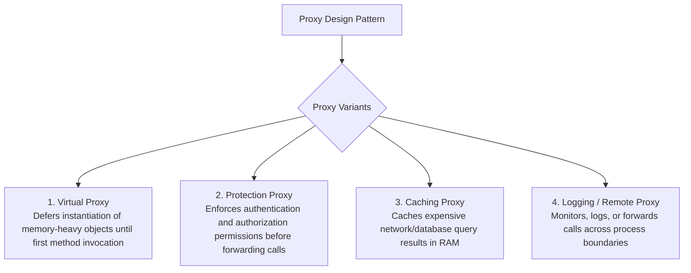
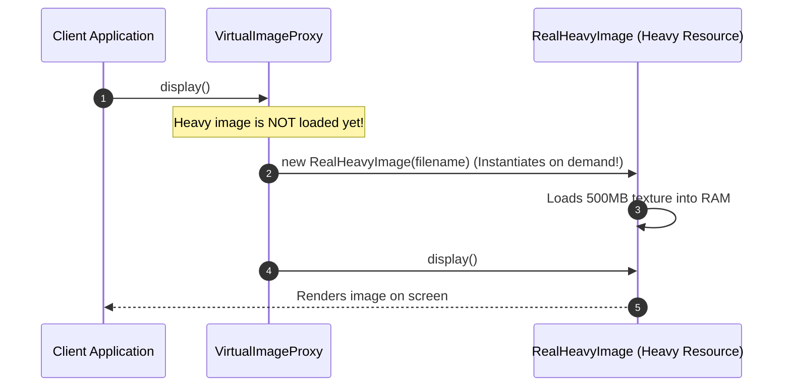

# Module 10: The Proxy Pattern — Access Control, Virtual Proxies, and Transparent Interception

## Overview

The **Proxy Pattern** is a Structural design pattern that provides a surrogate or placeholder object that controls access to a target subject.

Unlike the Adapter pattern (which changes the target interface) or the Decorator pattern (which dynamically enhances functionality), a Proxy **implements the exact same interface as the target subject**, controlling access transparently.

Proxy variations include **Virtual Proxies** (lazy initialization of memory-heavy objects), **Protection Proxies** (access validation), **Caching Proxies** (memoizing API calls), and **Remote / Logging Proxies**.

---

## 1. Proxy Pattern Classification Taxonomy



---

## 2. Virtual Proxy (Lazy Initialization) Sequence Diagram



---

## 3. Code Showcase: Virtual & Protection Proxy Implementations

```javascript
// 1. Target Subject Contract & Heavy Real Subject
class RealHeavyDatabaseConnection {
  #connectionURI;

  constructor(connectionURI) {
    this.#connectionURI = connectionURI;
    this.#connectToCluster(); // Heavy allocation call!
  }

  #connectToCluster() {
    console.log(`[HEAVY CONNECT]: Allocating 100 TCP sockets for ${this.#connectionURI}...`);
  }

  executeQuery(query) {
    return `[DB RESULT for '${query}']`;
  }
}

// 2. Protection & Virtual Proxy Implementation
class SecureDatabaseProxy {
  #connectionURI;
  #userRole;
  #realConnection = null; // Deferred Lazy Instantiation!

  constructor(connectionURI, userRole) {
    this.#connectionURI = connectionURI;
    this.#userRole = userRole;
  }

  executeQuery(query) {
    // 1. PROTECTION PROXY GUARD: Check permissions
    if (this.#userRole !== "ADMIN") {
      throw new Error(`ACCESS DENIED: Role '${this.#userRole}' unauthorized to execute database queries.`);
    }

    // 2. VIRTUAL PROXY LAZY LOADING: Instantiate heavy real subject on demand ONLY!
    if (!this.#realConnection) {
      console.log("[VIRTUAL PROXY]: First query encountered. Initializing real DB connection now...");
      this.#realConnection = new RealHeavyDatabaseConnection(this.#connectionURI);
    }

    // 3. Delegate execution to real subject transparently
    return this.#realConnection.executeQuery(query);
  }
}

// Client Execution
const guestProxy = new SecureDatabaseProxy("mongodb://prod:27017", "GUEST");
const adminProxy = new SecureDatabaseProxy("mongodb://prod:27017", "ADMIN");

// Guest query fails at Protection Proxy boundary before DB allocation:
try {
  guestProxy.executeQuery("SELECT * FROM users");
} catch (err) {
  console.error(err.message); // "ACCESS DENIED..."
}

// Admin query passes Protection Guard, triggering Virtual Proxy Lazy Allocation:
console.log(adminProxy.executeQuery("SELECT * FROM orders"));
```

---

## 4. ES6 Native `Proxy` Trap Integration

In modern JavaScript, Proxies can also be built using the native `new Proxy(target, handler)` constructor:

```javascript
const targetService = {
  fetchUser(id) {
    return { id, name: "Anita", role: "Dev" };
  }
};

const cachingProxyHandler = {
  cache: new Map(),

  get(target, prop, receiver) {
    if (prop === "fetchUser") {
      return (id) => {
        if (this.cache.has(id)) {
          console.log(`[ES6 PROXY CACHE HIT]: User ID ${id}`);
          return this.cache.get(id);
        }
        const result = target.fetchUser(id);
        this.cache.set(id, result);
        return result;
      };
    }
    return Reflect.get(target, prop, receiver);
  }
};

const proxiedService = new Proxy(targetService, cachingProxyHandler);
console.log(proxiedService.fetchUser(101)); // Fresh fetch
console.log(proxiedService.fetchUser(101)); // Cache Hit!
```

---

## Key Production Takeaways

1. **Keep Proxy Interfaces Identical to Target Subjects**: Ensure Proxies implement the exact same methods and signatures as the real target so client code remains unaware of the proxy layer.
2. **Use Virtual Proxies for Heavy Objects**: Use Virtual Proxies to defer memory allocations for large graphics, database pools, or remote SDK connections until they are actually used.
3. **Use Protection Proxies for Security Boundaries**: Intercept unauthorized queries or mutations early at the Proxy boundary before hitting underlying domain models.
4. **Use ES6 `new Proxy()` for Dynamic Interception**: Use native ES6 Proxy objects when intercepting generic property reads/writes dynamically across arbitrary objects.

