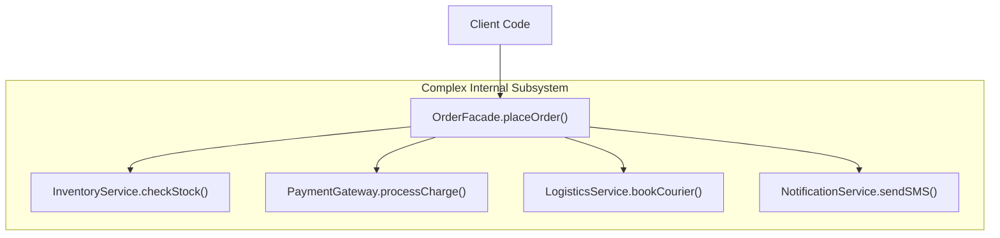

# File 11: The Facade Pattern

## Overview
The **Facade Pattern** provides a simplified, high-level unified interface over a large, complex subsystem of classes or APIs, hiding implementation complexities behind a clean entry point.

---

## 1. Facade Architecture



---

## 2. E-Commerce Order Facade Implementation

```javascript
// Subsystem Component 1: Inventory
class InventoryService {
    checkStock(productId) { return true; }
    reserveStock(productId) { console.log(`Stock reserved for product ${productId}`); }
}

// Subsystem Component 2: Payment
class PaymentGateway {
    charge(amount) { console.log(`Charged ₹${amount} successfully`); return true; }
}

// Subsystem Component 3: Shipping
class LogisticsService {
    scheduleDelivery(productId) { console.log(`Shipping scheduled for product ${productId}`); }
}

// High-Level Facade Unified Entry Point
class OrderFacade {
    constructor() {
        this.inventory = new InventoryService();
        this.payment = new PaymentGateway();
        this.logistics = new LogisticsService();
    }

    // Simplified 1-step public method for client application
    placeOrder(productId, amount) {
        if (!this.inventory.checkStock(productId)) throw new Error("Out of stock");
        
        this.inventory.reserveStock(productId);
        this.payment.charge(amount);
        this.logistics.scheduleDelivery(productId);

        return { status: "SUCCESS", message: "Order processed end-to-end!" };
    }
}

// Simple Client Call
const orderFacade = new OrderFacade();
orderFacade.placeOrder("PROD_1001", 1500);
```

---

## Key Takeaways
1. Facades **hide subsystem complexity** behind a single simplified public method.
2. Promotes **loose coupling** between client callers and complex internal API subsystems.
3. Common in libraries (e.g. `jQuery.ajax()` wrapping complex `XMLHttpRequest` edge-cases).
