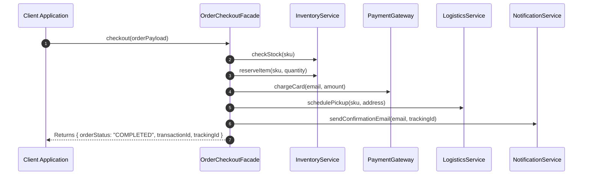

# Module 11: The Facade Pattern — Subsystem Orchestration, Unified APIs, and API Gateways

## Overview

The **Facade Pattern** is a Structural design pattern that provides a simplified, high-level unified interface over a complex subsystem of interdependent classes, services, or APIs.

Instead of forcing client application code to understand, instantiate, and orchestrate dozens of low-level subsystem objects in precise sequence, the Facade provides a single entry point method (e.g. `orderFacade.placeOrder(...)`) that encapsulates the underlying orchestration workflow.

Understanding how Facades differ from **Adapters** and **Mediators**, and leveraging Facades in API Gateways and SDK design is essential.

---

## 1. Facade Subsystem Architecture

```mermaid
flowchart TD
    Client[Client Application Code] -->|Simple 1-Step Call: checkout()| Facade["CheckoutFacade Unified API Entry Point"]

    subgraph Complex Subsystem Operations
        Facade --> Sub1["InventoryService.reserveStock()"]
        Facade --> Sub2["PaymentGateway.processCharge()"]
        Facade --> Sub3["TaxCalculator.calculateGST()"]
        Facade --> Sub4["ShippingService.scheduleCourier()"]
        Facade --> Sub5["NotificationService.sendEmailReceipt()"]
    end
```

---

## 2. Structural & Behavioral Comparison Matrix

| Pattern | Architectural Goal | Subsystem Relationship | Interface Modification |
| :--- | :--- | :--- | :--- |
| **Facade Pattern** | Simplifies access to complex multi-class subsystems | **Unidirectional Orchestrator** | Exposes a **NEW, Simplified** interface |
| **Adapter Pattern** | Enables incompatible interfaces to work together | Wraps single adaptee target | **Translates** interface to match target contract |
| **Mediator Pattern** | Centralizes communication between peer objects | **Bidirectional Hub** | Replaces multi-directional object links |

---

## 3. Code Showcase: E-Commerce Order Checkout Facade

```javascript
// Low-Level Subsystem 1: Inventory Management
class InventoryService {
  checkStock(sku) {
    console.log(`[InventoryService]: Verifying stock for SKU '${sku}'...`);
    return true;
  }
  reserveItem(sku, quantity) {
    console.log(`[InventoryService]: Reserved ${quantity} unit(s) of SKU '${sku}'.`);
  }
}

// Low-Level Subsystem 2: Payment Processing
class PaymentGateway {
  chargeCard(userEmail, amountINR) {
    console.log(`[PaymentGateway]: Charging Rs.${amountINR} to card associated with ${userEmail}...`);
    return { success: true, txnId: "TXN_99014" };
  }
}

// Low-Level Subsystem 3: Logistics & Shipping
class LogisticsService {
  schedulePickup(sku, shippingAddress) {
    console.log(`[LogisticsService]: Scheduled courier pickup for '${sku}' to address '${shippingAddress}'.`);
    return "TRACK-IN-98123";
  }
}

// Low-Level Subsystem 4: Notification Dispatcher
class NotificationService {
  sendConfirmationEmail(email, trackingId) {
    console.log(`[NotificationService]: Email confirmation sent to ${email} (Tracking: ${trackingId}).`);
  }
}

// High-Level Unified Facade Entry Point
class OrderCheckoutFacade {
  #inventory;
  #payment;
  #logistics;
  #notification;

  constructor() {
    this.#inventory = new InventoryService();
    this.#payment = new PaymentGateway();
    this.#logistics = new LogisticsService();
    this.#notification = new NotificationService();
  }

  // Simplified 1-step public API method for caller!
  checkout(orderPayload) {
    const { sku, quantity, amountINR, userEmail, shippingAddress } = orderPayload;

    console.log("=== BEGIN FACADE ORCHESTRATION ===");

    if (!this.#inventory.checkStock(sku)) {
      throw new Error(`Checkout Aborted: Item SKU '${sku}' is out of stock.`);
    }

    this.#inventory.reserveItem(sku, quantity);
    
    const paymentResult = this.#payment.chargeCard(userEmail, amountINR);
    if (!paymentResult.success) {
      throw new Error("Checkout Aborted: Payment authorization failed.");
    }

    const trackingId = this.#logistics.schedulePickup(sku, shippingAddress);
    this.#notification.sendConfirmationEmail(userEmail, trackingId);

    console.log("=== END FACADE ORCHESTRATION ===");

    return {
      orderStatus: "COMPLETED",
      transactionId: paymentResult.txnId,
      trackingId
    };
  }
}

// Client Application Code (Simple 1-line facade call!)
const checkoutFacade = new OrderCheckoutFacade();

const response = checkoutFacade.checkout({
  sku: "LAPTOP-MBP-16",
  quantity: 1,
  amountINR: 245000,
  userEmail: "anita@domain.com",
  shippingAddress: "Bengaluru, KA, India"
});

console.log("Client Order Response:", response);
```

---

## 4. Facade Execution Sequence



---

## Key Production Takeaways

1. **Use Facades to Simplify Complex Subsystems**: Implement a Facade when clients must perform a multi-step sequence across several independent services to accomplish a single business operation.
2. **Decouple Client Code from Subsystem Dependencies**: By calling the Facade, client code does not need to import or instantiate individual subsystem classes directly.
3. **Facades Do Not Block Direct Access**: A Facade provides a simplified convenience API, but low-level subsystem classes remain accessible directly if advanced customization is needed.
4. **Use Facades for Microservice API Gateways**: Implement Facade patterns in Node.js API Gateways to aggregate requests from multiple backend microservices into a single clean JSON response for mobile/web apps.

