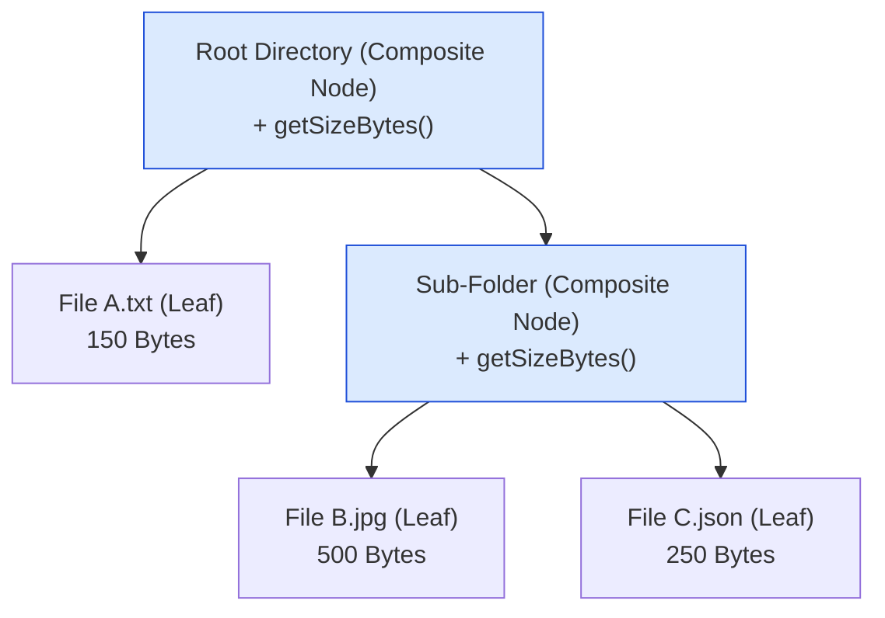
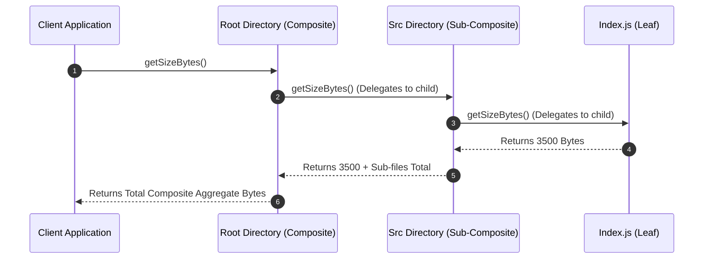

# Module 12: The Composite Pattern — Part-Whole Hierarchies, Tree Traversal, and Recursive Composition

## Overview

The **Composite Pattern** is a Structural design pattern that composes objects into **tree structures** to represent part-whole hierarchies.

The key innovation of the Composite pattern is that it allows clients to treat individual atomic elements (**Leaf Nodes**) and containers of elements (**Composite Nodes / Sub-trees**) **uniformly** through a shared component interface.

Real-world examples include the **Browser DOM Tree** (`Node` $\to$ `Element` & `TextNode`), **File Systems** (`Directory` vs. `File`), and **GUI Component Trees** (Window $\to$ Panel $\to$ Button).

---

## 1. Composite Tree Architecture



---

## 2. Component Taxonomy Matrix

| Component Type | Role in Hierarchy | Contains Children? | Polymorphic Interface Behavior |
| :--- | :--- | :--- | :--- |
| **Component Base** | Interface / Contract | Abstract definition | Declares shared operational methods (`render()`, `getSize()`) |
| **Leaf Node** | Atomic leaf element | **No** (Terminal node) | Executes operation directly on leaf state |
| **Composite Node** | Branch container node | **YES** (Holds array/set of children) | Iterates over children, calling method **recursively** |

---

## 3. Code Showcase: File System Directory Composite Tree

```javascript
// 1. Base Component Interface
class FileSystemComponent {
  constructor(name) {
    if (this.constructor === FileSystemComponent) {
      throw new Error("Cannot instantiate abstract class 'FileSystemComponent'");
    }
    this.name = name;
  }

  getSizeBytes() { throw new Error("Method 'getSizeBytes()' must be implemented"); }
  printTree(indent = 0) { throw new Error("Method 'printTree()' must be implemented"); }
}

// 2. Leaf Object: File
class FileLeaf extends FileSystemComponent {
  #sizeBytes;

  constructor(name, sizeBytes) {
    super(name);
    this.#sizeBytes = sizeBytes;
  }

  getSizeBytes() {
    return this.#sizeBytes;
  }

  printTree(indent = 0) {
    const padding = " ".repeat(indent * 2);
    console.log(`${padding}📄 ${this.name} (${this.getSizeBytes()} Bytes)`);
  }
}

// 3. Composite Object: Directory (Contains child FileSystemComponents)
class DirectoryComposite extends FileSystemComponent {
  #children = [];

  constructor(name) {
    super(name);
  }

  add(component) {
    if (!(component instanceof FileSystemComponent)) {
      throw new TypeError("Child must inherit from FileSystemComponent");
    }
    this.#children.push(component);
  }

  remove(component) {
    const index = this.#children.indexOf(component);
    if (index !== -1) this.#children.splice(index, 1);
  }

  // RECURSIVE DELEGATION: Sums sizes of all child files and sub-directories!
  getSizeBytes() {
    return this.#children.reduce((totalSize, child) => totalSize + child.getSizeBytes(), 0);
  }

  // RECURSIVE PRINTING: Walks tree depth-first
  printTree(indent = 0) {
    const padding = " ".repeat(indent * 2);
    console.log(`${padding}📁 [Directory] ${this.name} (Total: ${this.getSizeBytes()} Bytes)`);
    this.#children.forEach((child) => child.printTree(indent + 1));
  }
}

// Tree Construction
const root = new DirectoryComposite("project-root");
root.add(new FileLeaf("package.json", 1200));

const srcFolder = new DirectoryComposite("src");
srcFolder.add(new FileLeaf("index.js", 3500));
srcFolder.add(new FileLeaf("styles.css", 1800));

const assetsFolder = new DirectoryComposite("assets");
assetsFolder.add(new FileLeaf("logo.png", 45000));

srcFolder.add(assetsFolder);
root.add(srcFolder);

// Polymorphic Client Invocation (Root is treated identically to a single File!)
root.printTree();
console.log(`\nTotal Project Footprint: ${root.getSizeBytes()} Bytes`); // Output: 51500 Bytes
```

---

## 4. Recursive Traversal Sequence



---

## Key Production Takeaways

1. **Treat Single Items and Groups Uniformly**: Use Composite when client code should not need to care whether an object is a single item or a collection of items.
2. **Leverage Recursive Traversal**: Implement operations (like `render()`, `getSize()`, or `toJSON()`) on Composite nodes by delegating recursively to all child components.
3. **Use for Nested Tree Structures**: The Composite pattern is ideal for nested menus, DOM nodes, folder systems, and organizational hierarchies.
4. **Guard Component Contracts**: Ensure Leaf and Composite nodes adhere strictly to the base component interface so callers can execute methods polymorphically.

