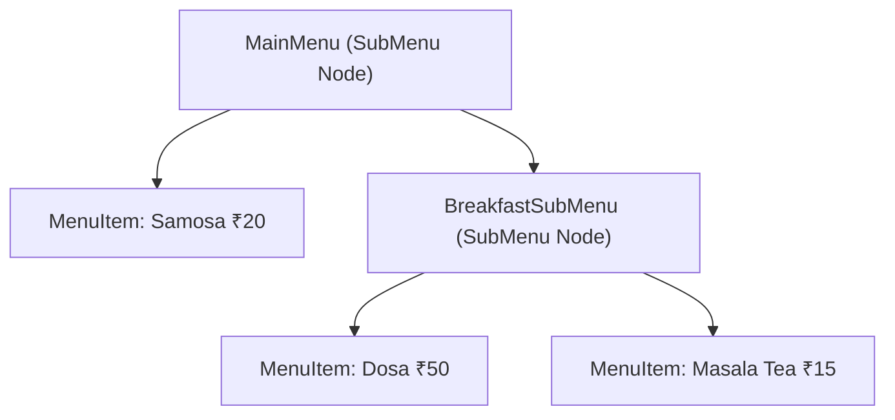

# File 12: The Composite Pattern

## Overview
The **Composite Pattern** organizes objects into tree structures to represent part-whole hierarchies. It allows clients to treat individual objects (**Leaves**) and compositions of objects (**Nodes/Sub-trees**) uniformly using a shared component interface.

---

## 1. Composite Tree Architecture



---

## 2. Menu Tree Implementation

```javascript
// Base Component Interface
class MenuComponent {
    getPrice() { throw new Error("Abstract method"); }
    print() { throw new Error("Abstract method"); }
}

// Leaf Object
class MenuItem extends MenuComponent {
    constructor(name, price) {
        super();
        this.name = name;
        this.price = price;
    }

    getPrice() {
        return this.price;
    }

    print() {
        console.log(`  - ${this.name}: ₹${this.price}`);
    }
}

// Composite Node (Contains sub-components)
class SubMenu extends MenuComponent {
    constructor(name) {
        super();
        this.name = name;
        this.children = [];
    }

    add(component) {
        this.children.push(component);
    }

    // Recursively sums price of all child items
    getPrice() {
        return this.children.reduce((total, child) => total + child.getPrice(), 0);
    }

    print() {
        console.log(`\n== ${this.name} SubMenu ==`);
        this.children.forEach(child => child.print());
    }
}

// Tree Building
const mainMenu = new SubMenu("Main Cafe Menu");
mainMenu.add(new MenuItem("Samosa", 20));

const drinksMenu = new SubMenu("Drinks Menu");
drinksMenu.add(new MenuItem("Masala Tea", 15));
drinksMenu.add(new MenuItem("Cold Coffee", 40));

mainMenu.add(drinksMenu);

mainMenu.print();
console.log(`Total Menu Price: ₹${mainMenu.getPrice()}`); // Total: ₹75
```

---

## Key Takeaways
1. Composites organize items into **tree structures** (DOM nodes, file systems, UI components).
2. Leaves and Node containers implement the **same interface**.
3. Operations (e.g. `getPrice()`) automatically cascade **recursively** down child nodes.
