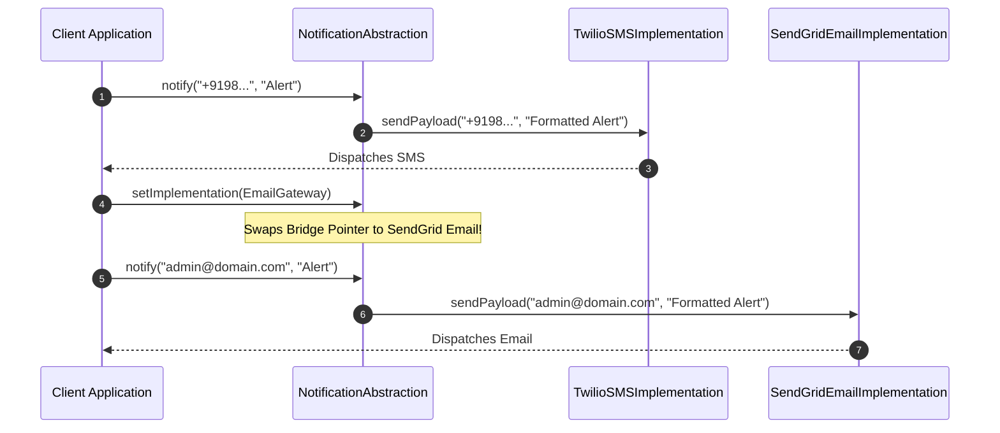

# Module 13: The Bridge Pattern — Abstraction Decoupling, Cartesian Explosion Defense, and Dynamic Implementation Switching

## Overview

The **Bridge Pattern** is a Structural design pattern that decouples an **Abstraction** (high-level control logic) from its **Implementation** (low-level platform execution) so that the two can vary independently without tight inheritance coupling.

Without the Bridge pattern, combining $M$ abstractions (e.g. Standard Remote, Advanced Voice Remote) with $N$ platform implementations (e.g. Sony TV, Samsung TV, LG TV) leads to a **Cartesian Class Explosion** of $M \times N$ rigid subclasses (`SonyStandardRemote`, `SamsungVoiceRemote`, etc.).

By replacing inheritance with **Object Composition**, the Bridge pattern reduces $M \times N$ subclasses to just $M + N$ independent classes connected via a composition bridge pointer.

---

## 1. Cartesian Subclass Explosion vs. Bridge Architecture

```mermaid
flowchart TD
    subgraph Cartesian Class Explosion (Inheritance: M x N = 6 Subclasses!)
        Base[RemoteControl] --> TV1[SonyTVStandardRemote]
        Base --> TV2[SonyTVVoiceRemote]
        Base --> TV3[SamsungTVStandardRemote]
        Base --> TV4[SamsungTVVoiceRemote]
        Base --> TV5[LGTVStandardRemote]
        Base --> TV6[LGTVVoiceRemote]
    end

    subgraph Bridge Composition Architecture (Bridge: M + N = 5 Classes!)
        Abstr1[StandardRemote] -->|Bridge Composition Pointer| Impl1[SonyTVDriver]
        Abstr2[VoiceRemote] -->|Bridge Composition Pointer| Impl2[SamsungTVDriver]
        Abstr2 -->|Bridge Composition Pointer| Impl3[LGTVDriver]
    end
```

---

## 2. Abstraction vs. Implementation Role Matrix

| Dimension | Abstraction Layer | Implementation Layer |
| :--- | :--- | :--- |
| **Role** | High-level control logic surface consumed by clients | Low-level platform or vendor execution details |
| **Example Classes** | `RemoteControl`, `AdvancedRemoteControl`, `View` | `SonyTVDriver`, `SamsungTVDriver`, `CanvasRenderer` |
| **Relationship** | Delegates low-level tasks to Implementation pointer | Implements abstract platform primitive interface |
| **Extensibility** | Add new remotes without modifying device drivers | Add new TV drivers without modifying remote controls |

---

## 3. Code Showcase: Multi-Platform Notification Bridge

```javascript
// 1. Implementation Layer Interface (Low-Level Platform Delivery Services)
class MessageServiceImplementation {
  sendPayload(recipient, formattedMessage) {
    throw new Error("Method 'sendPayload()' must be implemented");
  }
}

// Concrete Implementation A: Twilio SMS Service
class TwilioSMSImplementation extends MessageServiceImplementation {
  sendPayload(recipient, formattedMessage) {
    console.log(`[Twilio SMS Gateway]: Transmitting to phone ${recipient}: "${formattedMessage}"`);
  }
}

// Concrete Implementation B: SendGrid Email Service
class SendGridEmailImplementation extends MessageServiceImplementation {
  sendPayload(recipient, formattedMessage) {
    console.log(`[SendGrid Email API]: Dispatching HTML email to ${recipient}: "${formattedMessage}"`);
  }
}

// 2. Abstraction Layer (High-Level Control Logic)
class NotificationAbstraction {
  #implementationBridge; // Composition Bridge Pointer!

  constructor(implementationBridge) {
    if (!(implementationBridge instanceof MessageServiceImplementation)) {
      throw new TypeError("Bridge parameter must implement MessageServiceImplementation");
    }
    this.#implementationBridge = implementationBridge;
  }

  // Set implementation dynamically at runtime!
  setImplementation(newBridge) {
    this.#implementationBridge = newBridge;
  }

  notify(userContact, messageBody) {
    // High-level abstraction formats message, then delegates delivery to Bridge implementation
    const formatted = `[ALERT]: ${messageBody.toUpperCase()}`;
    this.#implementationBridge.sendPayload(userContact, formatted);
  }
}

// Refined Abstraction: Urgent Notification (Adds retry logic)
class UrgentNotificationAbstraction extends NotificationAbstraction {
  notifyUrgent(userContact, messageBody) {
    console.log("=== HIGH-PRIORITY URGENT DISPATCH ===");
    this.notify(userContact, `URGENT: ${messageBody}`);
  }
}

// Client Execution
const smsGateway = new TwilioSMSImplementation();
const emailGateway = new SendGridEmailImplementation();

// 1. Create Urgent Abstraction backed by SMS Implementation
const urgentAlert = new UrgentNotificationAbstraction(smsGateway);
urgentAlert.notifyUrgent("+919876543210", "Database CPU usage > 95%");

// 2. Swap Implementation dynamically at runtime to Email Gateway!
urgentAlert.setImplementation(emailGateway);
urgentAlert.notifyUrgent("admin@domain.com", "Database CPU usage > 95%");
```

---

## 4. Dynamic Implementation Swap Sequence



---

## Key Production Takeaways

1. **Use Bridge to Avoid $M \times N$ Subclass Explosions**: Implement a Bridge when you have multiple variations of control logic (Abstractions) and multiple platform implementations (Implementations).
2. **Favor Composition Over Inheritance**: Replace multi-level inheritance hierarchies with a simple composition link (`this.#implementation = impl`).
3. **Allow Dynamic Implementation Swapping**: Because the abstraction references an implementation interface, you can change platform implementations at runtime.
4. **Distinguish Bridge from Adapter**: A Bridge is designed upfront to let abstractions and implementations vary independently, whereas an Adapter makes unrelated existing classes work together after the fact.

