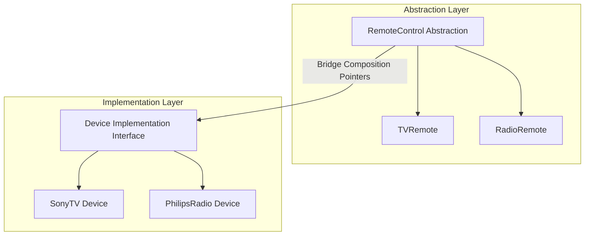

# File 13: The Bridge Pattern

## Overview
The **Bridge Pattern** decouples an abstraction from its implementation so that the two can vary independently. It replaces inheritance-based multi-dimensional class explosions with object composition.

---

## 1. Bridge Pattern Architecture



---

## 2. Remote Control Device Bridge Implementation

```javascript
// Implementation Layer Interface
class Device {
    turnOn() {}
    turnOff() {}
    setVolume(percent) {}
}

// Concrete Implementation 1: TV
class SonyTV extends Device {
    turnOn() { console.log("Sony TV turned ON"); }
    turnOff() { console.log("Sony TV turned OFF"); }
    setVolume(percent) { console.log(`Sony TV volume set to ${percent}%`); }
}

// Concrete Implementation 2: Radio
class PhilipsRadio extends Device {
    turnOn() { console.log("Philips Radio playing"); }
    turnOff() { console.log("Philips Radio muted"); }
    setVolume(percent) { console.log(`Philips Radio volume set to ${percent}%`); }
}

// Abstraction Layer
class RemoteControl {
    constructor(device) {
        this.device = device; // Bridge composition link
    }

    togglePower() {
        this.device.turnOn();
    }

    volumeUp() {
        this.device.setVolume(80);
    }
}

// Inter-changing implementations dynamically
const tvRemote = new RemoteControl(new SonyTV());
tvRemote.togglePower(); // "Sony TV turned ON"

const radioRemote = new RemoteControl(new PhilipsRadio());
radioRemote.togglePower(); // "Philips Radio playing"
```

---

## Key Takeaways
1. Bridges **decouple abstraction from implementation** using composition over inheritance.
2. Prevents exponential class creation (`SonyTVRemote`, `PhilipsTVRemote`, `SonyRadioRemote`, `PhilipsRadioRemote`).
3. Implementation details can be swapped at runtime dynamically.
