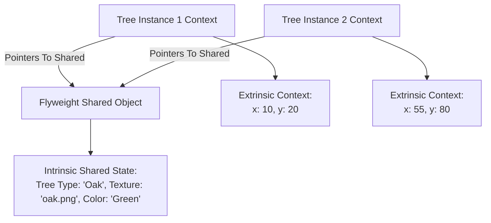

# File 14: The Flyweight Pattern

## Overview
The **Flyweight Pattern** minimizes memory usage by sharing immutable intrinsic state across large numbers of similar objects, storing extrinsic state (unique variables like coordinates or IDs) externally.

---

## 1. Intrinsic vs Extrinsic State Split



---

## 2. Forest Tree Rendering Implementation

```javascript
// Flyweight Object: Contains Intrinsic Heavy Data (Shared in Memory)
class TreeType {
    constructor(name, color, texture) {
        this.name = name;
        this.color = color;
        this.texture = texture;
    }

    render(x, y) {
        console.log(`Rendering '${this.name}' [${this.color}] at coordinates (${x}, ${y})`);
    }
}

// Flyweight Factory: Ensures identical TreeTypes are cached and reused
class TreeFactory {
    static types = new Map();

    static getTreeType(name, color, texture) {
        const key = `${name}_${color}_${texture}`;
        if (!TreeFactory.types.has(key)) {
            console.log(`[FLYWEIGHT CREATED] Allocating shared heavy TreeType: ${key}`);
            TreeFactory.types.set(key, new TreeType(name, color, texture));
        }
        return TreeFactory.types.get(key);
    }
}

// Context Class: Holds Extrinsic Lightweight Data (Unique per object instance)
class Tree {
    constructor(x, y, treeType) {
        this.x = x;
        this.y = y;
        this.type = treeType; // Reference pointer to shared Flyweight
    }

    draw() {
        this.type.render(this.x, this.y);
    }
}

// Forest Container
class Forest {
    constructor() {
        this.trees = [];
    }

    plantTree(x, y, name, color, texture) {
        const type = TreeFactory.getTreeType(name, color, texture);
        const tree = new Tree(x, y, type);
        this.trees.push(tree);
    }
}

const forest = new Forest();
// Plant 1,000 Oak trees
for (let i = 0; i < 1000; i++) {
    forest.plantTree(i, i * 2, "Oak", "Green", "oak.png");
}

console.log(`Total Trees Planted: ${forest.trees.length}`);
console.log(`Total Heavy TreeType Objects in Memory: ${TreeFactory.types.size}`); // ONLY 1!
```

---

## Key Takeaways
1. **Intrinsic state** (heavy, invariant, shared) is stored inside the **Flyweight**.
2. **Extrinsic state** (lightweight, unique per instance) is passed in externally at runtime.
3. Reduces memory overhead when managing thousands of similar objects.
