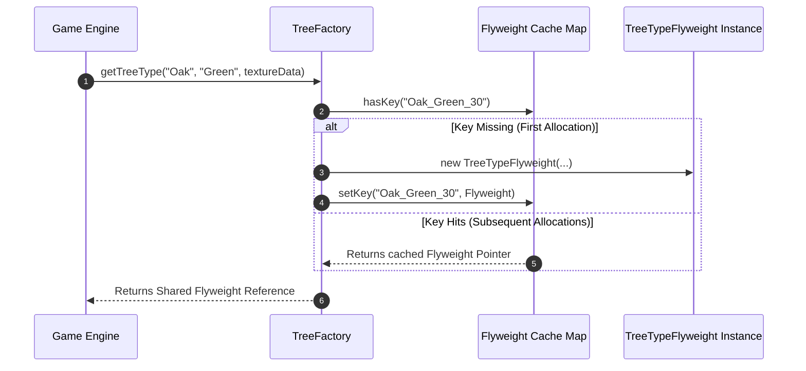

# Module 14: The Flyweight Pattern — RAM Footprint Optimization, Intrinsic vs. Extrinsic State, and Shared Caching

## Overview

The **Flyweight Pattern** is a Structural design pattern designed to drastically minimize application memory usage by **sharing invariant data** across thousands or millions of similar object instances.

When instantiating large collections of objects (e.g. 100,000 trees in a game map, millions of characters in a text editor canvas, or map pin markers), duplicating heavy properties (textures, font metrics, sound clips) causes V8 Heap Out-Of-Memory crashes.

The Flyweight pattern resolves this by splitting object state into two parts:
1. **Intrinsic State**: Constant, heavy, invariant data stored inside a **shared Flyweight object**.
2. **Extrinsic State**: Unique, variable context data (e.g., $x, y$ coordinates) stored outside or passed in dynamically during method execution.

---

## 1. Intrinsic vs. Extrinsic Memory Decomposition

```mermaid
flowchart TD
    subgraph Without Flyweight (1,000 Duplicated Objects = 500 MB RAM!)
        Obj1["Tree 1: [100MB Texture, 500KB Mesh] + (x:10, y:20)"]
        Obj2["Tree 2: [100MB Texture, 500KB Mesh] + (x:50, y:80)"]
        Obj3["Tree N: [100MB Texture, 500KB Mesh] + (x:90, y:30)"]
    end

    subgraph With Flyweight (1 Shared Flyweight + 1,000 Lightweight Pointers = 100.1 MB RAM!)
        SharedFlyweight["Shared Flyweight: OakTreeType<br/>[100MB Texture, 500KB Mesh]"]
        
        Context1["Tree 1 Context: pointer -> OakTreeType | (x:10, y:20)"]
        Context2["Tree 2 Context: pointer -> OakTreeType | (x:50, y:80)"]

        Context1 -->|Pointers to Single Instance| SharedFlyweight
        Context2 -->|Pointers to Single Instance| SharedFlyweight
    end
```

---

## 2. Intrinsic vs. Extrinsic State Comparison Matrix

| State Category | Variability | Storage Location | Sharing Capability | Example Properties |
| :--- | :--- | :--- | :--- | :--- |
| **Intrinsic State** | **Invariant** (Never changes across instances) | Stored inside **Shared Flyweight Object** | **100% Shared** across all context pointers | 3D Textures, Sound Buffers, Font Families |
| **Extrinsic State** | **Variant** (Unique per specific object) | Stored in **Context Object** or passed in parameters | **Unique** per instance | $x, y$ screen coordinates, selection state, unique ID |

---

## 3. Code Showcase: High-Density Forest Renderer

```javascript
// 1. Shared Flyweight Class (Holds Heavy Intrinsic State)
class TreeTypeFlyweight {
  #name;
  #color;
  #textureMeshData; // Imagine 50MB 3D Texture Buffer!

  constructor(name, color, textureMeshData) {
    this.#name = name;
    this.#color = color;
    this.#textureMeshData = textureMeshData;
  }

  // Method accepts Extrinsic State (x, y coordinates) dynamically!
  render(x, y, scale) {
    console.log(`[RENDER FLYWEIGHT]: '${this.#name}' [${this.#color}] rendered at (${x}, ${y}) with scale ${scale}x.`);
  }
}

// 2. Flyweight Factory (Ensures identical Intrinsic Types are cached & reused)
class TreeFactory {
  static #flyweights = new Map();

  static getTreeType(name, color, textureMeshData) {
    const key = `${name}_${color}_${textureMeshData.length}`;

    if (!TreeFactory.#flyweights.has(key)) {
      console.log(`[FLYWEIGHT CREATED]: Allocating fresh shared TreeTypeFlyweight for '${key}'`);
      TreeFactory.#flyweights.set(key, new TreeTypeFlyweight(name, color, textureMeshData));
    }

    return TreeFactory.#flyweights.get(key); // Returns cached instance!
  }

  static get totalFlyweightsInMemory() {
    return TreeFactory.#flyweights.size;
  }
}

// 3. Lightweight Context Class (Holds Extrinsic State & Pointer to Shared Flyweight)
class TreeContext {
  constructor(x, y, scale, flyweightType) {
    this.x = x;
    this.y = y;
    this.scale = scale;
    this.type = flyweightType; // Shared memory pointer!
  }

  draw() {
    // Pass extrinsic context into shared Flyweight render method!
    this.type.render(this.x, this.y, this.scale);
  }
}

// 4. Forest Container
class GameForest {
  #trees = [];

  plantTree(x, y, scale, name, color, textureData) {
    const sharedType = TreeFactory.getTreeType(name, color, textureData);
    const treeContext = new TreeContext(x, y, scale, sharedType);
    this.#trees.push(treeContext);
  }

  renderForest() {
    this.#trees.forEach((tree) => tree.draw());
  }

  get totalTreeCount() {
    return this.#trees.length;
  }
}

// Execution Benchmark
const forest = new GameForest();
const heavyOakTexture = "RAW_BINARY_TEXTURE_BUFFER_50MB";

// Plant 10,000 Oak Trees in the game world!
for (let i = 0; i < 10000; i++) {
  forest.plantTree(i * 5, i * 10, 1.2, "Oak", "Green", heavyOakTexture);
}

console.log(`Total Trees Planted in Game World: ${forest.totalTreeCount}`);
console.log(`Total Heavy Flyweight Objects Allocated in Heap: ${TreeFactory.totalFlyweightsInMemory}`); // Output: ONLY 1!
```

---

## 4. Flyweight Factory Lookup Sequence



---

## Key Production Takeaways

1. **Use Flyweight to Fix Heap Memory Exhaustion**: Implement Flyweight when an application instantiates tens of thousands of similar objects that threaten to crash V8 memory.
2. **Strictly Separate Intrinsic vs. Extrinsic State**: Ensure intrinsic state stored in the Flyweight object is completely immutable (`Object.freeze(this)`) so sharing it across contexts is safe.
3. **Use a Centralized Flyweight Factory**: Always request Flyweights through a centralized factory backed by a `Map` cache to guarantee instance reuse.
4. **Pass Extrinsic State as Method Arguments**: Do not store extrinsic state inside the Flyweight; pass extrinsic coordinates or parameters into Flyweight execution methods at invocation time.

