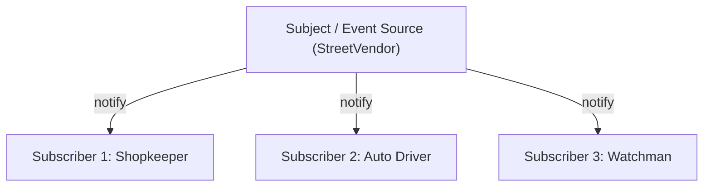

# File 15: The Observer Pattern

## Overview
The **Observer Pattern** defines a one-to-many dependency relationship between objects so that when one object (**Subject**) changes state, all registered dependents (**Observers**) are notified and updated automatically.

---

## 1. Observer Architecture



---

## 2. Observer & EventEmitter Implementation

```javascript
// Subject Class
class StreetVendor {
    constructor(name) {
        this.name = name;
        this.subscribers = [];
    }

    subscribe(fn) {
        this.subscribers.push(fn);
    }

    unsubscribe(fn) {
        this.subscribers = this.subscribers.filter(sub => sub !== fn);
    }

    notify(message) {
        this.subscribers.forEach(sub => sub(message));
    }
}

// Client Observers
const vendor = new StreetVendor("Govind");

const shopkeeper = msg => console.log("Shopkeeper heard:", msg);
const autoDriver = msg => console.log("Auto Driver heard:", msg);

vendor.subscribe(shopkeeper);
vendor.subscribe(autoDriver);

vendor.notify("Spiced tea ready!");
// "Shopkeeper heard: Spiced tea ready!"
// "Auto Driver heard: Spiced tea ready!"

vendor.unsubscribe(autoDriver);
vendor.notify("Fresh coffee ready!");
// Only Shopkeeper receives update!
```

---

## Key Takeaways
1. Enables **one-to-many publish-subscribe communication** between decoupled objects.
2. Foundation of DOM `addEventListener`, Node.js `EventEmitter`, and Reactive State libraries (RxJS, Redux).
3. Always unsubscribe observers when no longer needed to prevent **memory leak subscriptions**.
