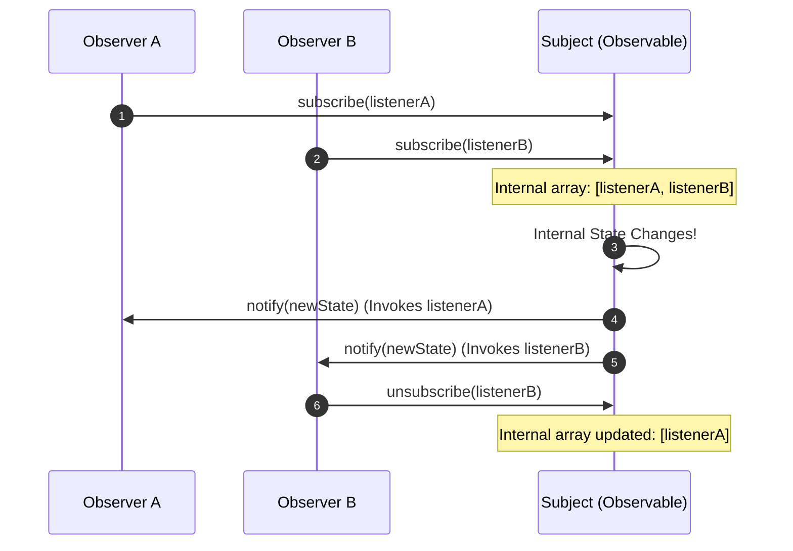
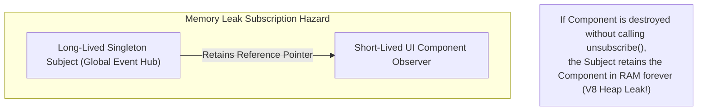

# Module 15: The Observer Pattern — 1-to-N Direct Subscriptions, Reactive State, and Memory Leak Hazards

## Overview

The **Observer Pattern** is a Behavioral design pattern that defines a direct **one-to-many dependency relationship** between objects. When the core object (**Subject / Observable**) changes state, all of its registered dependents (**Observers / Subscribers**) are notified and updated automatically.

In JavaScript, the Observer pattern forms the foundation of browser **DOM Event Listeners** (`element.addEventListener`), **Node.js `EventEmitter`**, and Reactive State management libraries (RxJS, MobX, Vue Reactivity).

Understanding the difference between the **Observer Pattern** (direct coupling) and the **Publish-Subscribe Pattern** (mediated via an Event Bus), as well as avoiding **Dangling Subscription Memory Leaks**, is essential.

---

## 1. Observer Structural Architecture



---

## 2. Observer vs. Pub-Sub Comparison Matrix

| Architectural Dimension | Observer Pattern (GoF) | Publish-Subscribe Pattern |
| :--- | :--- | :--- |
| **Coupling Degree** | **Tightly Coupled** (Subject holds direct references to Observer callbacks) | **Loosely Coupled** (Publishers & Subscribers are completely unaware of each other) |
| **Broker Presence** | No Broker (Direct call loop inside Subject) | **Central Message Broker / Event Bus** (Topic channels) |
| **Execution Context** | Typically **Synchronous** inline dispatch | Can be **Asynchronous** message queuing |
| **Use Case** | Single component local state binding (DOM, Vue refs) | Microservice events, cross-module application messaging |

---

## 3. Code Showcase: Typed Subject & Listener Unsubscribe Cleanup

```javascript
// Subject / Observable Base Class
class ObservableSubject {
  #observers = new Set(); // Use Set to prevent duplicate listener registration!

  subscribe(observerCallback) {
    if (typeof observerCallback !== "function") {
      throw new TypeError("Observer callback must be a function");
    }

    this.#observers.add(observerCallback);

    // Return Unsubscribe Disposer Function (Clean Idiomatic JS Pattern!)
    return () => {
      this.#observers.delete(observerCallback);
      console.log("[ObservableSubject]: Observer unsubscribed successfully.");
    };
  }

  notify(dataPayload) {
    console.log(`[ObservableSubject]: Broadcasting update to ${this.#observers.size} observer(s)...`);
    this.#observers.forEach((callback) => {
      try {
        callback(dataPayload);
      } catch (err) {
        console.error("[ObservableSubject]: Error inside observer callback:", err);
      }
    });
  }

  get observerCount() {
    return this.#observers.size;
  }
}

// Concrete Subject: Weather Station
class WeatherStation extends ObservableSubject {
  #temperature = 25;

  setTemperature(newTemp) {
    console.log(`\n[WeatherStation]: Temperature updated: ${newTemp}°C`);
    this.#temperature = newTemp;
    this.notify({ temperature: this.#temperature, timestamp: Date.now() });
  }
}

// Client Observers
const station = new WeatherStation();

// Subscribe Observer 1: Digital Display
const unsubscribeDisplay = station.subscribe((data) => {
  console.log(`  -> [Digital Display]: Current Temp: ${data.temperature}°C`);
});

// Subscribe Observer 2: Logger Service
const unsubscribeLogger = station.subscribe((data) => {
  console.log(`  -> [Logger Service]: Logging reading at ${data.timestamp}`);
});

// Trigger Updates
station.setTemperature(29);
station.setTemperature(32);

// Cleanly Unsubscribe Observer 1 to prevent memory leak!
unsubscribeDisplay();

// Next update only notifies Logger Service:
station.setTemperature(30);
```

---

## 4. Dangling Subscription Memory Leak Hazard



> [!CAUTION]
> **Dangling Subscription Hazard**: If a short-lived component (e.g., a modal or view) subscribes to a long-lived singleton Subject without unsubscribing when unmounted, V8 cannot garbage-collect the component, causing a severe memory leak. Always call the returned unsubscribe disposer hook!

---

## Key Production Takeaways

1. **Always Return an Unsubscribe Disposer Function**: Return a cleanup function `() => listeners.delete(fn)` directly from `subscribe()` to make teardown clean and straightforward.
2. **Use `Set` for Observer Storage**: Use JavaScript `Set` instead of arrays to prevent registering the exact same observer callback multiple times.
3. **Isolate Exceptions in Observer Notification Loops**: Wrap callback invocations inside `try...catch` blocks inside `notify()` so one throwing observer does not block notifications to remaining subscribers.
4. **Clean Up Subscriptions on Component Teardown**: Always invoke unsubscribe disposers when UI components unmount or disconnect to avoid V8 memory leaks.

