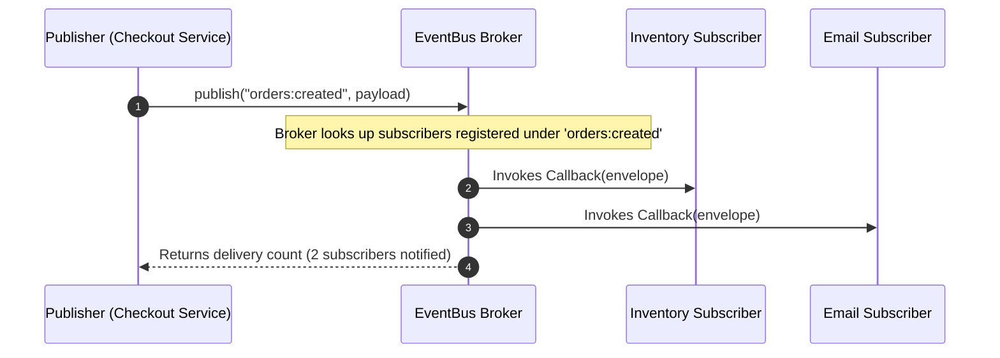

# Module 16: The Publish-Subscribe (Pub/Sub) Pattern — Event Buses, Topic Channels, and Decoupled Brokers

## Overview

The **Publish-Subscribe (Pub/Sub) Pattern** is an asynchronous architectural messaging pattern where senders of messages (**Publishers**) do not broadcast directly to specific receivers (**Subscribers**).

Instead, messages are categorized into **Topic Channels** and routed through a centralized **Message Broker / Event Bus**. Publishers have zero knowledge of who (or how many) subscribers consume their events, achieving **100% Structural Decoupling**.

Understanding how Pub/Sub differs from the **Observer Pattern**, implementing **Wildcard Topic Matching**, and managing Event Buses is essential.

---

## 1. Pub/Sub Broker Architecture

```mermaid
flowchart LR
    subgraph Senders (Publishers)
        Pub1[Checkout Controller] -->|publish('order:created')| EventBus
        Pub2[Auth Controller] -->|publish('user:login')| EventBus
    end

    EventBus["Central Event Bus / Message Broker<br/>(Topic Channel Registry)"]

    subgraph Receivers (Subscribers)
        EventBus -->|Topic: 'order:created'| Sub1[Inventory Microservice]
        EventBus -->|Topic: 'order:created'| Sub2[Email Dispatcher]
        EventBus -->|Topic: 'user:login'| Sub3[Audit Security Logger]
    end

    style EventBus fill:#fef3c7,stroke:#d97706,stroke-width:2px
```

---

## 2. Observer vs. Pub/Sub Structural Matrix

```mermaid
flowchart TD
    subgraph Observer Pattern (Direct Link)
        Subject["Subject (State Holder)"] -->|Direct Array Iteration| Observers["Observer 1, Observer 2"]
    end

    subgraph Pub/Sub Pattern (Indirect Broker Mediation)
        Publisher["Publisher"] -->|Emits to Topic Name| Broker["Event Bus Broker"]
        Broker -->|Delivers to Registered Topic Listeners| Subscribers["Subscriber A, Subscriber B"]
    end
```

### Architectural Comparison

| Dimension | Observer Pattern | Publish-Subscribe Pattern |
| :--- | :--- | :--- |
| **Component Awareness** | Subject directly holds array of Observer references | Publishers and Subscribers are **completely anonymous** to each other |
| **Message Routing** | Subject calls observers when internal state mutates | Central Broker routes messages based on **Topic Channels** |
| **Cross-Process Scalability** | Limited to single memory space | Easily scaled across processes, threads, or Redis/Kafka clusters |
| **Overhead** | Minimal ($\mathcal{O}(1)$ function call) | Slight broker lookup overhead |

---

## 3. Code Showcase: High-Performance Event Bus Broker with Wildcards

```javascript
// Central Event Bus Broker Implementation
class EventBusBroker {
  #topics = new Map();

  // Subscribe to a specific topic channel
  subscribe(topic, listenerCallback) {
    if (typeof listenerCallback !== "function") {
      throw new TypeError("Subscriber listener must be a function");
    }

    if (!this.#topics.has(topic)) {
      this.#topics.set(topic, new Set());
    }

    const listeners = this.#topics.get(topic);
    listeners.add(listenerCallback);

    console.log(`[EventBus]: Subscribed callback to topic '${topic}' (Total: ${listeners.size})`);

    // Return Unsubscribe Disposer
    return () => {
      const topicListeners = this.#topics.get(topic);
      if (topicListeners) {
        topicListeners.delete(listenerCallback);
        if (topicListeners.size === 0) {
          this.#topics.delete(topic); // Garbage collect empty topic channels!
        }
      }
      console.log(`[EventBus]: Unsubscribed listener from topic '${topic}'`);
    };
  }

  // Publish message payload to a topic channel
  publish(topic, payload) {
    console.log(`\n[EventBus PUBLISH]: Topic '${topic}'`);
    const envelope = {
      topic,
      payload,
      timestamp: new Date().toISOString()
    };

    let deliveredCount = 0;

    // 1. Direct Topic Channel Match
    if (this.#topics.has(topic)) {
      this.#topics.get(topic).forEach((callback) => {
        try {
          callback(envelope);
          deliveredCount++;
        } catch (err) {
          console.error(`[EventBus ERROR]: Handler threw on topic '${topic}':`, err);
        }
      });
    }

    // 2. Wildcard Channel Match (e.g., 'orders:*')
    this.#topics.forEach((listeners, registeredTopic) => {
      if (registeredTopic.endsWith(":*")) {
        const prefix = registeredTopic.slice(0, -2);
        if (topic.startsWith(prefix) && topic !== registeredTopic) {
          listeners.forEach((callback) => {
            try {
              callback(envelope);
              deliveredCount++;
            } catch (err) {
              console.error(`[EventBus ERROR]: Wildcard handler error:`, err);
            }
          });
        }
      }
    });

    return deliveredCount;
  }
}

// Client Application Execution
const globalEventBus = new EventBusBroker();

// Subscriber 1: Specific Topic Listener
const unsubInventory = globalEventBus.subscribe("orders:created", (event) => {
  console.log(`  -> [INVENTORY SERVICE]: Reserving items for Order ID: ${event.payload.orderId}`);
});

// Subscriber 2: Wildcard Logger Listener
globalEventBus.subscribe("orders:*", (event) => {
  console.log(`  -> [WILDCARD AUDIT LOGGER]: Logged event on channel '${event.topic}' at ${event.timestamp}`);
});

// Publisher emits event without knowing who processes it!
globalEventBus.publish("orders:created", { orderId: "ORD-99012", item: "Laptop", amountINR: 85000 });

// Unsubscribe Inventory listener cleanly
unsubInventory();

// Next publish only triggers Wildcard Audit Logger:
globalEventBus.publish("orders:created", { orderId: "ORD-99013", item: "Phone", amountINR: 45000 });
```

---

## 4. Pub/Sub Message Dispatch Sequence



---

## Key Production Takeaways

1. **Use Pub/Sub for Decoupled Modular Architectures**: Use Pub/Sub when distinct modules or microservices need to react to system events without importing or referencing each other.
2. **Standardize Event Payload Envelopes**: Always wrap event data in a consistent envelope structure (e.g. `{ topic, payload, timestamp, correlationId }`).
3. **Garbage Collect Empty Topic Channels**: Delete empty topic sets from the internal broker map when all subscribers unsubscribe to avoid memory leaks.
4. **Wrap Handlers in Try-Catch Blocks**: Ensure the broker executes subscriber callbacks inside `try...catch` blocks so an exception in one handler does not halt execution of subsequent subscribers.
