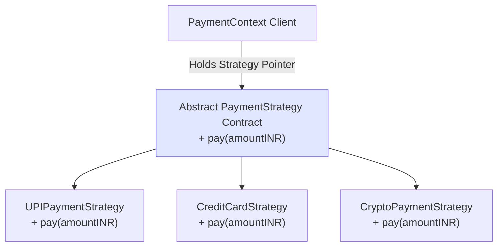
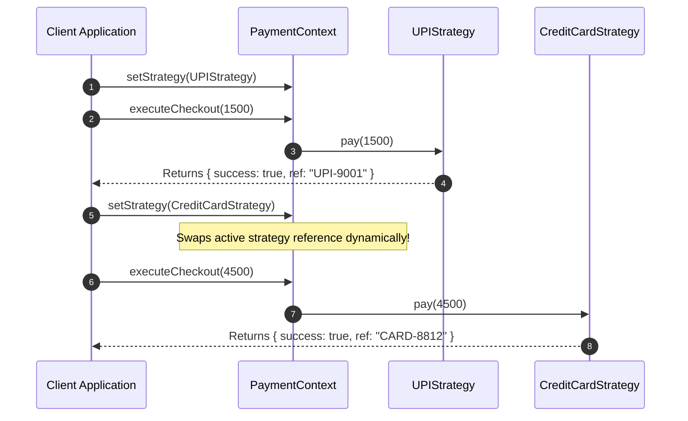

# Module 17: The Strategy Pattern — Algorithm Encapsulation, Conditional Elimination, and Functional Idioms

## Overview

The **Strategy Pattern** is a Behavioral design pattern that defines a family of algorithms, encapsulates each one inside an independent class or function, and makes them **interchangeable at runtime**.

Without the Strategy pattern, selecting an algorithm (e.g. Payment Gateways, Compression Formats, Sorting Algorithms, or Discount Rules) leads to monolithic conditional branching (`switch(type) { case 'A': ... case 'B': ... }`), violating SOLID's **Open/Closed Principle**.

In JavaScript, Strategies can be implemented using formal **OOP Interfaces** or idiomatic **Higher-Order Functions / Closure Maps**.

---

## 1. Strategy Structural Architecture



---

## 2. Behavioral Patterns Comparison Matrix

| Pattern Name | Architectural Intent | State / Algorithm Coupling | Swapping Frequency |
| :--- | :--- | :--- | :--- |
| **Strategy Pattern** | Interchangeable algorithms executing a specific task | **Externalized** (Client explicitly sets strategy) | Swapped by client on demand |
| **State Pattern** | Behavior changes based on internal state transitions | **Internalized** (State objects trigger transitions to next state) | Swaps automatically based on internal state |
| **Command Pattern** | Encapsulates a request/action as an object | Holds request context & execution parameters | Executed, queued, or undone |

---

## 3. Code Showcase: Class-Based vs. Functional Strategy Map

```javascript
// 1. Class-Based Strategy Pattern (Formal OOP Approach)
class UPIStrategy {
  #vpa;
  constructor(vpa) { this.#vpa = vpa; }
  pay(amountINR) {
    console.log(`[UPI Strategy]: Debited Rs.${amountINR} via Virtual Address '${this.#vpa}'.`);
    return { success: true, ref: "UPI-9001" };
  }
}

class CreditCardStrategy {
  #cardNumber;
  constructor(cardNumber) { this.#cardNumber = cardNumber; }
  pay(amountINR) {
    const masked = this.#cardNumber.slice(-4);
    console.log(`[Card Strategy]: Charged Rs.${amountINR} to Credit Card ending in ****${masked}.`);
    return { success: true, ref: "CARD-8812" };
  }
}

class PaymentContext {
  #strategy = null;

  setStrategy(strategy) {
    this.#strategy = strategy;
  }

  executeCheckout(amountINR) {
    if (!this.#strategy) {
      throw new Error("[PaymentContext]: Cannot process checkout: No strategy assigned.");
    }
    return this.#strategy.pay(amountINR);
  }
}

// OOP Client Execution
const context = new PaymentProcessor ? new PaymentContext() : new PaymentContext();
context.setStrategy(new UPIStrategy("anita@upi"));
context.executeCheckout(1500);

// Swap strategy dynamically at runtime!
context.setStrategy(new CreditCardStrategy("4532111122229988"));
context.executeCheckout(4500);
```

```javascript
// 2. Idiomatic Functional Strategy Map (Clean JavaScript Idiom!)
const discountStrategies = {
  REGULAR: (price) => price,
  VIP: (price) => price * 0.80,         // 20% discount
  FESTIVE: (price) => price * 0.70,     // 30% discount
  CLEARANCE: (price) => price * 0.50   // 50% discount
};

function calculateFinalPrice(strategyKey, basePrice) {
  const strategyFn = discountStrategies[strategyKey.toUpperCase()];
  if (!strategyFn) {
    throw new Error(`Unknown discount strategy: ${strategyKey}`);
  }
  return strategyFn(basePrice); // Zero if/else or switch statements!
}

console.log("VIP Price:", calculateFinalPrice("VIP", 1000));             // Output: 800
console.log("Festive Price:", calculateFinalPrice("FESTIVE", 1000));     // Output: 700
```

---

## 4. Dynamic Strategy Swap Sequence



---

## Key Production Takeaways

1. **Eliminate Large Conditional Branch Blocks**: Replace long `if/else` or `switch` statements with a strategy object or strategy function map.
2. **Adhere to the Open/Closed Principle**: Adding a new algorithm variant simply requires creating a new strategy class or object key without modifying existing context code.
3. **Use Functional Strategy Maps for Light Logic**: In JavaScript, a plain object dictionary mapping string keys to functions (`const strategies = { KEY: (val) => ... }`) is often cleaner than full OOP class hierarchies.
4. **Enforce Strategy Method Contracts**: Ensure all concrete strategy classes implement identical method names and parameter signatures so the Context can call them polymorphically.

