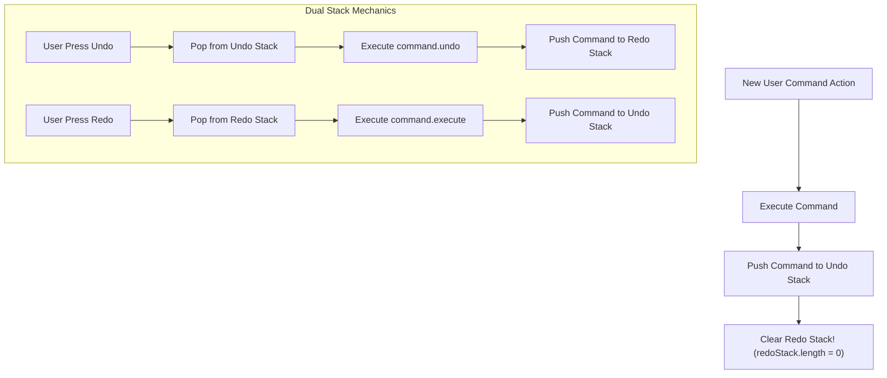

# Module 18: The Command Pattern — Request Encapsulation, Undo/Redo Stacks, and Macro Commands

## Overview

The **Command Pattern** is a Behavioral design pattern that encapsulates a request or action as a **standalone command object**.

By packaging the receiver object, method name, and execution arguments inside a single object, the Command pattern decouples the object that invokes the command (**Invoker**) from the object that performs the work (**Receiver**).

This pattern enables powerful application capabilities including **Dual-Stack Undo / Redo Engines**, **Command Queuing**, **Macro Commands** (composite sequence execution), and **Transactional Logs**.

---

## 1. Command Structural Architecture

```mermaid
flowchart LR
    Client[Client UI Button] -->|Creates| Cmd["Command Object<br/>+ execute()<br/>+ undo()"]
    Client -->|Passes Command to| Invoker["EditorInvoker (History Manager)"]

    Invoker -->|1. Pushes to History Stack<br/>2. Calls execute()| Cmd
    Cmd -->|3. Mutates State| Receiver["TextDocument (Receiver Data Model)"]

    style Cmd fill:#e0e7ff,stroke:#4338ca
```

---

## 2. Command Pattern Roles Taxonomy Matrix

| Role | Responsibilities | Knowledge Boundaries |
| :--- | :--- | :--- |
| **Command Contract Interface** | Declares standard execution surface (`execute()`, `undo()`) | Abstract contract |
| **Concrete Command** | Binds Receiver reference with parameters; implements `execute()` & `undo()` | Knows Receiver details and parameters |
| **Receiver** | Performs actual business operations (e.g. `document.append()`, `db.delete()`) | Independent domain model |
| **Invoker** | Triggers command execution; manages **Undo History Stack** & **Redo Stack** | Stores Command objects in history |

---

## 3. Code Showcase: Text Editor with Dual-Stack Undo / Redo

```javascript
// 1. Receiver Class (Target Model containing domain state)
class TextDocumentReceiver {
  #content = "";

  getContent() {
    return this.#content;
  }

  insert(text, position) {
    this.#content = this.#content.slice(0, position) + text + this.#content.slice(position);
  }

  delete(position, length) {
    const deletedText = this.#content.slice(position, position + length);
    this.#content = this.#content.slice(0, position) + this.#content.slice(position + length);
    return deletedText;
  }
}

// 2. Abstract Command Contract
class Command {
  execute() { throw new Error("Method 'execute()' must be implemented"); }
  undo() { throw new Error("Method 'undo()' must be implemented"); }
}

// 3. Concrete Command A: Insert Text
class InsertTextCommand extends Command {
  #receiver;
  #textToInsert;
  #insertPosition;

  constructor(receiver, textToInsert, insertPosition) {
    super();
    this.#receiver = receiver;
    this.#textToInsert = textToInsert;
    this.#insertPosition = insertPosition;
  }

  execute() {
    this.#receiver.insert(this.#textToInsert, this.#insertPosition);
  }

  undo() {
    // Inverse Operation of Insert is Delete!
    this.#receiver.delete(this.#insertPosition, this.#textToInsert.length);
  }
}

// 4. Invoker Class (Manages Execution & Dual Undo/Redo Stacks)
class CommandInvoker {
  #undoStack = [];
  #redoStack = [];

  executeCommand(command) {
    if (!(command instanceof Command)) {
      throw new TypeError("Must pass valid Command instance");
    }

    command.execute();
    this.#undoStack.push(command);
    this.#redoStack.length = 0; // Mandatory: Clear Redo stack on new user action!

    console.log(`[Invoker]: Executed command. Undo Stack depth: ${this.#undoStack.length}`);
  }

  undo() {
    if (this.#undoStack.length === 0) {
      console.warn("[Invoker]: Nothing to undo.");
      return false;
    }

    const command = this.#undoStack.pop();
    command.undo();
    this.#redoStack.push(command);

    console.log(`[Invoker]: Undid command. Redo Stack depth: ${this.#redoStack.length}`);
    return true;
  }

  redo() {
    if (this.#redoStack.length === 0) {
      console.warn("[Invoker]: Nothing to redo.");
      return false;
    }

    const command = this.#redoStack.pop();
    command.execute();
    this.#undoStack.push(command);

    console.log(`[Invoker]: Redid command. Undo Stack depth: ${this.#undoStack.length}`);
    return true;
  }
}

// Execution Demonstration
const docReceiver = new TextDocumentReceiver();
const invoker = new CommandInvoker();

// 1. User Types "Hello "
invoker.executeCommand(new InsertTextCommand(docReceiver, "Hello ", 0));
console.log("Current Text:", docReceiver.getContent()); // "Hello "

// 2. User Types "World!"
invoker.executeCommand(new InsertTextCommand(docReceiver, "World!", 6));
console.log("Current Text:", docReceiver.getContent()); // "Hello World!"

// 3. User Presses Undo (Ctrl+Z)
invoker.undo();
console.log("After Undo:", docReceiver.getContent());  // "Hello "

// 4. User Presses Redo (Ctrl+Y)
invoker.redo();
console.log("After Redo:", docReceiver.getContent());  // "Hello World!"
```

---

## 4. Undo / Redo Dual-Stack Flowchart



---

## Key Production Takeaways

1. **Package Actions as Objects**: Use the Command pattern when actions need to be saved, queued, scheduled, or passed as arguments into invoker UI controls.
2. **Clear the Redo Stack on New User Actions**: Always wipe the `#redoStack` array when a new command is executed to prevent invalid history state branching.
3. **Keep Commands Self-Contained**: Ensure each concrete Command captures all necessary parameters during constructor initialization so `.execute()` and `.undo()` require zero arguments.
4. **Leverage Macro Commands for Composite Actions**: Combine multiple individual commands into a `MacroCommand` array to execute or undo entire batches of operations atomically.

