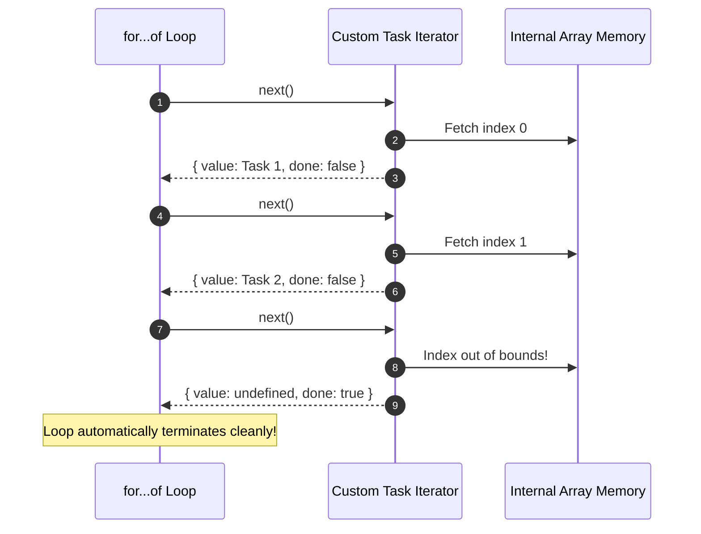

# Module 19: The Iterator Pattern — Traversals, ES6 Protocols, and Generator Integration

## Overview

The **Iterator Pattern** is a Behavioral design pattern that provides a standardized method to access elements of an aggregate collection sequentially without exposing its underlying internal structure (whether stored as an array, linked list, binary tree, or graph).

In JavaScript, the Iterator pattern is natively standardized into the language via the **ES6 Iterable Protocol (`Symbol.iterator`)** and the **ES6 Iterator Protocol (`{ value, done }`)**, powering `for...of` loops, spread syntax (`...`), `Array.from()`, and **Generator Functions (`function*`)**.

Understanding how to construct custom iterators and reverse/tree traversal strategies is essential.

---

## 1. ES6 Iterable & Iterator Protocol Architecture

```mermaid
flowchart LR
    Client["Client Code (for...of / Spread)"] -->|1. Calls [Symbol.iterator]()| Iterable["Custom Collection (Iterable)"]
    Iterable -->|2. Returns| IteratorObj["Iterator Object"]

    Client -->|3. Repeatedly calls next()| IteratorObj
    IteratorObj -- "4. Returns { value: X, done: false }" --> Client
    IteratorObj -- "5. Returns { value: undefined, done: true }" --> Client
```

---

## 2. ES6 Protocol Contracts Matrix

| Protocol Component | Required Method Signature | Expected Return Payload | Native Language Integration |
| :--- | :--- | :--- | :--- |
| **Iterable Protocol** | `[Symbol.iterator]()` | Returns an **Iterator Object** | Enables `for...of`, `[...iterable]`, `Promise.all()` |
| **Iterator Protocol** | `next(value?)` | Returns `{ value: any, done: boolean }` | Low-level step iteration pointer |
| **Generator Protocol** | `function* ()` + `yield` | Returns an **IterableIterator** object | Native coroutine state machine |

---

## 3. Code Showcase: Custom Collection with Range & Reverse Iterators

```javascript
// Custom Task Collection Class
class TaskListCollection {
  #tasks = [];

  addTask(title, priority) {
    this.#tasks.push({ id: this.#tasks.length + 1, title, priority });
  }

  // 1. Standard Forward Iterator (ES6 Iterable Protocol Compliance)
  [Symbol.iterator]() {
    let cursor = 0;
    const items = this.#tasks;

    return {
      next() {
        if (cursor < items.length) {
          return { value: items[cursor++], done: false };
        }
        return { value: undefined, done: true }; // Termination signal!
      }
    };
  }

  // 2. Custom Generator Iterator: Priority Filtered Traversal
  *getPriorityTasks(targetPriority) {
    for (const task of this.#tasks) {
      if (task.priority.toUpperCase() === targetPriority.toUpperCase()) {
        yield task; // Suspends execution and yields matching task!
      }
    }
  }

  // 3. Custom Generator Iterator: Reverse Chronological Traversal
  *reverseIterator() {
    for (let i = this.#tasks.length - 1; i >= 0; i--) {
      yield this.#tasks[i];
    }
  }
}

// Client Execution
const todoList = new TaskListCollection();
todoList.addTask("Fix production memory leak", "HIGH");
todoList.addTask("Update documentation", "LOW");
todoList.addTask("Patch API vulnerability", "HIGH");

// 1. Iterating using standard for...of loop
console.log("=== 1. STANDARD FOR...OF ITERATION ===");
for (const task of todoList) {
  console.log(`Task #${task.id}: ${task.title} [${task.priority}]`);
}

// 2. Iterating using Generator Priority Filter
console.log("\n=== 2. HIGH PRIORITY ONLY (GENERATOR) ===");
for (const highTask of todoList.getPriorityTasks("HIGH")) {
  console.log(`CRITICAL: ${highTask.title}`);
}

// 3. Iterating using Reverse Generator
console.log("\n=== 3. REVERSE TRAVERSAL ===");
for (const revTask of todoList.reverseIterator()) {
  console.log(`Reverse Task #${revTask.id}: ${revTask.title}`);
}
```

---

## 4. Iterator Execution State Machine Sequence



---

## Key Production Takeaways

1. **Implement `[Symbol.iterator]()` for Custom Collections**: Make custom data structures natively compatible with JavaScript `for...of` loops and spread syntax by implementing `[Symbol.iterator]()`.
2. **Use Generator Functions (`function*`) for Concise Iterators**: Prefer generator functions (`yield`) over manually writing `{ next() { ... } }` objects to reduce boilerplate and avoid cursor bugs.
3. **Decouple Data Structure from Traversal Logic**: Provide multiple iterator generator methods (e.g. `getDepthFirst()`, `getBreadthFirst()`) on complex tree collections.
4. **Never Expose Internal Storage Arrays Directly**: Use the Iterator pattern to let clients traverse private arrays without returning references to internal array instances.

