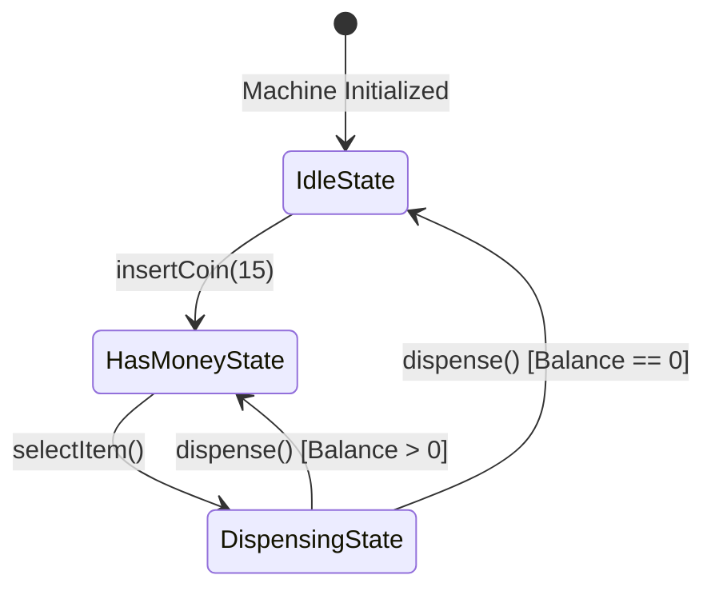

# File 20: The State Pattern

## Overview
The **State Pattern** allows an object to alter its behavior when its internal state changes. The object appears to change its class, delegating actions to discrete state objects instead of using large conditional branching logic.

---

## 1. Finite State Machine (FSM) State Diagram



---

## 2. Vending Machine State Implementation

```javascript
// State 1: Idle
class IdleState {
    constructor(machine) { this.machine = machine; }
    insertCoin(amount) {
        this.machine.balance += amount;
        console.log(`Inserted ₹${amount}. Balance: ₹${this.machine.balance}`);
        this.machine.setState(this.machine.hasMoneyState);
    }
    selectItem() { console.log("Please insert coins first."); }
}

// State 2: Has Money
class HasMoneyState {
    constructor(machine) { this.machine = machine; }
    insertCoin(amount) {
        this.machine.balance += amount;
        console.log(`Added ₹${amount}. Balance: ₹${this.machine.balance}`);
    }
    selectItem(item) {
        if (this.machine.balance >= item.price) {
            console.log(`Selected: ${item.name}`);
            this.machine.selectedItem = item;
            this.machine.setState(this.machine.dispensingState);
            this.machine.dispense();
        } else {
            console.log(`Insufficient balance for ${item.name}. Price: ₹${item.price}`);
        }
    }
}

// State 3: Dispensing
class DispensingState {
    constructor(machine) { this.machine = machine; }
    insertCoin() { console.log("Please wait, dispensing item..."); }
    selectItem() { console.log("Please wait, dispensing item..."); }
    dispense() {
        const item = this.machine.selectedItem;
        this.machine.balance -= item.price;
        console.log(`[DISPENSED] ${item.name}! Remaining balance: ₹${this.machine.balance}`);
        if (this.machine.balance > 0) {
            this.machine.setState(this.machine.hasMoneyState);
        } else {
            this.machine.setState(this.machine.idleState);
        }
    }
}

// Context Object
class BeverageVendingMachine {
    constructor() {
        this.balance = 0;
        this.selectedItem = null;
        this.idleState = new IdleState(this);
        this.hasMoneyState = new HasMoneyState(this);
        this.dispensingState = new DispensingState(this);
        this.state = this.idleState;
    }

    setState(newState) { this.state = newState; }
    insertCoin(amount) { this.state.insertCoin(amount); }
    selectItem(item) { this.state.selectItem(item); }
    dispense() { this.state.dispense(); }
}

const machine = new BeverageVendingMachine();
const masalaTea = { name: "Masala Tea", price: 15 };

machine.selectItem(masalaTea); // "Please insert coins first."
machine.insertCoin(20);        // Inserted ₹20 -> Transitions to HasMoneyState
machine.selectItem(masalaTea); // Dispensed Masala Tea! Remaining: ₹5
```

---

## Key Takeaways
1. Encapsulates state-specific behaviors inside **separate State classes**.
2. Eliminates nested `if (state === 'IDLE') ... else if ...` conditional chains.
3. Forms the foundation of **Finite State Machines (FSM)** and UI state libraries (XState, Redux useReducer).
