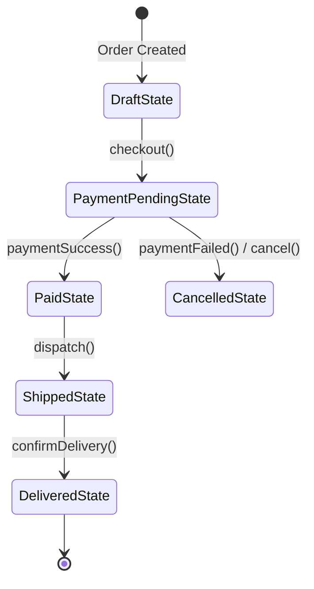
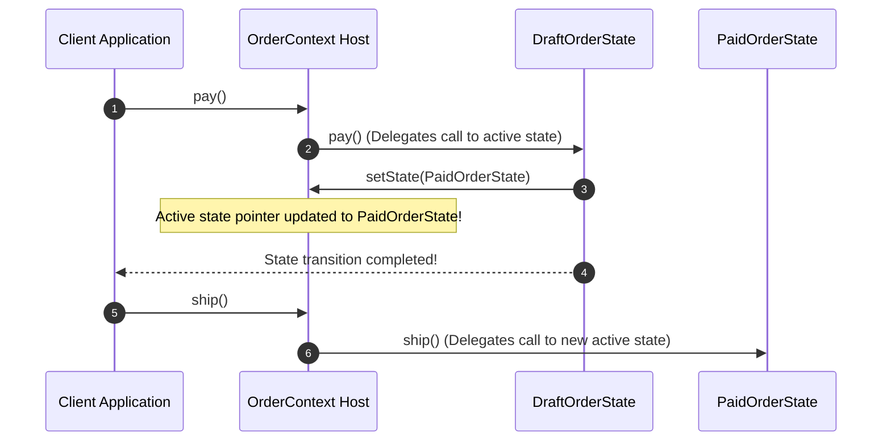

# Module 20: The State Pattern — Finite State Machines (FSM), State Transitions, and Encapsulated Behavior

## Overview

The **State Pattern** is a Behavioral design pattern that enables an object to alter its behavior when its internal state changes. To external clients, the object appears to dynamically change its class.

Without the State pattern, state-dependent applications (e.g. Order Processing Pipelines, Vending Machines, UI Form Wizards, or Media Players) become cluttered with massive conditional branching (`if (state === 'PAID') ... else if (state === 'SHIPPED') ...`), violating SOLID's **Single Responsibility Principle**.

The State pattern organizes state-specific logic into discrete **State Classes** that trigger state transitions on the host **Context Object**.

---

## 1. Finite State Machine (FSM) Transition Diagram



---

## 2. State vs. Strategy Comparison Matrix

| Dimension | State Pattern (GoF) | Strategy Pattern (GoF) |
| :--- | :--- | :--- |
| **Architectural Intent** | Change object behavior automatically as internal state transitions | Provide interchangeable algorithms to execute a specific task |
| **State Awareness** | **High** (State classes are aware of next states and trigger transitions) | **Low** (Strategies are independent and unaware of each other) |
| **Transition Control** | Driven internally by State objects or Context events | Driven externally by Client code explicitly setting a new strategy |
| **Example Use Case** | Order Lifecycle (`Draft` $\to$ `Paid` $\to$ `Shipped`) | Payment Gateways (`UPI`, `CreditCard`, `NetBanking`) |

---

## 3. Code Showcase: E-Commerce Order Lifecycle State Machine

```javascript
// 1. Base Abstract State Class
class OrderState {
  constructor(orderContext) {
    this.order = orderContext;
  }

  pay() { console.log(`[OrderState]: Action 'pay()' invalid in state '${this.constructor.name}'.`); }
  ship() { console.log(`[OrderState]: Action 'ship()' invalid in state '${this.constructor.name}'.`); }
  deliver() { console.log(`[OrderState]: Action 'deliver()' invalid in state '${this.constructor.name}'.`); }
  cancel() { console.log(`[OrderState]: Action 'cancel()' invalid in state '${this.constructor.name}'.`); }
}

// 2. Concrete State 1: Draft State
class DraftOrderState extends OrderState {
  pay() {
    console.log("[DraftState]: Payment received. Transitioning to PaidState...");
    this.order.setState(this.order.paidState);
  }

  cancel() {
    console.log("[DraftState]: Draft order cancelled. Transitioning to CancelledState...");
    this.order.setState(this.order.cancelledState);
  }
}

// 3. Concrete State 2: Paid State
class PaidOrderState extends OrderState {
  ship() {
    console.log("[PaidState]: Order packaged & handed to courier. Transitioning to ShippedState...");
    this.order.setState(this.order.shippedState);
  }

  cancel() {
    console.log("[PaidState]: Order cancelled before shipping. Initiating refund & transitioning to CancelledState...");
    this.order.setState(this.order.cancelledState);
  }
}

// 4. Concrete State 3: Shipped State
class ShippedOrderState extends OrderState {
  deliver() {
    console.log("[ShippedOrderState]: Package delivered to customer. Transitioning to DeliveredState...");
    this.order.setState(this.order.deliveredState);
  }
  // Cannot cancel once shipped!
}

// 5. Concrete State 4: Terminal States
class DeliveredOrderState extends OrderState {}
class CancelledOrderState extends OrderState {}

// 6. Context Host Class
class OrderContext {
  constructor(orderId) {
    this.orderId = orderId;
    
    // Pre-allocate State Instances linked to this context
    this.draftState = new DraftOrderState(this);
    this.paidState = new PaidOrderState(this);
    this.shippedState = new ShippedOrderState(this);
    this.deliveredState = new DeliveredOrderState(this);
    this.cancelledState = new CancelledOrderState(this);

    this.currentState = this.draftState; // Initial State
  }

  setState(newState) {
    console.log(`[OrderContext:${this.orderId}]: State transitioned: ${this.currentState.constructor.name} -> ${newState.constructor.name}`);
    this.currentState = newState;
  }

  // Delegate actions transparently to active state object!
  pay() { this.currentState.pay(); }
  ship() { this.currentState.ship(); }
  deliver() { this.currentState.deliver(); }
  cancel() { this.currentState.cancel(); }
}

// Execution Sequence Simulation
const order = new OrderContext("ORD-99810");

order.ship();   // Invalid action in DraftState!
order.pay();    // Transitions: DraftState -> PaidState
order.ship();   // Transitions: PaidState -> ShippedState
order.cancel(); // Invalid action once shipped!
order.deliver();// Transitions: ShippedState -> DeliveredState
```

---

## 4. State Transition Execution Sequence



---

## Key Production Takeaways

1. **Eliminate State Conditional Branching**: Use the State pattern when an object's behavior depends heavily on its state, replacing `if/else` checks with discrete state classes.
2. **Encapsulate State-Specific Invariants**: State classes prevent executing invalid operations (e.g. attempting to ship an order before payment).
3. **Control Transitions inside State Classes**: Allow state classes to manage transition triggers (`context.setState(...)`) to keep transition rules close to relevant state logic.
4. **Forms Foundation for FSM Libraries**: Understanding the State pattern simplifies using formal Finite State Machine (FSM) engines like XState in complex Web applications.

