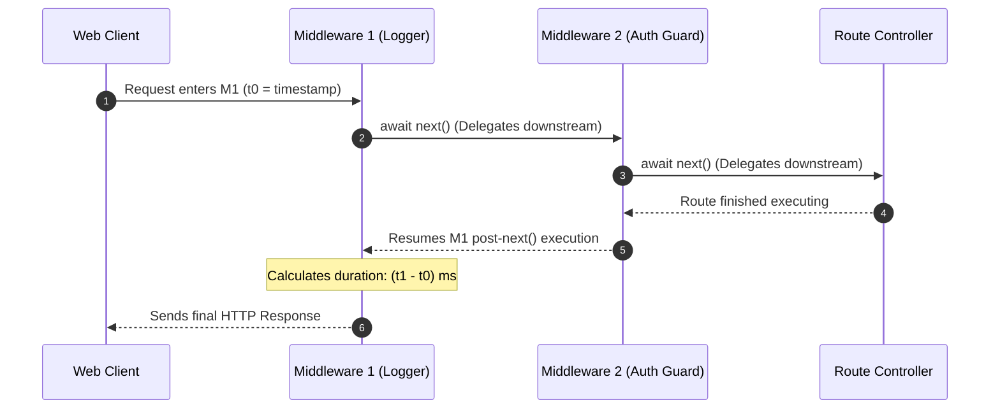

# Module 21: The Chain of Responsibility Pattern — Middleware Pipelines, Onion Architecture, and Request Interception

## Overview

The **Chain of Responsibility Pattern** is a Behavioral design pattern that passes a request along a chain of potential handler objects. Upon receiving a request, each handler decides either to **process the request**, **transform the payload**, **short-circuit the chain early**, or **pass execution to the next handler** in the sequence.

In JavaScript & Node.js, the Chain of Responsibility pattern is the foundational architecture powering **Express.js Middleware Chains**, **Koa.js Onion Pipelines**, and **Axios HTTP Request/Response Interceptors**.

Understanding sequential middleware chains, **Koa-style Onion (`async next()`) execution**, and short-circuiting error handlers is essential.

---

## 1. Chain Architecture & Sequential Execution

```mermaid
flowchart LR
    Request[HTTP Request Payload] --> Handler1["AuthMiddleware<br/>(Validates Token)"]
    Handler1 -->|next()| Handler2["RateLimitMiddleware<br/>(Check IP Quota)"]
    Handler2 -->|next()| Handler3["ValidationMiddleware<br/>(Sanitize Body)"]
    Handler3 -->|next()| RouteHandler["Controller Route Handler<br/>(Executes Business Logic)"]

    Handler1 -.->|Token Missing!| ShortCircuit["Short-Circuit Early!<br/>(Return 401 Unauthorized)"]

    style Handler1 fill:#dbeafe,stroke:#1d4ed8
    style ShortCircuit fill:#fee2e2,stroke:#dc2626
```

---

## 2. Express Sequential vs. Koa Onion Execution Matrix

| Dimension | Express Sequential Chain | Koa Onion Middleware (`async/await`) |
| :--- | :--- | :--- |
| **Execution Flow** | Linear top-to-bottom sequential passing | **Onion Model** (Downstream request pass $\to$ Upstream response rewind) |
| **`next()` Signature** | `next(err?)` passes control to next handler | `await next()` waits for downstream handlers to complete |
| **Response Post-Processing** | Requires hooking response write methods | Performed directly after `await next()` line |

---

## 3. Code Showcase: Express-Style & Async Koa-Style Pipeline

```javascript
// 1. Express-Style Sequential Chain of Responsibility Engine
class SequentialPipeline {
  #middlewares = [];

  use(middlewareFn) {
    if (typeof middlewareFn !== "function") {
      throw new TypeError("Middleware must be a function");
    }
    this.#middlewares.push(middlewareFn);
    return this; // Method chaining!
  }

  execute(requestContext) {
    let index = 0;

    const next = (err) => {
      // 1. Error Handler Short-Circuit Guard
      if (err) {
        console.error(`[PIPELINE ABORTED]: Chain stopped early by error: ${err.message}`);
        requestContext.error = err;
        return;
      }

      // 2. Process Next Handler in Chain
      if (index < this.#middlewares.length) {
        const currentMiddleware = this.#middlewares[index++];
        try {
          currentMiddleware(requestContext, next);
        } catch (catastrophicErr) {
          next(catastrophicErr); // Forward synchronous exceptions to next error handler
        }
      }
    };

    next(); // Initiate pipeline processing!
  }
}

// Client Execution: Sequential Web Pipeline
const app = new SequentialPipeline();

// Middleware 1: Logging Handler
app.use((req, next) => {
  console.log(`[LOG - 1]: Incoming ${req.method} request to URL '${req.url}'`);
  next();
});

// Middleware 2: Authentication Guard Handler
app.use((req, next) => {
  if (!req.headers || !req.headers.authorization) {
    return next(new Error("401 Unauthorized: Authorization header missing"));
  }
  req.user = { id: "USER-9001", role: "ADMIN" };
  console.log(`[AUTH - 2]: User authenticated as '${req.user.id}'`);
  next();
});

// Middleware 3: Final Controller Route Handler
app.use((req, next) => {
  console.log(`[CONTROLLER - 3]: Processing data payload for user ${req.user.id}...`);
  req.response = { status: 200, body: "Protected Dashboard Data" };
});

// Valid Execution Pass:
console.log("=== EXECUTION PASS 1: VALID AUTH ===");
app.execute({ method: "GET", url: "/api/dashboard", headers: { authorization: "Bearer TOKEN_SECURE" } });

// Short-Circuit Execution Pass:
console.log("\n=== EXECUTION PASS 2: MISSING AUTH ===");
app.execute({ method: "GET", url: "/api/dashboard", headers: {} });
```

---

## 4. Koa Async Onion Execution Diagram

In Koa's **Onion Architecture**, calling `await next()` pauses execution, delegates down the chain, and then resumes execution back UP the chain to allow response timing/logging:



---

## Key Production Takeaways

1. **Use Chain of Responsibility for Step-by-Step Processing**: Use middleware chains when requests must pass through independent processing steps (Authentication, Authorization, Rate Limiting, Input Sanitization).
2. **Support Early Short-Circuiting**: Ensure handlers can halt pipeline processing immediately (e.g. returning an authentication error) without invoking remaining handlers.
3. **Use `await next()` for Response Rewinding**: Implement Koa-style onion middleware (`await next()`) when upstream middleware needs to inspect or measure downstream execution timing.
4. **Isolate Handler Errors**: Wrap middleware invocations in `try...catch` blocks to capture unexpected runtime errors and pass them safely to error handling middleware.

