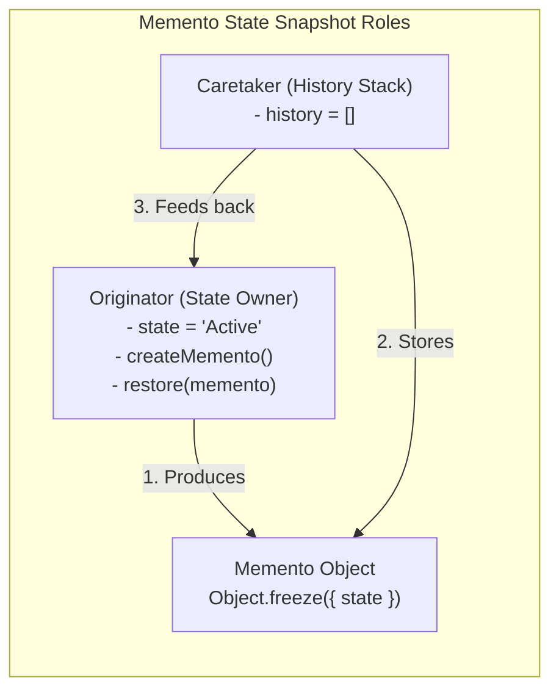
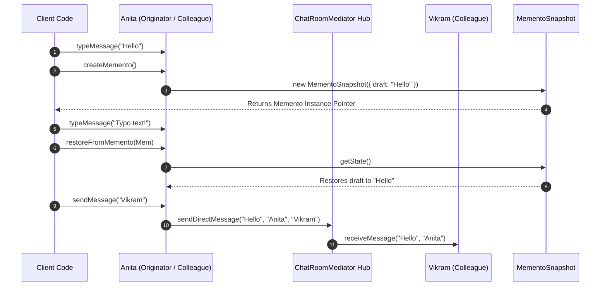

# Module 22: Mediator & Memento Patterns — Centralized Coordination and Encapsulated State Snapshots

## Overview

This module covers two complementary Behavioral design patterns:
1. **The Mediator Pattern**: Centralizes complex communication between multiple peer objects (**Colleagues**), replacing $N:M$ direct mesh dependencies with a single $1:N$ central hub.
2. **The Memento Pattern**: Captures and externalizes an object's internal state snapshot without violating encapsulation, allowing the object (**Originator**) to be restored to a previous state later.

Understanding **Chat Room Mediators**, **Air Traffic Controllers**, and **Immutable Memento Snapshots** is essential.

---

## 1. Architectural Overview Diagrams

```mermaid
flowchart TD
    subgraph Mesh Dependencies Without Mediator (BAD: N x M Chaos)
        Col1[Colleague A] <--> Col2[Colleague B]
        Col2 <--> Col3[Colleague C]
        Col3 <--> Col1
        Col1 <--> Col4[Colleague D]
    end

    subgraph Centralized Hub With Mediator (GOOD: Clean 1:N Hub)
        UserA[Colleague A] <--> Hub["Central Mediator Hub"]
        UserB[Colleague B] <--> Hub
        UserC[Colleague C] <--> Hub
    end
```



---

## 2. Mediator vs. Observer vs. Facade Comparison Matrix

| Pattern Name | Architectural Goal | Communication Direction | Encapsulation & Role |
| :--- | :--- | :--- | :--- |
| **Mediator Pattern** | Centralizes communication between peer objects | **Bidirectional** (Colleague $\leftrightarrow$ Mediator) | Prevents tight mesh coupling between peers |
| **Observer Pattern** | Notifies subscribers when state mutates | **Unidirectional** (Subject $\to$ Observers) | 1-to-N event broadcasting |
| **Facade Pattern** | Simplifies complex multi-class subsystems | **Unidirectional** (Client $\to$ Facade $\to$ Subsystem) | Unified entry point over subsystem |

---

## 3. Code Showcase: Combined Chat Mediator & Text Memento Snapshot

```javascript
// 1. MEMENTO PATTERN: Immutable State Snapshot Contract
class MementoSnapshot {
  #state;
  #timestamp;

  constructor(stateData) {
    this.#state = structuredClone(stateData); // Deep copy snapshot state!
    this.#timestamp = new Date().toISOString();
    Object.freeze(this); // Guarantee absolute immutability!
  }

  getState() {
    return this.#state;
  }

  get timestamp() {
    return this.#timestamp;
  }
}

// 2. MEDIATOR PATTERN: Centralized Chat Room Hub
class ChatRoomMediator {
  #colleagues = new Map();

  registerColleague(user) {
    this.#colleagues.set(user.name, user);
    user.setMediator(this);
    console.log(`[ChatRoomMediator]: Registered '${user.name}' to chat session.`);
  }

  sendDirectMessage(message, senderName, recipientName) {
    const recipient = this.#colleagues.get(recipientName);
    if (!recipient) {
      console.warn(`[ChatRoomMediator]: Delivery failed. User '${recipientName}' not found.`);
      return false;
    }
    recipient.receiveMessage(message, senderName);
    return true;
  }
}

// 3. ORIGINATOR & COLLEAGUE CLASS: Chat Participant
class ChatParticipant {
  #draftMessage = "";

  constructor(name) {
    this.name = name;
    this.mediator = null;
  }

  setMediator(mediator) {
    this.mediator = mediator;
  }

  typeMessage(text) {
    this.#draftMessage = text;
  }

  sendMessage(recipientName) {
    if (!this.mediator) throw new Error("Participant has no registered mediator hub.");
    console.log(`[${this.name}]: Sending message to '${recipientName}'...`);
    this.mediator.sendDirectMessage(this.#draftMessage, this.name, recipientName);
  }

  receiveMessage(message, senderName) {
    console.log(`[${this.name}'s Screen]: From ${senderName}: "${message}"`);
  }

  // MEMENTO PATTERN METHODS: Create & Restore Snapshots!
  createMemento() {
    console.log(`[${this.name}]: Saved Memento snapshot: "${this.#draftMessage}"`);
    return new MementoSnapshot({ draft: this.#draftMessage });
  }

  restoreFromMemento(memento) {
    if (!(memento instanceof MementoSnapshot)) {
      throw new TypeError("Invalid Memento snapshot instance");
    }
    const restored = memento.getState();
    this.#draftMessage = restored.draft;
    console.log(`[${this.name}]: Restored draft state to: "${this.#draftMessage}" at ${memento.timestamp}`);
  }

  get draft() {
    return this.#draftMessage;
  }
}

// Execution Demonstration
const mediatorHub = new ChatRoomMediator();

const participantA = new ChatParticipant("Anita");
const participantB = new ChatParticipant("Vikram");

mediatorHub.registerColleague(participantA);
mediatorHub.registerColleague(participantB);

// 1. Participant A types message & saves Memento snapshot
participantA.typeMessage("Version 1: Meeting at 3 PM");
const savedDraftMemento = participantA.createMemento(); // Saved Memento #1

// 2. Participant A modifies draft accidentally
participantA.typeMessage("Version 2: Accidental typo text!!!");

// 3. Participant A restores draft state from Memento
participantA.restoreFromMemento(savedDraftMemento);

// 4. Participant A sends restored draft via Mediator Hub
participantA.sendMessage("Vikram");
```

---

## 4. Combined Execution Sequence



---

## Key Production Takeaways

1. **Use Mediator to Eliminate Mesh Dependencies**: Implement a Mediator when multiple peer objects communicate in a complex many-to-many web, simplifying dependencies to a $1:N$ central hub.
2. **Use Memento for Immutable State Checkpoints**: Implement Memento when an application requires snapshot, undo, or rollback checkpoints without exposing private instance fields to the caretaker.
3. **Freeze Memento Instances**: Call `Object.freeze(this)` inside the Memento constructor to guarantee snapshots cannot be mutated after creation.
4. **Decouple Originator from Caretaker**: Ensure the Caretaker (history manager) simply holds Memento object references without inspecting or modifying their internal snapshot payload.

