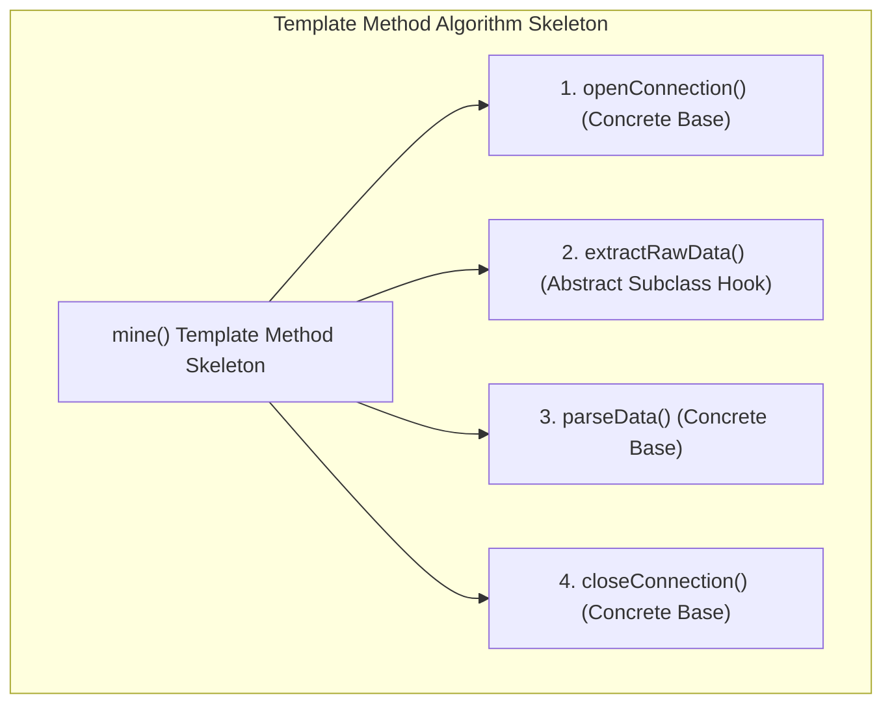
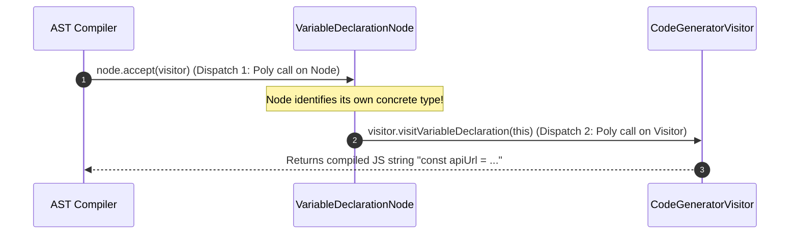

# Module 23: Template Method & Visitor Patterns — Invariant Workflow Skeletons and Double Dispatch AST Traversal

## Overview

This module explores two advanced Behavioral design patterns:
1. **The Template Method Pattern**: Defines the invariant skeleton of an algorithm in a base class method, allowing subclasses to override specific step hooks without modifying the overall execution structure.
2. **The Visitor Pattern**: Enables adding new operational algorithms to complex object hierarchies (e.g., AST syntax trees or complex document structures) without altering the target element classes, using **Double Dispatch (`accept(visitor)`)**.

Understanding **Data Processing Pipelines**, **Babel/ESLint AST Visitors**, and **Double Dispatch** is essential.

---

## 1. Architectural Workflow & Double Dispatch Diagrams



```mermaid
flowchart LR
    subgraph Visitor Pattern Double Dispatch
        Element["Element (Node)<br/>+ accept(visitor)"] -->|1. Invokes accept(v)| Visitor["Visitor Subclass<br/>+ visitElementA(node)<br/>+ visitElementB(node)"]
        Visitor -->|2. Double Dispatch Call| Element
    end
```

---

## 2. Behavioral Patterns Comparison Matrix

| Pattern Name | Architectural Intent | Modification Strategy | Primary Use Case |
| :--- | :--- | :--- | :--- |
| **Template Method** | Fixes algorithm skeleton in base class; subclasses override step hooks | **Subclassing / Polymorphism** | Invariant workflows (ETL pipelines, data mineworks) |
| **Visitor Pattern** | Adds new operations to existing class hierarchies without mutating them | **Double Dispatch Composition** | AST parsers (Babel, ESLint), Compiler code generators |
| **Strategy Pattern** | Encapsulates entire interchangeable algorithms | **Composition Interface** | Swapping algorithms dynamically at runtime |

---

## 3. Code Showcase: Data Mining Template Method & AST Node Visitor

```javascript
// ==========================================
// 1. TEMPLATE METHOD PATTERN IMPLEMENTATION
// ==========================================
class AbstractDataMiner {
  // Skeleton Template Method: Controls exact step execution order!
  mineData(filePath) {
    console.log(`\n[DataMiner]: Starting data mining pipeline for '${filePath}'...`);
    this.openFile(filePath);
    const rawContent = this.extractRawData(); // Step Hook (Subclass Override!)
    const parsedData = this.parseRawData(rawContent);
    this.closeFile(filePath);
    console.log("[DataMiner]: Mining pipeline complete.");
    return parsedData;
  }

  // Base Concrete Steps
  openFile(filePath) {
    console.log(`  -> [Step 1]: File handle opened for '${filePath}'.`);
  }
  closeFile(filePath) {
    console.log(`  -> [Step 4]: File handle closed for '${filePath}'.`);
  }
  parseRawData(rawText) {
    console.log("  -> [Step 3]: Parsing raw content into JSON structure.");
    return { payload: rawText.trim().toUpperCase() };
  }

  // Abstract Step Hook (MUST be overridden by subclasses!)
  extractRawData() {
    throw new Error("Subclasses must implement abstract method 'extractRawData()'");
  }
}

class CSVDataMiner extends AbstractDataMiner {
  extractRawData() {
    console.log("  -> [Step 2 (CSV Hook)]: Extracting comma-separated values...");
    return "id,name,role\n101,Anita,Engineer";
  }
}

// Client Execution: Template Method
const csvMiner = new CSVDataMiner();
const result = csvMiner.mineData("/var/data/users.csv");
console.log("Mined Output:", result);
```

```javascript
// ==========================================
// 2. VISITOR PATTERN IMPLEMENTATION (Double Dispatch AST Engine)
// ==========================================

// Element Class A: Variable Declaration AST Node
class VariableDeclarationNode {
  constructor(varName, varValue) {
    this.varName = varName;
    this.varValue = varValue;
  }

  // DOUBLE DISPATCH STEP 1: Accepts Visitor and passes self ('this')
  accept(visitor) {
    return visitor.visitVariableDeclaration(this);
  }
}

// Element Class B: Function Declaration AST Node
class FunctionDeclarationNode {
  constructor(fnName, params) {
    this.fnName = fnName;
    this.params = params;
  }

  accept(visitor) {
    return visitor.visitFunctionDeclaration(this);
  }
}

// Visitor Interface 1: Code Generator Visitor (Compiles AST to JS String)
class CodeGeneratorVisitor {
  visitVariableDeclaration(node) {
    return `const ${node.varName} = ${JSON.stringify(node.varValue)};`;
  }
  visitFunctionDeclaration(node) {
    return `function ${node.fnName}(${node.params.join(", ")}) { /* body */ }`;
  }
}

// Visitor Interface 2: Type Checker Visitor (Calculates Static Metrics)
class TypeCheckerVisitor {
  visitVariableDeclaration(node) {
    console.log(`[TypeChecker]: Inspected variable declaration '${node.varName}' (Type: ${typeof node.varValue}).`);
    return true;
  }
  visitFunctionDeclaration(node) {
    console.log(`[TypeChecker]: Inspected function '${node.fnName}' with ${node.params.length} param(s).`);
    return true;
  }
}

// AST Tree Nodes Collection
const astNodes = [
  new VariableDeclarationNode("apiUrl", "https://api.domain.com/v1"),
  new FunctionDeclarationNode("fetchUserData", ["userId", "authToken"])
];

// Instantiating Visitors
const codeGenVisitor = new CodeGeneratorVisitor();
const typeCheckVisitor = new TypeCheckerVisitor();

console.log("\n=== VISITOR 1: TYPE CHECKER PASS ===");
astNodes.forEach((node) => node.accept(typeCheckVisitor));

console.log("\n=== VISITOR 2: CODE GENERATOR PASS ===");
astNodes.forEach((node) => {
  console.log(node.accept(codeGenVisitor));
});
```

---

## 4. Visitor Double Dispatch Sequence Diagram



---

## Key Production Takeaways

1. **Use Template Method for Invariant Algorithms**: Implement a Template Method when the overall steps of an algorithm are fixed, but individual steps differ across formats (e.g., CSV, PDF, XML mineworkers).
2. **Use Visitor to Extend Complex Data Hierarchies**: Use Visitor when you need to add operations to a complex object tree (such as AST nodes, document DOMs, or composite UI structures) without modifying element classes.
3. **Understand Double Dispatch**: Double dispatch ensures the correct operation is called based on both the type of the element (`Node`) and the type of the visitor (`Visitor`).
4. **Beware of Class Hierarchy Changes**: If element node classes change frequently, adding new element classes requires updating every Visitor interface subclass.

