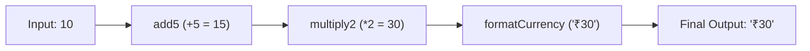

# File 24: Function Composition and Currying

## Overview
- **Function Composition** is the process of combining two or more functions to produce a new function (`pipe` or `compose`).
- **Currying** is a functional technique that transforms a function taking multiple arguments into a sequence of functions that each take a single argument.

---

## 1. Composition Pipeline Architecture



---

## 2. Currying & Composition Implementation

```javascript
// 1. Currying Utility
function curry(fn) {
    return function curried(...args) {
        if (args.length >= fn.length) {
            return fn.apply(this, args);
        } else {
            return function(...nextArgs) {
                return curried.apply(this, args.concat(nextArgs));
            };
        }
    };
}

const multiply = (a, b, c) => a * b * c;
const curriedMultiply = curry(multiply);

console.log(curriedMultiply(2)(3)(4)); // 24
console.log(curriedMultiply(2, 3)(4)); // 24

// 2. Composition (pipe: left-to-right execution)
const pipe = (...fns) => initialValue => fns.reduce((acc, fn) => fn(acc), initialValue);

const add5 = x => x + 5;
const double = x => x * 2;
const formatCurrency = x => `₹${x}`;

const calculateTotal = pipe(add5, double, formatCurrency);

console.log(calculateTotal(10)); // (10 + 5) * 2 -> "₹30"
```

---

## Key Takeaways
1. **Currying** enables partial application and function reusability.
2. **Function Composition (`pipe`)** builds modular, readable data transformation pipelines without temporary variables.
3. Forms the backbone of functional programming architectures (Ramda, Lodash/fp, Redux `compose`).
