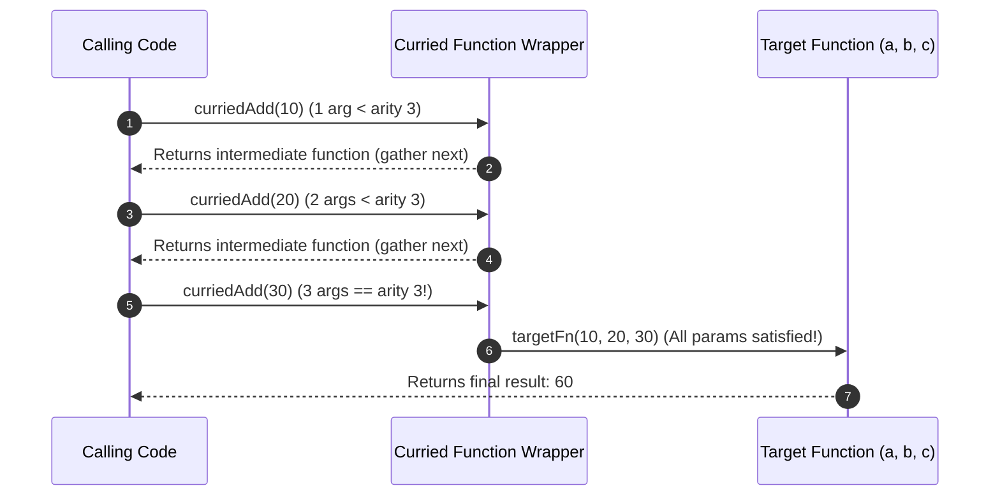

# Module 24: Function Composition & Currying — Pipe Pipelines, Partial Application, and Point-Free Idioms

## Overview

**Function Composition** and **Currying** are core Functional Programming (FP) paradigms used to build modular, declarative data transformation pipelines in JavaScript.

- **Function Composition**: Combines two or more pure functions into a single composite function. Execution flow can be left-to-right (**`pipe`**) or right-to-left (**`compose`**).
- **Currying**: Transforms a multi-argument function into a sequence of unary functions that each take a single argument until all parameters are satisfied (based on function arity `fn.length`).

Understanding **Partial Application**, **Point-Free Programming**, and functional libraries (Redux `compose`, Lodash/fp) is essential.

---

## 1. Pipe vs. Compose Pipeline Architecture

```mermaid
flowchart LR
    subgraph Pipe Pipeline (Left-to-Right Execution)
        InputPipe[Input Data: 10] --> P1["trimString"]
        P1 --> P2["toLowerCase"]
        P2 --> P3["addPrefix ('usr_')"]
        P3 --> OutputPipe["Result: 'usr_anita'"]
    end
```

```mermaid
flowchart RL
    subgraph Compose Pipeline (Right-to-Left Mathematical Order)
        OutputComp["Result: 'usr_anita'"] <-- C3["addPrefix"]
        C3 <-- C2["toLowerCase"]
        C2 <-- C1["trimString"]
        C1 <-- InputComp["Input Data: 10"]
    end
```

---

## 2. FP Core Concepts Comparison Matrix

| Functional Concept | Definition | Primary Architectural Benefit | Example Code |
| :--- | :--- | :--- | :--- |
| **`pipe(...fns)`** | Combines functions for **Left-to-Right** evaluation | Intuitive, readable step-by-step data transformations | `pipe(sanitize, validate, save)(data)` |
| **`compose(...fns)`** | Combines functions for **Right-to-Left** evaluation | Aligns with mathematical function composition $(f \circ g)(x)$ | `compose(save, validate, sanitize)(data)` |
| **Currying** | Converts $N$-arity function to $N$ nested 1-arity functions | High function reuse via partial argument binding | `curry(add)(5)(10)` |
| **Partial Application** | Pre-binds a subset of arguments to a function | Pre-configures utilities with default arguments | `const add5 = add.bind(null, 5)` |
| **Point-Free Style** | Writing functions without explicitly naming input parameters | Eliminates redundant parameter boilerplate | `const process = pipe(trim, toLower);` |

---

## 3. Code Showcase: Currying Polyfill & Functional Data Pipeline

```javascript
// 1. Universal Currying Utility (Resolves Function Arity via fn.length)
function curry(targetFn) {
  return function curried(...accumulatedArgs) {
    // If accumulated arguments satisfy target function's declared arity (fn.length):
    if (accumulatedArgs.length >= targetFn.length) {
      return targetFn.apply(this, accumulatedArgs);
    } else {
      // Otherwise return nested unary function to gather remaining arguments:
      return function (...nextArgs) {
        return curried.apply(this, accumulatedArgs.concat(nextArgs));
      };
    }
  };
}

// 2. Left-to-Right Pipe Utility
const pipe = (...fns) => (initialValue) => 
  fns.reduce((currentVal, currentFn) => currentFn(currentVal), initialValue);

// 3. Pure Unary Helper Functions
const trimText = (str) => str.trim();
const toLowerCaseText = (str) => str.toLowerCase();
const removeSpecialChars = (str) => str.replace(/[^a-zA-Z0-9\s]/g, "");

// Curried Helper: Prefixing string
const prefixWith = curry((prefix, str) => `${prefix}_${str}`);

// Curried Helper: Tax Calculation
const calculateTax = curry((taxRate, price) => price + price * taxRate);
const applyGst18 = calculateTax(0.18); // Partial application!

// 4. Point-Free Pipeline Assembly
const generateUsername = pipe(
  trimText,
  toLowerCaseText,
  removeSpecialChars,
  prefixWith("usr") // Curried function invocation returning 1-arity function!
);

// Execution Demonstration
console.log("=== 1. POINT-FREE PIPELINE EXECUTION ===");
const rawInput = "   Anita_Sharma!99   ";
const formattedUsername = generateUsername(rawInput);
console.log("Formatted Username:", formattedUsername); // Output: "usr_anitasharma99"

console.log("\n=== 2. CURRIED TAX CALCULATION ===");
console.log("Base Price 1000 + 18% GST:", applyGst18(1000)); // Output: 1180
console.log("Base Price 2500 + 18% GST:", applyGst18(2500)); // Output: 2950
```

---

## 4. Currying Arity Resolution Stack



---

## Key Production Takeaways

1. **Use `pipe()` for Clean Data Transformations**: Prefer `pipe(fn1, fn2, fn3)` over deeply nested function calls (`fn3(fn2(fn1(x)))`) to improve code readability.
2. **Leverage Currying for Pre-configured Utilities**: Use curried functions to create reusable specialized utilities (e.g. `const logError = log("ERROR")`) via partial application.
3. **Adopt Point-Free Style Moderately**: Omit explicit input arguments when composing functions (`const process = pipe(...)`), but ensure variable names remain clear if complexity grows.
4. **Be Mindful of Function Arity (`fn.length`)**: Remember that native JS functions with default parameters (`(a = 1, b) => ...`) or rest parameters (`(...args) => ...`) have `fn.length === 0`, requiring explicit arity specifications in currying utilities.

