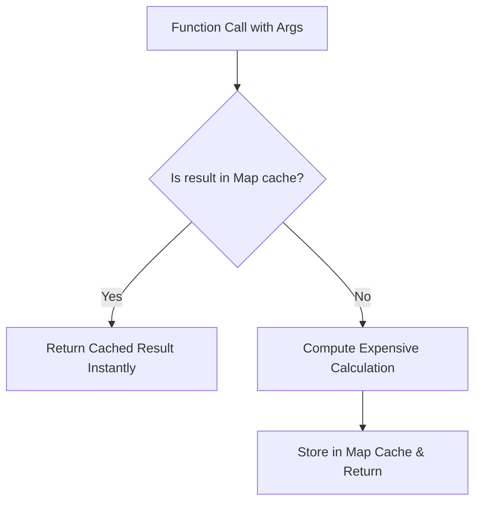

# File 25: Memoization and Lazy Evaluation Patterns

## Overview
- **Memoization** is an optimization technique that speeds up execution by caching the results of expensive function calls and returning the cached result when identical inputs occur.
- **Lazy Evaluation** delays the calculation of a value until the exact moment it is explicitly needed.

---

## 1. Memoization & Lazy Loading Flow



---

## 2. Memoization Decorator & Lazy Value Evaluator

```javascript
// 1. Generic Memoization Decorator
function memoize(fn) {
    const cache = new Map();
    return function (...args) {
        const key = JSON.stringify(args);
        if (cache.has(key)) {
            console.log(`[CACHE HIT] Returning cached result for args: ${key}`);
            return cache.get(key);
        }
        console.log(`[COMPUTING] Calculating expensive result for args: ${key}`);
        const result = fn.apply(this, args);
        cache.set(key, result);
        return result;
    };
}

const expensiveFibonacci = memoize(function fib(n) {
    if (n <= 1) return n;
    return fib(n - 1) + fib(n - 2);
});

console.log(expensiveFibonacci(10)); // Computes
console.log(expensiveFibonacci(10)); // Returns from Cache instantly!

// 2. Lazy Evaluation Container
class LazyValue {
    constructor(initializerFn) {
        this.initializerFn = initializerFn;
        this.value = null;
        this.isEvaluated = false;
    }

    get() {
        if (!this.isEvaluated) {
            console.log("[LAZY EVALUATION] Initializing heavy object on demand...");
            this.value = this.initializerFn();
            this.isEvaluated = true;
        }
        return this.value;
    }
}

const heavyDbConnection = new LazyValue(() => {
    return { status: "CONNECTED", pool: [1, 2, 3, 4, 5] };
});

// Db connection is NOT created yet!
console.log("App initialized.");

// Evaluated only when get() is explicitly called
console.log(heavyDbConnection.get().status);
```

---

## Key Takeaways
1. **Memoization** caches expensive pure function evaluations by argument keys.
2. **Lazy Evaluation** defers heavy computation/resource loading until explicitly requested.
3. Protects application startup performance and optimizes recursive/repetitive algorithms.
