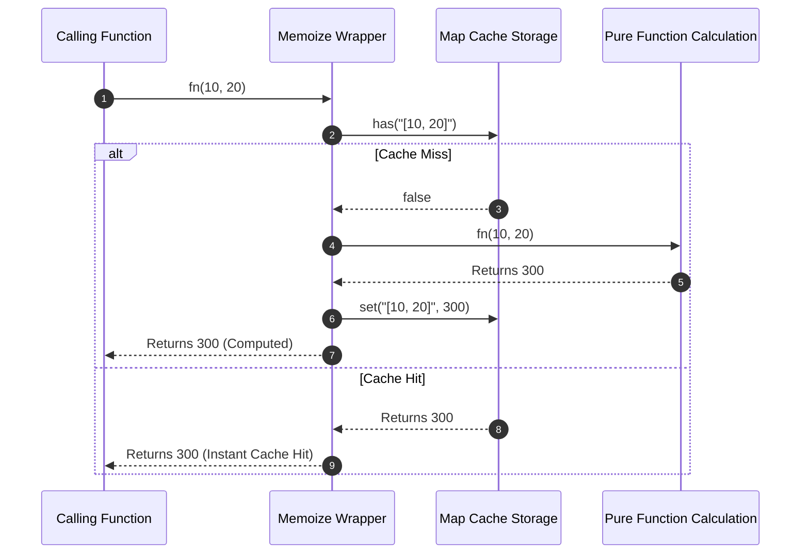

# Module 25: Memoization & Lazy Evaluation — Pure Function Caching, WeakMaps, and Deferred Execution

## Overview

**Memoization** and **Lazy Evaluation** are performance optimization patterns that prevent unnecessary CPU computation and defer memory allocations.

- **Memoization**: An optimization technique that caches the return values of **Pure Functions** based on their input parameters. Subsequent calls with identical arguments return the cached result instantly in $\mathcal{O}(1)$ time.
- **Lazy Evaluation**: Defers heavy resource loading or expensive mathematical computation until the exact millisecond the value is explicitly accessed.

Understanding **Cache Key Serialization**, **`WeakMap` Garbage Collection Caching**, **LRU Eviction**, and **Lazy Property Getters** is essential.

---

## 1. Evaluation Strategies Architectural Matrix

```mermaid
flowchart TD
    subgraph Eager Evaluation (Default JS)
        EagerInit["Application Startup"] -->|Immediately Allocates| Heavy1["Allocate 500MB DB Pool (Unused!)"]
    end

    subgraph Lazy Evaluation (On-Demand)
        LazyInit["Application Startup"] -->|Defers Allocation| TargetPoint["Client Calls lazyDb.get()"]
        TargetPoint -->|Allocates On Demand| Heavy2["Allocate 500MB DB Pool"]
    end
```

### Evaluation Strategies Comparison

| Strategy | Computation Timing | Memory Allocation Timing | Ideal Use Case |
| :--- | :--- | :--- | :--- |
| **Eager Evaluation** | Instantly at assignment time | Upfront during initialization | Small, mandatory lightweight variables |
| **Lazy Evaluation** | Deferred until `.get()` call | On-demand at first access | Heavy DB connections, large image textures |
| **Memoized Evaluation**| Computed once per unique argument set | Cached in memory Map/WeakMap | Pure deterministic functions (Fibonacci, Fibonacci DP) |

---

## 2. Code Showcase: LRU Memoization & Lazy Getter Property

```javascript
// 1. Production Memoizer with Cache Size Limit (LRU Eviction)
function memoizeWithLRU(targetFn, maxCacheSize = 100) {
  const cache = new Map(); // Map preserves insertion order!

  return function (...args) {
    // Standardize argument serialization key
    const key = args.length === 1 && typeof args[0] !== "object" 
      ? String(args[0]) 
      : JSON.stringify(args);

    if (cache.has(key)) {
      console.log(`[MEMOIZE CACHE HIT]: Key '${key}'`);
      // Refresh key in Map to keep it recent (LRU ordering)
      const cachedValue = cache.get(key);
      cache.delete(key);
      cache.set(key, cachedValue);
      return cachedValue;
    }

    console.log(`[MEMOIZE COMPUTING]: Calculating result for Key '${key}'...`);
    const result = targetFn.apply(this, args);

    // Evict oldest cache item if max capacity exceeded!
    if (cache.size >= maxCacheSize) {
      const oldestKey = cache.keys().next().value;
      console.warn(`[LRU EVICTION]: Cache capacity reached. Evicting oldest key '${oldestKey}'`);
      cache.delete(oldestKey);
    }

    cache.set(key, result);
    return result;
  };
}

// Expensive Pure Function Example: Factorial
const memoizedFactorial = memoizeWithLRU((n) => {
  if (n <= 1) return 1;
  return n * memoizedFactorial(n - 1);
}, 5);

console.log("Factorial(5):", memoizedFactorial(5)); // Computes
console.log("Factorial(5):", memoizedFactorial(5)); // Instant Cache Hit!
```

```javascript
// 2. Lazy Initialization Wrapper & Lazy Property Getter
class LazyInitializer {
  #initializerFn;
  #instance = null;
  #isEvaluated = false;

  constructor(initializerFn) {
    if (typeof initializerFn !== "function") {
      throw new TypeError("Initializer must be a function");
    }
    this.#initializerFn = initializerFn;
  }

  get value() {
    if (!this.#isEvaluated) {
      console.log("[LAZY GETTER]: Initializing heavy resource on demand...");
      this.#instance = this.#initializerFn();
      this.#isEvaluated = true;
    }
    return this.#instance;
  }

  get isEvaluated() {
    return this.#isEvaluated;
  }
}

// Client Execution: Deferred DB Allocation
const lazyDatabasePool = new LazyInitializer(() => {
  console.log("--> [HEAVY SYSTEM CALL]: Allocating 50 TCP Sockets to Postgres Cluster...");
  return { status: "ACTIVE", poolId: "POOL-8812" };
});

console.log("\nApp started. DB Evaluated?", lazyDatabasePool.isEvaluated); // false!

// Database connection is ONLY initialized when value getter is accessed:
console.log("Accessing DB Status:", lazyDatabasePool.value.status);
console.log("App running. DB Evaluated?", lazyDatabasePool.isEvaluated); // true!
```

---

## 3. Memoization Cache Lookup & Eviction Sequence



---

## Key Production Takeaways

1. **Memoize ONLY Pure Functions**: Never memoize impure functions that depend on global state, system time, or network calls, as stale cached responses will introduce severe bugs.
2. **Implement LRU Cache Eviction Limits**: Always bound memoization cache sizes using LRU eviction or TTL expiration to prevent unbounded memory growth (`Map` holding millions of entries).
3. **Use `WeakMap` for Object Arguments**: Use `WeakMap` when memoizing functions taking object references as arguments so unused objects can be garbage collected by V8.
4. **Use Lazy Evaluation for Expensive Startup Resources**: Wrap heavy resource initialization (e.g. database connections, heavy configuration parsers) in lazy getters to accelerate application cold-start times.

