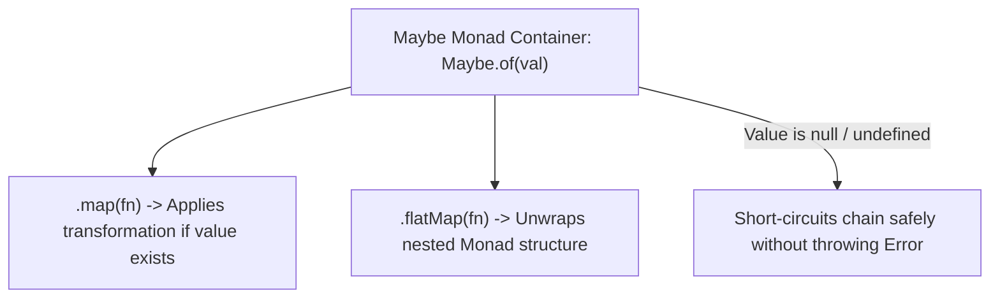

# File 26: Monad and Functor Patterns

## Overview
- A **Functor** is a data structure container that implements a `.map()` method, allowing functions to transform encapsulated values safely without mutating the outer structure.
- A **Monad** is a Functor that also implements a `.flatMap()` (or `chain` / `bind`) method, flattening nested structures and allowing safe error short-circuiting (e.g. `Maybe` monad handling nulls).

---

## 1. Functor & Monad Architecture



---

## 2. Maybe Monad Implementation

```javascript
class Maybe {
    constructor(value) {
        this.value = value;
    }

    static of(value) {
        return new Maybe(value);
    }

    isNothing() {
        return this.value === null || this.value === undefined;
    }

    map(fn) {
        return this.isNothing() ? Maybe.of(null) : Maybe.of(fn(this.value));
    }

    flatMap(fn) {
        return this.isNothing() ? Maybe.of(null) : fn(this.value);
    }

    getOrElse(defaultValue) {
        return this.isNothing() ? defaultValue : this.value;
    }
}

const userResponse = {
    profile: {
        address: {
            zipcode: "560001"
        }
    }
};

// Safe Nested Extraction via Monadic Chaining
const zip = Maybe.of(userResponse)
    .map(u => u.profile)
    .map(p => p.address)
    .map(a => a.zipcode)
    .getOrElse("UNKNOWN");

console.log("Zipcode:", zip); // "560001"

// Short-circuiting null safety (equivalent to optional chaining ?.)
const missingZip = Maybe.of({})
    .map(u => u.profile)
    .map(p => p.address)
    .map(a => a.zipcode)
    .getOrElse("UNKNOWN");

console.log("Missing Zipcode:", missingZip); // "UNKNOWN" (No null pointer exception!)
```

---

## Key Takeaways
1. **Functors (`map`)** wrap values and allow transforming them safely.
2. **Monads (`flatMap`)** handle nested container unwrapping and short-circuiting.
3. JavaScript built-in analogies: **`Array.prototype.map`** (Functor), **`Promise.prototype.then`** (Monad), **Optional Chaining `?.`** (Maybe Monad).
