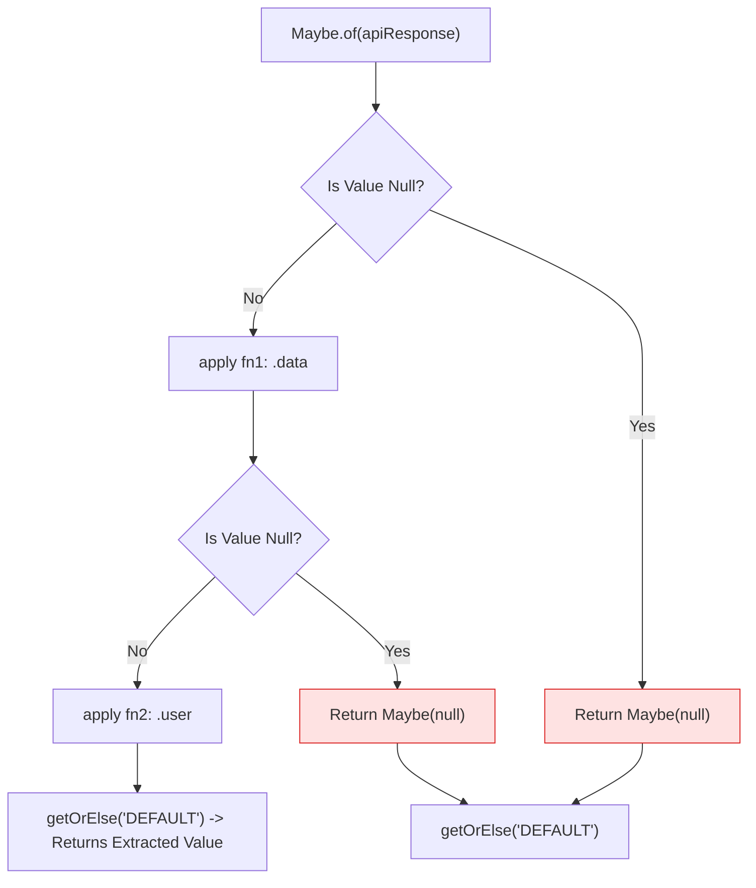

# Module 26: Monads & Functors — Algebraic Data Types, Safe Chaining, and `flatMap` Unwrapping

## Overview

**Functors** and **Monads** are functional design patterns derived from Category Theory that encapsulate values inside container objects to enable **safe functional transformations** and **null/error short-circuiting**.

- **Functor**: A data container implementing a **`.map(fn)`** method that transforms the encapsulated value according to the Functor Laws (Identity & Composition), returning a new Functor instance.
- **Monad**: A Functor that also implements a **`.flatMap(fn)`** (or `chain`/`bind`) method to unwrap nested monadic containers (preventing `Maybe(Maybe(x))`) and control execution flow (such as short-circuiting nulls or handling errors).

Understanding **The Maybe Monad**, **The Either Monad**, and JavaScript analogues (`Array.prototype.flatMap`, `Promise.prototype.then`) is essential.

---

## 1. Functor vs. Monad Transformation Architecture

```mermaid
flowchart TD
    subgraph Functor .map(fn)
        InputF["Functor Container: Container(5)"] -->|map(x => x * 2)| OutputF["New Functor Container: Container(10)"]
    end

    subgraph Monad .flatMap(fn) Unwrapping
        InputM["Monad Container: Maybe(5)"] -->|flatMap(x => Maybe(x * 2))| UnwrappedM["Flat Monad Container: Maybe(10)<br/>(Avoids nested Maybe(Maybe(10))!)"]
    end
```

---

## 2. Algebraic Monads Comparison Matrix

| Monad Pattern | Encapsulated States | Operational Behavior | Built-in JavaScript Equivalent |
| :--- | :--- | :--- | :--- |
| **`Maybe` Monad** | `Just(value)` or `Nothing` | Short-circuits null/undefined values | Optional Chaining (`?.`) & Nullish Coalescing (`??`) |
| **`Either` Monad** | `Right(value)` or `Left(error)` | Separates successful computation from error handling | `try...catch` blocks / Result Type |
| **`Promise` Monad** | `Fulfilled(val)` or `Rejected(err)` | Handles asynchronous computation & flatMap flattening | `Promise.prototype.then()` |

---

## 3. Code Showcase: Maybe Monad & Either Error Handling Monad

```javascript
// ==========================================
// 1. THE MAYBE MONAD IMPLEMENTATION
// ==========================================
class Maybe {
  #value;

  constructor(value) {
    this.#value = value;
  }

  static of(value) {
    return new Maybe(value);
  }

  isNothing() {
    return this.#value === null || this.#value === undefined;
  }

  // Functor .map() -> Applies transformation if value exists
  map(fn) {
    return this.isNothing() ? Maybe.of(null) : Maybe.of(fn(this.#value));
  }

  // Monadic .flatMap() -> Flattens returned nested Maybe monad!
  flatMap(fn) {
    return this.isNothing() ? Maybe.of(null) : fn(this.#value);
  }

  getOrElse(defaultValue) {
    return this.isNothing() ? defaultValue : this.#value;
  }
}

// Nested Payload Parsing Example
const apiResponse = {
  data: {
    user: {
      profile: {
        address: { zipcode: "560001" }
      }
    }
  }
};

// Safe Monadic Extraction
const validZip = Maybe.of(apiResponse)
  .map((res) => res.data)
  .map((d) => d.user)
  .map((u) => u.profile)
  .map((p) => p.address)
  .map((a) => a.zipcode)
  .getOrElse("ZIP_NOT_PROVIDED");

console.log("Safe Extracted Zipcode:", validZip); // "560001"

// Null Short-Circuiting (Safe failure without throwing TypeError!)
const nullZip = Maybe.of({})
  .map((res) => res.data)
  .map((d) => d.user)
  .getOrElse("ZIP_NOT_PROVIDED");

console.log("Null Payload Zipcode:", nullZip); // "ZIP_NOT_PROVIDED"
```

```javascript
// ==========================================
// 2. THE EITHER MONAD (Functional Error Pipeline)
// ==========================================
class Either {
  // Right = Success Path, Left = Error/Failure Path
  static Right(value) {
    return {
      map: (fn) => Either.Right(fn(value)),
      flatMap: (fn) => fn(value),
      fold: (onError, onSuccess) => onSuccess(value)
    };
  }

  static Left(error) {
    return {
      map: () => Either.Left(error), // Bypasses transformations on Left error!
      flatMap: () => Either.Left(error),
      fold: (onError) => onError(error)
    };
  }
}

// Pure Function using Either Monad for Error Handling
function parseJSON(jsonString) {
  try {
    return Either.Right(JSON.parse(jsonString));
  } catch (err) {
    return Either.Left(`JSON Parsing Failed: ${err.message}`);
  }
}

// Functional Chaining Pipeline
const result1 = parseJSON('{"name": "Anita", "age": 28}')
  .map((user) => user.name.toUpperCase())
  .fold(
    (err) => `[ERROR]: ${err}`,
    (name) => `[SUCCESS]: User ${name} processed!`
  );

const result2 = parseJSON("INVALID_JSON_PAYLOAD")
  .map((user) => user.name.toUpperCase()) // Bypassed safely!
  .fold(
    (err) => `[ERROR]: ${err}`,
    (name) => `[SUCCESS]: User ${name} processed!`
  );

console.log(result1); // "[SUCCESS]: User ANITA processed!"
console.log(result2); // "[ERROR]: JSON Parsing Failed: Unexpected token I in JSON..."
```

---

## 4. Maybe Monad Null Safety Flowchart



---

## Key Production Takeaways

1. **Use `Maybe` Monads to Eliminate Defensive Null Checks**: Replace repetitive `if (obj && obj.a && obj.a.b)` checks with a declarative `Maybe.of(obj).map(...)` chain.
2. **Use `Either` Monads for Pure Functional Error Pipelines**: Use `Either.Right` and `Either.Left` to propagate runtime errors cleanly down pipelines without throwing unhandled exceptions.
3. **Distinguish `map` from `flatMap`**: Use `.map()` when returning raw values from callback functions; use `.flatMap()` when callback functions return new Monad instances to prevent nested Monads (`Maybe(Maybe(x))`).
4. **Recognize Native JavaScript Analogues**: Native ES6 Optional Chaining (`?.`) behaves like a `Maybe` monad, while `Promise.prototype.then()` automatically flattens returned promises like `flatMap()`.

