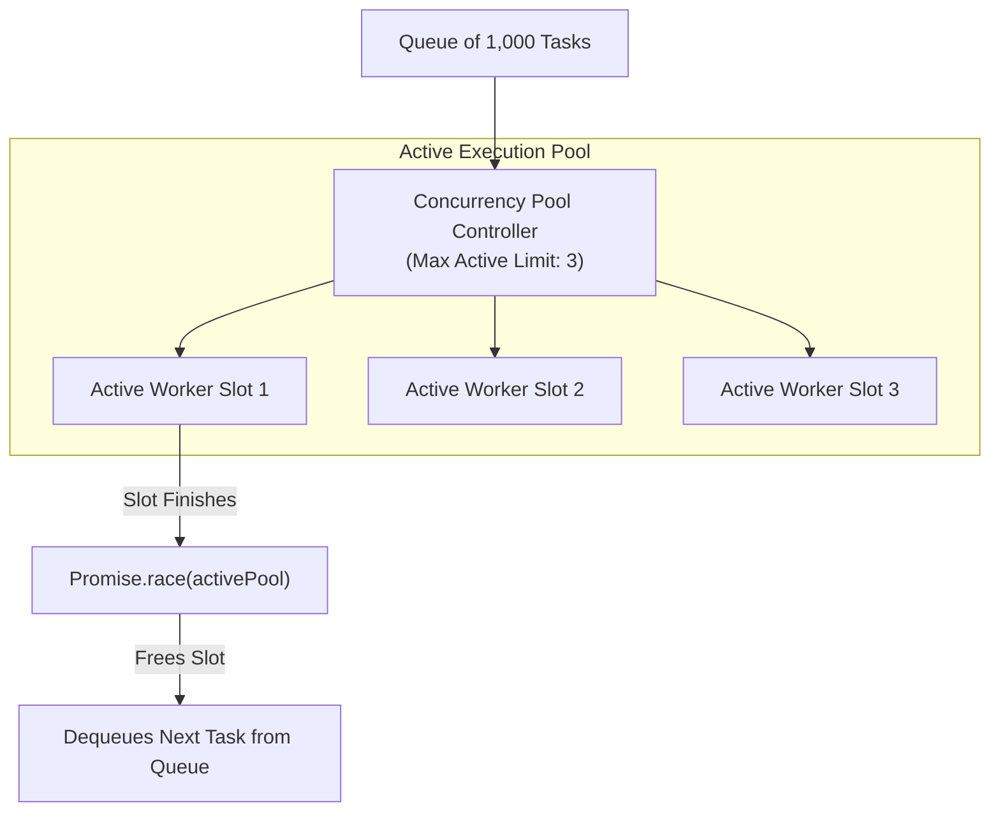
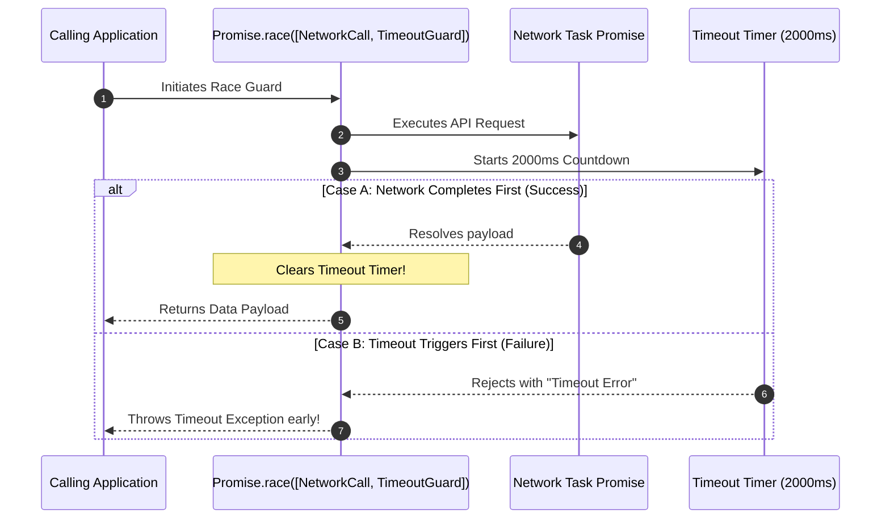

# Module 27: Promise Concurrency Patterns — Combinators, Bounded Pools, and Timeouts

## Overview

JavaScript provides built-in **Promise Combinator APIs** and custom orchestration patterns to manage complex asynchronous workflows, enforce execution timeouts, run sequential waterfalls, and throttle active concurrent network requests.

Without proper concurrency controls, firing thousands of parallel `Promise.all()` requests can crash database socket pools or trigger rate-limiting HTTP 429 errors from external APIs.

Understanding **Promise Combinators (`all`, `allSettled`, `race`, `any`)**, building **Bounded Concurrency Pools**, and enforcing **Promise Timeouts** is essential.

---

## 1. Concurrency Pool Architecture



---

## 2. Standard Promise Combinators Matrix

| Combinator API | Short-Circuit Condition | Resolution Behavior | Primary Use Case |
| :--- | :--- | :--- | :--- |
| **`Promise.all([p1, p2])`** | **Fails fast** on FIRST rejection | Resolves array of ALL fulfilled values | Parallel execution where ALL tasks must succeed |
| **`Promise.allSettled([p1, p2])`** | **Never short-circuits** | Resolves array of status objects `{ status, value/reason }` | Batch operations where partial failures are acceptable |
| **`Promise.race([p1, p2])`** | **Settles fast** on FIRST resolution OR rejection | Resolves or rejects with the FIRST settled result | Execution timeouts and fastest-responder races |
| **`Promise.any([p1, p2])`** | Resolves on FIRST fulfillment; fails if ALL reject | Resolves first fulfilled value (or `AggregateError`) | Redundant fallback mirrors (e.g. fastest CDN mirror) |

---

## 3. Code Showcase: Bounded Concurrency Pool & Timeout Guard

```javascript
// 1. Promise Timeout Wrapper Pattern
function withTimeout(asyncTaskPromise, timeoutMs) {
  let timeoutTimer;

  const timeoutGuard = new Promise((_, reject) => {
    timeoutTimer = setTimeout(() => {
      reject(new Error(`[TimeoutGuard]: Operation timed out after ${timeoutMs} ms`));
    }, timeoutMs);
  });

  return Promise.race([
    asyncTaskPromise.finally(() => clearTimeout(timeoutTimer)),
    timeoutGuard
  ]);
}

// 2. Production Bounded Concurrency Pool Controller
async function mapConcurrentPool(items, taskWorkerFn, concurrencyLimit = 3) {
  if (!Array.isArray(items)) throw new TypeError("Items must be an array");
  if (concurrencyLimit < 1) throw new RangeError("Concurrency limit must be >= 1");

  const results = new Array(items.length);
  const executingPool = new Set();
  let currentIndex = 0;

  async function enqueueNext() {
    if (currentIndex >= items.length) return;

    const index = currentIndex++;
    const item = items[index];

    // Create worker promise wrapper
    const workerPromise = (async () => {
      try {
        results[index] = await taskWorkerFn(item, index);
      } catch (err) {
        results[index] = { error: err.message };
      }
    })();

    executingPool.add(workerPromise);

    // Clean up worker slot when finished
    const cleanUp = () => executingPool.delete(workerPromise);
    workerPromise.then(cleanUp, cleanUp);

    // If pool is full, wait for ANY worker to finish before spawning next task!
    if (executingPool.size >= concurrencyLimit) {
      await Promise.race(executingPool);
    }

    // Recursively pull next task from queue
    await enqueueNext();
  }

  // Spawn initial batch up to concurrency limit
  const initialBatch = [];
  for (let i = 0; i < Math.min(concurrencyLimit, items.length); i++) {
    initialBatch.push(enqueueNext());
  }

  await Promise.all(initialBatch);
  return results;
}

// Execution Benchmark Simulation
const taskQueue = [1, 2, 3, 4, 5, 6, 7];

const mockNetworkCall = (id) =>
  new Promise((resolve) => {
    const duration = Math.floor(Math.random() * 300) + 100;
    setTimeout(() => {
      console.log(`  -> Completed Task #${id} in ${duration}ms`);
      resolve(`DataPayload_${id}`);
    }, duration);
  });

console.log("=== EXECUTING BOUNDED CONCURRENCY POOL (LIMIT: 2) ===");
mapConcurrentPool(taskQueue, mockNetworkCall, 2).then((allResults) => {
  console.log("All Concurrency Pool Tasks Completed:", allResults);
});
```

---

## 4. Promise Timeout Guard Sequence Diagram



---

## Key Production Takeaways

1. **Never Fling Unbounded `Promise.all()` at Remote Endpoints**: Limit concurrent outgoing requests using a Bounded Concurrency Pool to avoid exhausting client/server resources.
2. **Use `Promise.allSettled()` for Batch Pipelines**: Use `Promise.allSettled()` when processing bulk operations (e.g. sending 1,000 emails) where individual failures should not halt the entire batch.
3. **Always Attach Timeout Guards to External Calls**: Wrap HTTP fetches and database queries with `Promise.race()` timeout guards to prevent hanging promises from consuming memory indefinitely.
4. **Clean Up Timers on Early Resolution**: Always call `clearTimeout(timer)` when a race resolves to prevent dangling timers in the Event Loop background.

