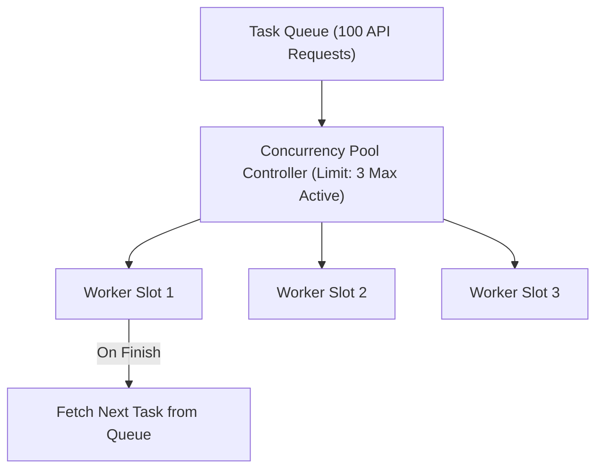

# File 27: Promise Concurrency Patterns

## Overview
JavaScript provides advanced Promise coordination patterns for managing concurrent async operations, enforcing execution timeouts, sequential queueing, and concurrency limits (pools).

---

## 1. Concurrency Pool Architecture



---

## 2. Promise Timeouts & Concurrency Pool Implementation

```javascript
// 1. Promise Timeout Wrapper
function withTimeout(promise, timeoutMs) {
    const timeoutPromise = new Promise((_, reject) => {
        setTimeout(() => reject(new Error(`Operation timed out after ${timeoutMs}ms`)), timeoutMs);
    });
    return Promise.race([promise, timeoutPromise]);
}

// 2. Concurrency Pool Controller
async function asyncPool(concurrencyLimit, tasks, taskFn) {
    const results = [];
    const executing = [];

    for (const item of tasks) {
        const p = Promise.resolve().then(() => taskFn(item));
        results.push(p);

        if (concurrencyLimit <= tasks.length) {
            const e = p.then(() => executing.splice(executing.indexOf(e), 1));
            executing.push(e);

            if (executing.length >= concurrencyLimit) {
                await Promise.race(executing); // Wait until any active slot frees up
            }
        }
    }

    return Promise.all(results);
}

// Usage Example
const items = [1, 2, 3, 4, 5, 6];
const mockTask = id => new Promise(r => setTimeout(() => {
    console.log(`Finished Task ${id}`);
    r(`Result ${id}`);
}, 100));

asyncPool(2, items, mockTask).then(res => console.log("All Completed:", res));
```

---

## Key Takeaways
1. Use **`Promise.race()`** to implement strict async timeouts.
2. Use **Concurrency Pools** to prevent overwhelming external APIs or exhausting database connections.
3. Concurrency pools process tasks concurrently up to a set batch limit.
