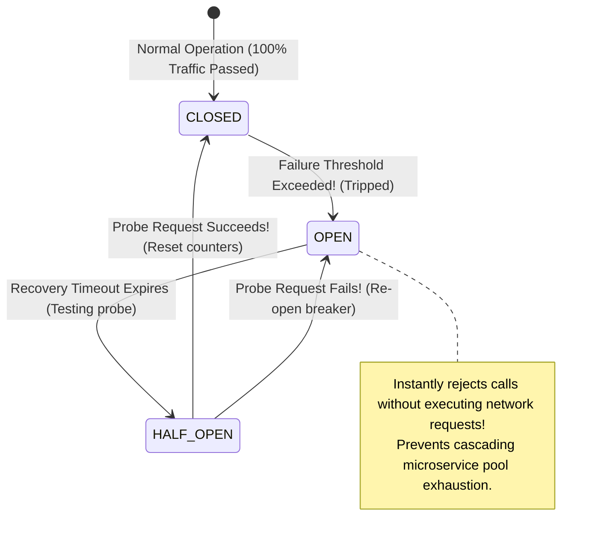
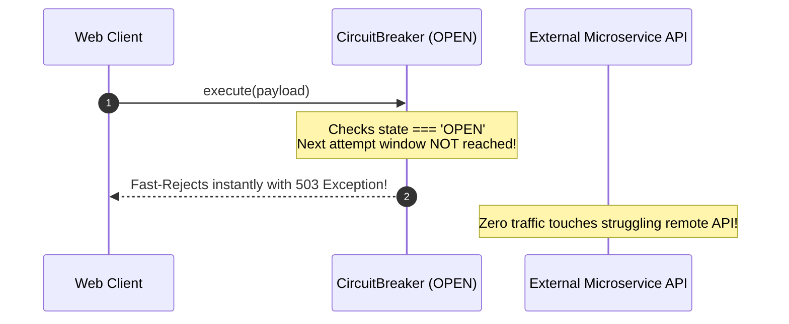

# Module 28: Retry & Circuit Breaker Patterns — Resiliency, Exponential Backoff Jitter, and Cascading Outage Defense

## Overview

Distributed microservices and web API integrations inevitably encounter transient network glitches and remote server outages.

- **The Retry Pattern**: Automatically re-attempts transiently failed network calls using an **Exponential Backoff with Random Jitter** strategy before throwing an error.
- **The Circuit Breaker Pattern**: Monitors failure rates of external dependencies. When errors exceed a threshold, the breaker **trips OPEN**, failing subsequent requests instantly ($\mathcal{O}(1)$ rejection) to prevent cascading outages and allow downstream services time to recover.

Understanding **Thundering Herd Defense**, **Jitter Algorithms**, and **Closed $\to$ Open $\to$ Half-Open State Transitions** is essential.

---

## 1. Circuit Breaker Finite State Machine Architecture



---

## 2. Distributed Resiliency Patterns Comparison Matrix

| Resiliency Pattern | Primary Architectural Objective | Failure Handling Strategy | Thundering Herd Mitigation |
| :--- | :--- | :--- | :--- |
| **Exponential Backoff Retry** | Recover from transient network hiccups (dropped packets) | Retries request $N$ times with increasing delays ($base \times 2^n$) | **Randomized Jitter Addition** |
| **Circuit Breaker** | Prevent cascading failures when remote service is down | Fails fast when failure rate exceeds threshold | Blocks calls completely during `OPEN` phase |
| **Bulkhead Pattern** | Isolate resources (thread/connection pools) per service | Bounds max concurrent calls per downstream dependency | Limits blast radius of single service failure |

---

## 3. Code Showcase: Exponential Backoff Retry with Jitter & Circuit Breaker

```javascript
// ==========================================
// 1. EXPONENTIAL BACKOFF WITH FULL JITTER RETRY
// ==========================================
async function retryWithExponentialBackoff(asyncTaskFn, options = {}) {
  const { maxRetries = 3, baseDelayMs = 200, maxDelayMs = 3000 } = options;

  for (let attempt = 0; attempt <= maxRetries; attempt++) {
    try {
      return await asyncTaskFn(attempt);
    } catch (err) {
      if (attempt === maxRetries) {
        console.error(`[RETRY EXHAUSTED]: Failed after ${maxRetries + 1} total attempts. Error: ${err.message}`);
        throw err;
      }

      // Calculate Exponential Backoff Delay with Full Jitter to prevent Thundering Herd!
      const exponentialDelay = Math.min(maxDelayMs, baseDelayMs * Math.pow(2, attempt));
      const jitteredDelay = Math.floor(Math.random() * exponentialDelay); // Full Jitter formula

      console.warn(`[RETRY WARNING]: Attempt #${attempt + 1} failed. Retrying in ${jitteredDelay} ms (Jittered backoff)...`);
      await new Promise((resolve) => setTimeout(resolve, jitteredDelay));
    }
  }
}
```

```javascript
// ==========================================
// 2. PRODUCTION CIRCUIT BREAKER ENGINE
// ==========================================
class ProductionCircuitBreaker {
  #requestFn;
  #failureThreshold;
  #recoveryTimeoutMs;
  #state = "CLOSED"; // States: "CLOSED", "OPEN", "HALF_OPEN"
  #failureCount = 0;
  #nextAttemptTimestamp = 0;

  constructor(requestFn, failureThreshold = 3, recoveryTimeoutMs = 5000) {
    if (typeof requestFn !== "function") throw new TypeError("Request target must be a function");
    this.#requestFn = requestFn;
    this.#failureThreshold = failureThreshold;
    this.#recoveryTimeoutMs = recoveryTimeoutMs;
  }

  async execute(...args) {
    const now = Date.now();

    // 1. OPEN STATE CHECK: Fast-fail if breaker is tripped!
    if (this.#state === "OPEN") {
      if (now >= this.#nextAttemptTimestamp) {
        console.log("\n[CIRCUIT BREAKER]: Recovery window expired. Switching to HALF_OPEN probe state...");
        this.#state = "HALF_OPEN";
      } else {
        const remainingTime = Math.ceil((this.#nextAttemptTimestamp - now) / 1000);
        throw new Error(`[CIRCUIT BREAKER OPEN]: Service unavailable. Fast-rejected! (Retry in ${remainingTime}s)`);
      }
    }

    // 2. EXECUTE REQUEST
    try {
      const response = await this.#requestFn(...args);
      this.#onSuccess();
      return response;
    } catch (err) {
      this.#onFailure(err);
      throw err;
    }
  }

  #onSuccess() {
    if (this.#state === "HALF_OPEN") {
      console.log("[CIRCUIT BREAKER]: Probe request succeeded! Circuit reset to CLOSED.");
    }
    this.#failureCount = 0;
    this.#state = "CLOSED";
  }

  #onFailure(err) {
    this.#failureCount++;
    console.error(`[CIRCUIT BREAKER FAILURE]: Count ${this.#failureCount}/${this.#failureThreshold}. Error: ${err.message}`);

    if (this.#failureCount >= this.#failureThreshold || this.#state === "HALF_OPEN") {
      this.#state = "OPEN";
      this.#nextAttemptTimestamp = Date.now() + this.#recoveryTimeoutMs;
      console.warn(`\n[CIRCUIT BREAKER TRIPPED]: State set to OPEN. Rejecting all traffic for ${this.#recoveryTimeoutMs} ms.`);
    }
  }

  get state() {
    return this.#state;
  }
}

// Execution Demonstration
const unstableExternalAPI = async (shouldFail) => {
  if (shouldFail) throw new Error("503 Service Unavailable");
  return { status: 200, payload: "Payment Processed" };
};

const breaker = new ProductionCircuitBreaker((fail) => unstableExternalAPI(fail), 2, 2000);

(async () => {
  try {
    // 1. Success Call
    await breaker.execute(false);

    // 2. Trigger failures to trip breaker
    await breaker.execute(true);
    await breaker.execute(true); // Trips breaker to OPEN!

    // 3. Subsequent calls fail instantly without network overhead:
    await breaker.execute(false);
  } catch (err) {
    console.error("Client Caught Exception:", err.message);
  }
})();
```

---

## 4. Circuit Breaker Fast-Reject Interception Sequence



---

## Key Production Takeaways

1. **Add Random Jitter to Exponential Backoff**: Always add randomized jitter (`Math.random() * delay`) to backoff calculations to avoid the **Thundering Herd Problem** (thousands of retrying clients hitting a recovering server simultaneously).
2. **Use Circuit Breakers to Protect Downstream Dependencies**: Wrap external HTTP SDKs and database connections in Circuit Breakers to prevent cascading system timeouts across microservices.
3. **Configure Realistic Thresholds**: Set failure thresholds and recovery windows based on production SLA benchmarks (e.g. 5 failures within 10 seconds triggers a 30-second open breaker).
4. **Fast-Fail Gracefully**: Handle Circuit Breaker `OPEN` exceptions gracefully by returning degraded fallback responses (e.g. cached data) to end users.

