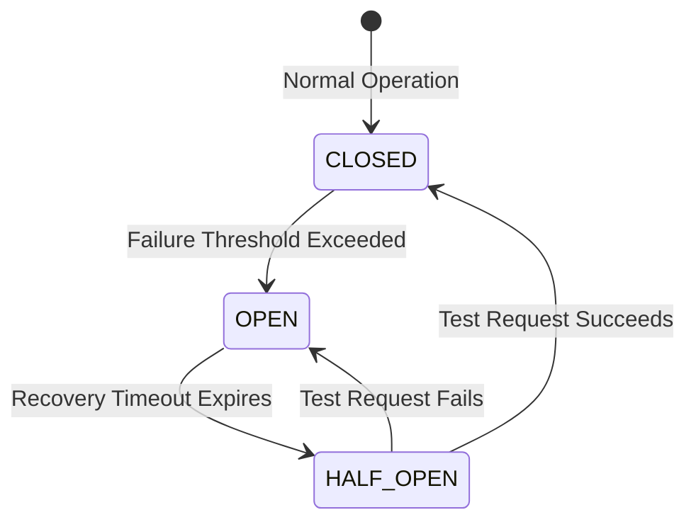

# File 28: Retry and Circuit Breaker Patterns

## Overview
- The **Retry Pattern** transparently re-executes failed network operations using exponential backoff strategy before raising an error.
- The **Circuit Breaker Pattern** monitors failures and trips open when an error threshold is reached, instantly failing subsequent calls to prevent cascading downstream server outages.

---

## 1. Circuit Breaker State Machine



---

## 2. Retry with Exponential Backoff & Circuit Breaker

```javascript
// 1. Retry with Exponential Backoff
async function retryWithBackoff(fn, retries = 3, delay = 100) {
    try {
        return await fn();
    } catch (err) {
        if (retries <= 0) throw err;
        console.log(`[RETRY] Retrying after ${delay}ms... (${retries} attempts remaining)`);
        await new Promise(r => setTimeout(r, delay));
        return retryWithBackoff(fn, retries - 1, delay * 2);
    }
}

// 2. Circuit Breaker Pattern
class CircuitBreaker {
    constructor(requestFn, failureThreshold = 3, recoveryTimeout = 1000) {
        this.requestFn = requestFn;
        this.failureThreshold = failureThreshold;
        this.recoveryTimeout = recoveryTimeout;
        
        this.state = "CLOSED"; // CLOSED, OPEN, HALF_OPEN
        this.failureCount = 0;
        this.nextAttempt = Date.now();
    }

    async fire(...args) {
        if (this.state === "OPEN") {
            if (Date.now() > this.nextAttempt) {
                this.state = "HALF_OPEN";
                console.log("[CIRCUIT BREAKER] Entering HALF_OPEN state (Testing request)");
            } else {
                throw new Error("Circuit Breaker is OPEN. Request blocked instantly!");
            }
        }

        try {
            const response = await this.requestFn(...args);
            this.onSuccess();
            return response;
        } catch (error) {
            this.onFailure();
            throw error;
        }
    }

    onSuccess() {
        this.failureCount = 0;
        this.state = "CLOSED";
    }

    onFailure() {
        this.failureCount++;
        if (this.failureCount >= this.failureThreshold) {
            this.state = "OPEN";
            this.nextAttempt = Date.now() + this.recoveryTimeout;
            console.warn(`[CIRCUIT BREAKER TRIPPED] State set to OPEN for ${this.recoveryTimeout}ms`);
        }
    }
}
```

---

## Key Takeaways
1. **Exponential backoff retry** prevents hammering recovering API servers.
2. **Circuit Breakers** prevent cascading system outages by failing fast when remote dependencies crash.
3. Transitions through **CLOSED**, **OPEN**, and **HALF_OPEN** states automatically.
