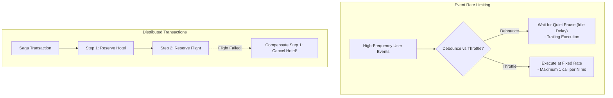
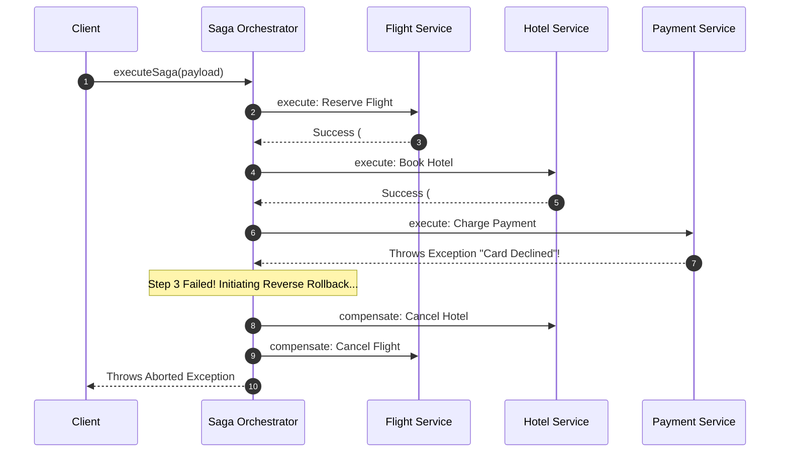

# Module 29: Throttle, Debounce, & Saga Orchestration — Rate Limiting and Distributed Transaction Rollbacks

## Overview

This module covers rate-limiting event storm patterns and distributed transaction orchestration:

- **Debounce**: Delays execution of a function until a specified **quiet period** (idle delay) has elapsed with no new triggers (ideal for search input autocomplete).
- **Throttle**: Guarantees execution of a function at most **once per fixed time interval**, discarding intermediate calls (ideal for window resize/scroll handlers).
- **Saga Orchestrator Pattern**: Manages multi-step distributed async transactions across microservices, executing **Compensating Rollback Actions** in reverse order if any step fails.

---

## 1. Debounce vs. Throttle vs. Saga Comparison Matrix



### Architectural Comparison

| Pattern Name | Execution Timing | Failure Handling | Primary Target |
| :--- | :--- | :--- | :--- |
| **Debounce** | Fires after $N$ ms of complete silence | N/A (Discards intermediate calls) | UI Search autocomplete, form autosave |
| **Throttle** | Fires at most once per $N$ ms interval | N/A (Paces call frequency) | Scroll position, window resize, API rate limits |
| **Saga Orchestrator** | Executes multi-step async transaction | Runs **Compensating Rollbacks** in reverse order | Distributed e-commerce checkouts, microservices |

---

## 2. Code Showcase: Debounce, Throttle, and Saga Orchestrator

```javascript
// ==========================================
// 1. DEBOUNCE UTILITY (With Immediate Leading Edge Option)
// ==========================================
function debounce(fn, delayMs, leading = false) {
  let timerId = null;

  return function (...args) {
    const context = this;
    const callNow = leading && !timerId;

    if (timerId) clearTimeout(timerId);

    timerId = setTimeout(() => {
      timerId = null;
      if (!leading) fn.apply(context, args);
    }, delayMs);

    if (callNow) fn.apply(context, args);
  };
}

// ==========================================
// 2. THROTTLE UTILITY (Timestamp-Based Pacing)
// ==========================================
function throttle(fn, limitMs) {
  let lastRanTimestamp = 0;
  let lastTimerId = null;

  return function (...args) {
    const context = this;
    const now = Date.now();

    if (now - lastRanTimestamp >= limitMs) {
      if (lastTimerId) {
        clearTimeout(lastTimerId);
        lastTimerId = null;
      }
      fn.apply(context, args);
      lastRanTimestamp = now;
    } else if (!lastTimerId) {
      const remainingTime = limitMs - (now - lastRanTimestamp);
      lastTimerId = setTimeout(() => {
        fn.apply(context, args);
        lastRanTimestamp = Date.now();
        lastTimerId = null;
      }, remainingTime);
    }
  };
}
```

```javascript
// ==========================================
// 3. SAGA ORCHESTRATOR WITH COMPENSATING ROLLBACKS
// ==========================================
class SagaOrchestrator {
  #steps = [];

  // Add transaction step with forward execute & reverse compensate functions
  addStep(name, executeFn, compensateFn) {
    this.#steps.push({ name, executeFn, compensateFn });
    return this;
  }

  async executeSaga(initialPayload) {
    console.log("=== STARTING SAGA DISTRIBUTED TRANSACTION ===");
    const executedSteps = [];
    let currentPayload = initialPayload;

    for (const step of this.#steps) {
      console.log(`[SAGA STEP]: Executing '${step.name}'...`);
      try {
        currentPayload = await step.executeFn(currentPayload);
        executedSteps.push(step); // Track successfully executed step for rollback!
      } catch (err) {
        console.error(`\n[SAGA STEP FAILED]: '${step.name}' error: ${err.message}`);
        console.warn("=== INITIATING COMPENSATING ROLLBACK IN REVERSE ORDER ===");
        await this.#rollback(executedSteps, currentPayload);
        throw new Error(`Saga Transaction Aborted: ${err.message}`);
      }
    }

    console.log("=== SAGA TRANSACTION SUCCESSFULLY COMPLETED ===");
    return currentPayload;
  }

  async #rollback(executedSteps, payload) {
    // Reverse array order to execute compensating actions backwards!
    const reverseSteps = [...executedSteps].reverse();

    for (const step of reverseSteps) {
      console.log(`  -> [SAGA COMPENSATE]: Rolling back step '${step.name}'...`);
      try {
        await step.compensateFn(payload);
      } catch (compensateErr) {
        console.error(`  !! CRITICAL: Compensation failed for '${step.name}':`, compensateErr);
      }
    }
  }
}

// Saga Execution Demonstration
const bookingSaga = new SagaOrchestrator();

bookingSaga
  .addStep(
    "Reserve Flight",
    async (data) => { console.log("    Flight Reserved #FL-901"); return { ...data, flightId: "FL-901" }; },
    async (data) => { console.log("    Compensate: Cancelled Flight #FL-901"); }
  )
  .addStep(
    "Book Hotel",
    async (data) => { console.log("    Hotel Booked #HT-552"); return { ...data, hotelId: "HT-552" }; },
    async (data) => { console.log("    Compensate: Cancelled Hotel #HT-552"); }
  )
  .addStep(
    "Charge Payment",
    async (data) => { throw new Error("Card Declined (Insufficient Funds)"); }, // Simulating Step Failure!
    async (data) => { console.log("    Compensate: Refunded Charge"); }
  );

(async () => {
  try {
    await bookingSaga.executeSaga({ user: "Anita" });
  } catch (err) {
    console.error(err.message);
  }
})();
```

---

## 3. Saga Rollback Sequence Diagram



---

## Key Production Takeaways

1. **Use Debounce for User Pause Triggers**: Implement `debounce()` for search inputs, form auto-saving, and window resizing end triggers where you want execution to wait until user activity pauses.
2. **Use Throttle for High-Frequency Scrolling**: Implement `throttle()` for scroll position tracking, drag events, and game input loops where you need predictable rate-paced executions.
3. **Always Reverse Step Order During Saga Rollbacks**: Ensure Saga orchestrators execute compensating rollback functions in strict reverse order of execution (LIFO).
4. **Make Saga Compensations Idempotent**: Ensure compensating actions can be executed multiple times safely without producing unintended side effects.

