# File 29: Throttle, Debounce, and Saga Orchestration

## Overview
- **Debounce** delays function execution until a specified quiet period has elapsed with no new triggers (ideal for search input autocomplete).
- **Throttle** limits function execution to at most once per specified time interval (ideal for window resize/scroll handlers).
- **Saga Orchestrator** manages multi-step distributed async workflows with compensation rollback handling upon failure.

---

## 1. Debounce vs Throttle Timeline

```mermaid
gantt
    title Executions Timeline Comparison
    dateFormat  ss
    section User Triggers
    Key 1           :active, 01, 1s
    Key 2           :active, 02, 1s
    Key 3           :active, 03, 1s
    section Debounced Exec
    Single Exec     :crit, 05, 1s
    section Throttled Exec
    Exec Slot 1     :done, 01, 1s
    Exec Slot 2     :done, 03, 1s
```



---

## 2. Throttle and Debounce Implementations

```javascript
// 1. Debounce Implementation
function debounce(fn, delay) {
    let timerId = null;
    return function (...args) {
        if (timerId) clearTimeout(timerId);
        timerId = setTimeout(() => {
            fn.apply(this, args);
        }, delay);
    };
}

// 2. Throttle Implementation
function throttle(fn, limit) {
    let lastFunc = null;
    let lastRan = null;
    return function (...args) {
        const context = this;
        if (!lastRan) {
            fn.apply(context, args);
            lastRan = Date.now();
        } else {
            clearTimeout(lastFunc);
            lastFunc = setTimeout(function () {
                if ((Date.now() - lastRan) >= limit) {
                    fn.apply(context, args);
                    lastRan = Date.now();
                }
            }, limit - (Date.now() - lastRan));
        }
    };
}
```

---

## Key Takeaways
1. **Debounce** waits for a pause in events before firing.
2. **Throttle** guarantees execution at fixed regular intervals.
3. Essential for frontend performance optimization during UI event storms.
