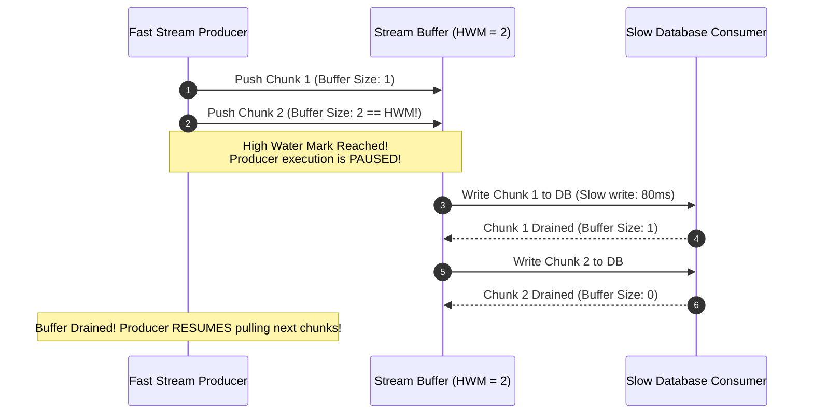

# Module 30: Async Iterators & Streams — Async Generators, `for await...of`, and Backpressure Management

## Overview

**Async Iterators** and **Streams** provide a memory-efficient mechanism for consuming large or continuous asynchronous data sources chunk-by-chunk without buffering entire datasets into memory at once.

In JavaScript, asynchronous data streaming is governed by:
1. **The Async Iterable Protocol (`Symbol.asyncIterator`)**: Defines an object capable of producing promises resolving to `{ value, done }` iteration steps, consumed via **`for await...of`** loops.
2. **Async Generator Functions (`async function*`)**: Provides coroutine syntax (`yield await ...`) for emitting asynchronous data streams lazily.
3. **Web / Node.js Streams**: High-performance stream primitives (`ReadableStream`, `TransformStream`, `WritableStream`) that feature automatic **Backpressure Management**.

Understanding **Backpressure**, **Async Generators**, and **Stream Pipelines** is essential.

---

## 1. Async Stream Pipeline Architecture

```mermaid
flowchart LR
    Source["Data Source<br/>(10 GB Log File / WebSocket Feed)"] -->|1. Emits Chunk| Generator["Async Generator<br/>(async function*)"]

    Generator -->|2. Promise.resolve({ value, done })| AsyncLoop["for await...of Loop Container"]

    AsyncLoop -->|3. Processes Chunk| Consumer["Destination Processing Sink<br/>(Database Writer)"]

    Consumer -.->|4. Backpressure Signal (High Water Mark)| Source
```

---

## 2. Streaming Abstractions Comparison Matrix

| Streaming Mechanism | Protocol Signature | Pull vs. Push | Backpressure Support | Primary Target |
| :--- | :--- | :--- | :--- | :--- |
| **Async Iterator** | `[Symbol.asyncIterator]()` | **Pull-Based** (Consumer requests next chunk via `await next()`) | Native (Consumer paces iterations) | Database cursor streaming, paginated APIs |
| **Async Generator** | `async function* ()` + `yield` | **Pull-Based Coroutine** | Native via promise suspension | Custom async stream generators |
| **ReadableStream (WHATWG)** | `.getReader().read()` | **Push / Pull Hybrid** | **Built-in `highWaterMark` control** | Web Fetch responses, large file streaming |

---

## 3. Code Showcase: Async Generator & Web Stream Pipeline with Backpressure

```javascript
// ==========================================
// 1. ASYNC GENERATOR DATA STREAM
// ==========================================
async function* fetchPaginatedAPIStream(totalPages = 4) {
  for (let page = 1; page <= totalPages; page++) {
    console.log(`[AsyncGenerator]: Fetching page ${page} from remote API...`);
    
    // Simulate async network fetch delay
    await new Promise((resolve) => setTimeout(resolve, 150));
    
    const pagePayload = [
      { id: (page - 1) * 2 + 1, item: `Record_${page}_A` },
      { id: (page - 1) * 2 + 2, item: `Record_${page}_B` }
    ];

    // Yield page chunk to consumer
    yield pagePayload;
  }
}

// Consuming Async Generator Stream with 'for await...of'
async function processPaginatedStream() {
  console.log("=== BEGINNING ASYNC ITERATOR CONSUMPTION ===");
  let recordCount = 0;

  for await (const pageChunk of fetchPaginatedAPIStream(3)) {
    console.log(`  -> [Consumer]: Received page chunk with ${pageChunk.length} records.`);
    pageChunk.forEach((record) => {
      recordCount++;
      console.log(`     Processing Record #${record.id}: ${record.item}`);
    });
  }

  console.log(`=== FINISHED STREAM CONSUMPTION. Total Records: ${recordCount} ===\n`);
}
```

```javascript
// ==========================================
// 2. BACKPRESSURE STREAMING PIPELINE SIMULATION
// ==========================================
class BackpressureStreamProcessor {
  #highWaterMark;
  #buffer = [];

  constructor(highWaterMark = 3) {
    this.#highWaterMark = highWaterMark;
  }

  async processChunkStream(asyncIterableSource) {
    console.log(`[StreamProcessor]: Starting stream processing with High Water Mark = ${this.#highWaterMark}...`);

    for await (const chunk of asyncIterableSource) {
      this.#buffer.push(chunk);
      console.log(`[Stream Buffer]: Added chunk. Current Buffer Size: ${this.#buffer.length}/${this.#highWaterMark}`);

      // BACKPRESSURE SIGNAL: Pause consumer if buffer hits high water mark!
      if (this.#buffer.length >= this.#highWaterMark) {
        console.warn("  [BACKPRESSURE WARNING]: Buffer full! Draining buffer before pulling more data...");
        await this.#drainBuffer();
      }
    }

    // Drain remaining items in buffer upon completion
    if (this.#buffer.length > 0) {
      await this.#drainBuffer();
    }
  }

  async #drainBuffer() {
    while (this.#buffer.length > 0) {
      const item = this.#buffer.shift();
      console.log(`  -> [DRAINED & WRITTEN TO DB]: ${JSON.stringify(item)}`);
      await new Promise((resolve) => setTimeout(resolve, 80)); // Simulate slow DB write
    }
  }
}

// Execution Demonstration
(async () => {
  await processPaginatedStream();

  const processor = new BackpressureStreamProcessor(2);
  await processor.processChunkStream(fetchPaginatedAPIStream(4));
})();
```

---

## 4. Backpressure Management Sequence Diagram



---

## Key Production Takeaways

1. **Use `async function*` to Stream Unbounded Datasets**: Use async generators (`yield await ...`) when fetching paginated REST APIs or reading large files to prevent holding entire datasets in memory.
2. **Consume Async Iterables with `for await...of`**: Use native `for await...of` loops for clean, readable consumption of async iterators.
3. **Respect Backpressure Limits**: Implement backpressure checks (`highWaterMark`) when writing data to slow sinks (like databases or disk writes) to prevent memory heap inflation.
4. **Clean Up Async Iterator Resources**: Ensure async generators implement `try...finally` blocks so open file descriptors or network sockets close cleanly if a `for await...of` loop breaks early.

