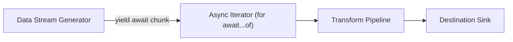

# File 30: Async Iterators and Streams

## Overview
**Async Iterators** (`for await...of`) and **Streams** allow processing asynchronous data streams lazily chunk-by-chunk without loading entire datasets into memory at once.

---

## 1. Async Streaming Pipeline



---

## 2. Async Generator Stream Implementation

```javascript
// Asynchronous Stream Generator
async function* fetchSensorStream() {
    const readings = [24.5, 25.1, 26.8, 29.4, 31.0];
    for (const temp of readings) {
        await new Promise(r => setTimeout(r, 50)); // Simulate async delay
        yield { timestamp: new Date().toISOString(), temp };
    }
}

// Processing Async Stream with for await...of
async function processStream() {
    console.log("=== Processing Sensor Stream ===");
    for await (const data of fetchSensorStream()) {
        console.log(`[READING] ${data.timestamp} - Temperature: ${data.temp}°C`);
        if (data.temp > 30.0) {
            console.warn("CRITICAL TEMPERATURE ALERT!");
        }
    }
}

processStream();
```

---

## Key Takeaways
1. **Async Generators (`async function*`)** yield promises sequentially.
2. Consume async streams cleanly using **`for await...of`** loops.
3. Memory efficient for processing large files, database cursor streaming, and socket events.
