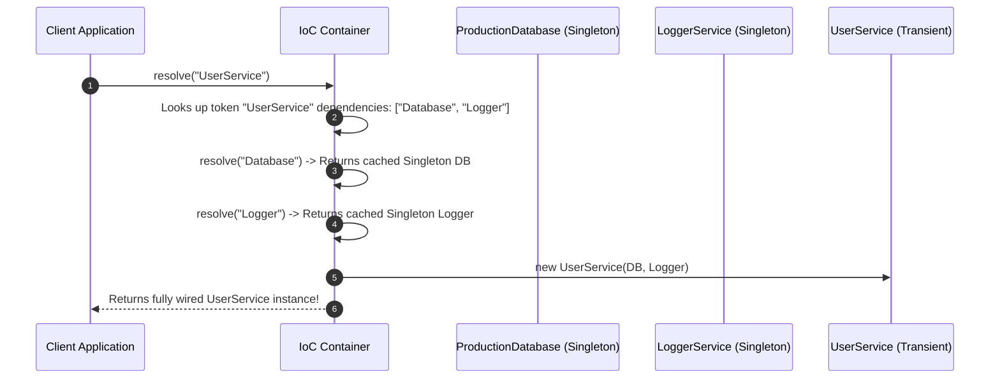

# Module 31: Dependency Injection & Inversion of Control — IoC Containers, Service Lifecycles, and Test Isolation

## Overview

**Dependency Injection (DI)** is a software design pattern implementing **Inversion of Control (IoC)**, where components receive their dependencies from an external container or framework rather than instantiating them internally using hardcoded `new` constructors.

Without DI, high-level business services become tightly coupled to low-level infrastructure implementations (e.g., `this.db = new PostgresDatabase()`), making it impossible to swap database drivers, mock external services for unit testing, or control instance lifecycles.

Understanding **Constructor Injection**, **IoC Container Resolution**, and **Service Lifecycles (Singleton, Transient, Scoped)** is essential.

---

## 1. Hardcoded Coupling vs. DI Container Architecture

```mermaid
flowchart TD
    subgraph Tightly Coupled Hardcoded Anti-Pattern (BAD)
        UserServiceBad[UserService] -->|Instantiates directly via 'new'| PostgresDBBad[new PostgresDatabase]
        UserServiceBad -->|Instantiates directly via 'new'| EmailServiceBad[new SendGridEmailService]
    end

    subgraph Dependency Injection Container (GOOD)
        IoCContainer["IoC Container Registry<br/>(Manages Dependencies & Lifecycles)"]
        IoCContainer -->|Injects Inverted DB Dependency| UserServiceGood[UserService]
        IoCContainer -->|Injects Mock DB in Test Mode| MockDBGood[MockDatabase]
        
        UserServiceGood -->|Interacts via Interface Contract| DBInterface["IDatabase Interface"]
    end
```

---

## 2. Dependency Injection Types & Lifecycles Matrix

| DI Strategy / Lifetime | Definition | Resolution Mechanism | Best Used For |
| :--- | :--- | :--- | :--- |
| **Constructor Injection** | Dependencies passed into class `constructor(...)` | Immutable parameters on instantiation | Mandatory dependencies required by service |
| **Setter Injection** | Dependencies supplied via setter methods (`setDB(...)`) | Mutable property assignment | Optional or reconfigurable dependencies |
| **Singleton Lifetime** | IoC Container instantiates dependency **once** per app | Single shared instance cached in memory | Connection pools, state stores, loggers |
| **Transient Lifetime** | IoC Container instantiates a **new instance** on every `resolve()` | Fresh object allocation per request | Stateful worker tasks, transient parsers |

---

## 3. Code Showcase: Production IoC Container with Lifecycles

```javascript
// 1. Dependency Interfaces & Concrete Implementations
class ProductionDatabase {
  query(sql) {
    return `[Postgres DB Result]: Executed '${sql}'`;
  }
}

class MockDatabase {
  query(sql) {
    return `[Mock Test DB Result]: Stubbed data for '${sql}'`;
  }
}

class LoggerService {
  #id = Math.floor(Math.random() * 1000);
  log(msg) {
    console.log(`[Logger #${this.#id}]: ${msg}`);
  }
}

// 2. Target Service using Constructor Dependency Injection
class UserService {
  #db;
  #logger;

  // Constructor Dependency Injection Contract!
  constructor(databaseInstance, loggerInstance) {
    this.#db = databaseInstance;
    this.#logger = loggerInstance;
  }

  fetchUserProfiles() {
    this.#logger.log("Fetching user profiles from database...");
    return this.#db.query("SELECT * FROM users");
  }
}

// 3. Lightweight IoC Container with Lifetime Management
class IoCContainer {
  #registry = new Map();
  #singletons = new Map();

  register(token, classDefinition, options = { lifetime: "TRANSIENT", dependencies: [] }) {
    this.#registry.set(token, {
      classDefinition,
      lifetime: options.lifetime || "TRANSIENT",
      dependencies: options.dependencies || []
    });
    return this;
  }

  resolve(token) {
    const registration = this.#registry.get(token);
    if (!registration) {
      throw new Error(`[IoCContainer]: Unregistered dependency token '${token}'`);
    }

    const { classDefinition, lifetime, dependencies } = registration;

    // 1. Singleton Resolution Handling
    if (lifetime === "SINGLETON") {
      if (!this.#singletons.has(token)) {
        console.log(`[IoCContainer]: Initializing SINGLETON instance for '${token}'`);
        const resolvedDeps = dependencies.map((depToken) => this.resolve(depToken));
        const instance = new classDefinition(...resolvedDeps);
        this.#singletons.set(token, instance);
      }
      return this.#singletons.get(token);
    }

    // 2. Transient Resolution Handling (Fresh instance per resolve call!)
    console.log(`[IoCContainer]: Creating TRANSIENT instance for '${token}'`);
    const resolvedDeps = dependencies.map((depToken) => this.resolve(depToken));
    return new classDefinition(...resolvedDeps);
  }
}

// Container Configuration & Execution
const container = new IoCContainer();

// Register Dependencies
container.register("Logger", LoggerService, { lifetime: "SINGLETON" });
container.register("Database", ProductionDatabase, { lifetime: "SINGLETON" });
container.register("UserService", UserService, {
  lifetime: "TRANSIENT",
  dependencies: ["Database", "Logger"] // Dependency Tree Resolution!
});

console.log("=== 1. PRODUCTION SERVICE RESOLUTION ===");
const userService1 = container.resolve("UserService");
console.log(userService1.fetchUserProfiles());

// Unit Testing Demonstration: Trivial Mock Injection!
console.log("\n=== 2. UNIT TESTING WITH MOCK INJECTION ===");
const mockService = new UserService(new MockDatabase(), new LoggerService());
console.log(mockService.fetchUserProfiles()); // Fully isolated test without DB connection!
```

---

## 4. IoC Container Resolution Sequence



---

## Key Production Takeaways

1. **Never Use `new` Inside Business Services**: Pass dependencies into constructors (`constructor(db, logger)`) so implementation details can be swapped out.
2. **Eliminate Testing Bottlenecks via DI**: Use Constructor Injection to effortlessly pass mock implementations during unit tests without needing fragile monkey-patching.
3. **Control Instance Lifecycles Centralized in IoC Containers**: Configure Singleton vs. Transient vs. Scoped lifetimes inside the container rather than cluttering class definitions.
4. **Adhere to the Dependency Inversion Principle**: Ensure high-level modules depend on abstractions (interfaces/abstract classes), not low-level concrete classes.

