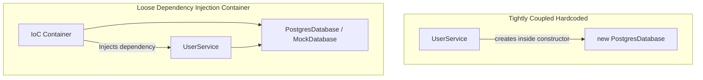

# File 31: Dependency Injection and Inversion of Control

## Overview
**Dependency Injection (DI)** is a design pattern implementing **Inversion of Control (IoC)**, where components receive their dependencies from an external container/framework rather than hardcoding `new` instantiations internally.

---

## 1. Hardcoded Dependencies vs Dependency Injection



---

## 2. IoC Container Implementation

```javascript
// Service Dependencies
class Database {
    query(sql) { return "Production DB Result"; }
}

class MockDatabase {
    query(sql) { return "Mock DB Result"; }
}

// Service requiring Dependency Injection
class UserService {
    constructor(db) {
        this.db = db; // Dependency injected externally!
    }

    getUser() {
        return this.db.query("SELECT * FROM users");
    }
}

// Simple IoC Container
class Container {
    constructor() {
        this.registry = new Map();
    }

    register(name, dependencyClass) {
        this.registry.set(name, dependencyClass);
    }

    resolve(name) {
        const DependencyClass = this.registry.get(name);
        return new DependencyClass();
    }
}

const container = new Container();
container.register("db", Database);

// Injected cleanly
const userService = new UserService(container.resolve("db"));
console.log(userService.getUser()); // "Production DB Result"

// Unit Testing is trivial by swapping with MockDatabase!
const testService = new UserService(new MockDatabase());
console.log(testService.getUser()); // "Mock DB Result"
```

---

## Key Takeaways
1. DI eliminates **tight coupling** between classes.
2. Makes unit testing simple by allowing **mocking dependencies**.
3. Promotes the **Inversion of Control (IoC)** design principle.
