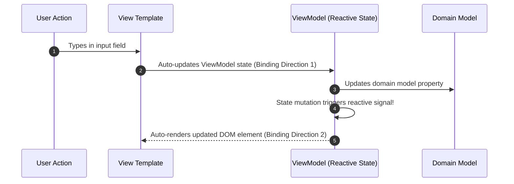

# Module 32: UI Architecture Patterns — MVC, MVP, and MVVM Breakdown

## Overview

**MVC (Model-View-Controller)**, **MVP (Model-View-Presenter)**, and **MVVM (Model-View-ViewModel)** are foundational UI architectural patterns designed to separate domain data models from user presentation interfaces.

While all three patterns enforce Separation of Concerns, they differ fundamentally in **Data Flow Direction**, **View Passivity**, and **State Binding Mechanics**:
- **MVC**: Controller updates Model; View renders Model state (Traditional Server-Side & Early Web).
- **MVP**: Presenter acts as a strict bidirectional broker between Model and a completely **Passive View** (Desktop & Mobile apps).
- **MVVM**: ViewModel exposes reactive state properties bound to the View via **Automated Two-Way Data Binding / Signals** (Vue, Angular, Knockout, React + MobX).

---

## 1. Architectural Topology Flowcharts

```mermaid
flowchart TD
    subgraph 1. Model-View-Controller (MVC)
        C[Controller] -->|1. Updates| M1[Model]
        C -->|2. Selects| V1[View]
        M1 -.->|3. State Notification| V1
    end

    subgraph 2. Model-View-Presenter (MVP)
        V2[Passive View] <-->|Bidirectional Interfaces| P[Presenter]
        P <-->|Mutates / Reads| M2[Model]
    end

    subgraph 3. Model-View-ViewModel (MVVM)
        V3[View HTML/Template] <===>|Automated 2-Way Binding / Signals| VM[ViewModel Reactive State]
        VM <-->|Syncs Domain Data| M3[Model]
    end
```

---

## 2. UI Patterns Architectural Comparison Matrix

| Feature Dimension | Model-View-Controller (MVC) | Model-View-Presenter (MVP) | Model-View-ViewModel (MVVM) |
| :--- | :--- | :--- | :--- |
| **View Characteristics** | Renders Model data; observes state | **Completely Passive Interface** | Reactive Template with data-bind attributes |
| **Mediator Component** | **Controller** (Handles user input actions) | **Presenter** (Formats data & drives view methods) | **ViewModel** (Exposes reactive observables) |
| **Data Binding** | None (Manual view updates / callbacks) | Manual explicit method invocations | **Automated 2-Way Data Binding / Signals** |
| **Unit Testability** | Moderate | **High** (Presenter tested with Mock View) | **Very High** (ViewModel tested without UI) |
| **Framework Examples** | Express.js, Ruby on Rails, Django | Android Native (Java/Kotlin), WinForms | Vue.js, Angular, Knockout, WPF |

---

## 3. Code Showcase: MVC vs. MVP vs. MVVM Implementation

```javascript
// Shared Domain Model
class TaskModel {
  constructor(title) {
    this.title = title;
    this.completed = false;
  }
}

// ==========================================
// 1. MODEL-VIEW-CONTROLLER (MVC) IMPLEMENTATION
// ==========================================
class MVCView {
  render(tasks) {
    console.log("[MVC View Render]:", tasks.map((t) => `${t.title} [${t.completed ? "DONE" : "PENDING"}]`).join(", "));
  }
}

class MVCController {
  #modelList = [];
  #view;

  constructor(view) {
    this.#view = view;
  }

  addTask(title) {
    this.#modelList.push(new TaskModel(title));
    this.#view.render(this.#modelList); // Controller manually triggers View re-render
  }
}

// ==========================================
// 2. MODEL-VIEW-PRESENTER (MVP - Passive View)
// ==========================================
class PassiveMVPView {
  displayTasks(taskStrings) {
    console.log("[MVP Passive View Display]:", taskStrings.join(" | "));
  }
  showErrorMessage(msg) {
    console.error("[MVP Passive View Error]:", msg);
  }
}

class MVPPresenter {
  #tasks = [];
  #view;

  constructor(view) {
    this.#view = view;
  }

  handleAddTask(title) {
    if (!title || title.trim() === "") {
      this.#view.showErrorMessage("Task title cannot be empty!");
      return;
    }
    const newTask = new TaskModel(title);
    this.#tasks.push(newTask);
    
    // Presenter formats raw data specifically for the passive view!
    const formattedList = this.#tasks.map((t) => `Task: ${t.title}`);
    this.#view.displayTasks(formattedList);
  }
}

// ==========================================
// 3. MODEL-VIEW-VIEWMODEL (MVVM - Reactive Data Binding)
// ==========================================
class TaskViewModel {
  #tasks = [];
  #subscribers = new Set(); // 2-Way Reactive Binding Publisher

  subscribe(binderCallback) {
    this.#subscribers.add(binderCallback);
    binderCallback(this.formattedTasks); // Initial sync
  }

  addTask(title) {
    this.#tasks.push(new TaskModel(title));
    this.#notify(); // Automated 2-way binding update signal!
  }

  get formattedTasks() {
    return this.#tasks.map((t) => `ReactiveItem: ${t.title}`);
  }

  #notify() {
    this.#subscribers.forEach((cb) => cb(this.formattedTasks));
  }
}

// Execution Demonstration
console.log("=== 1. MVC EXECUTION ===");
const mvcApp = new MVCController(new MVCView());
mvcApp.addTask("Write Documentation");

console.log("\n=== 2. MVP EXECUTION ===");
const mvpApp = new MVPPresenter(new PassiveMVPView());
mvpApp.handleAddTask("Refactor Architecture");

console.log("\n=== 3. MVVM EXECUTION ===");
const vm = new TaskViewModel();
// View binds automatically to ViewModel reactive updates:
vm.subscribe((data) => console.log("[MVVM Reactive View Sync]:", data));
vm.addTask("Build Reactive Engine");
```

---

## 4. MVVM Reactive Binding Sequence



---

## Key Production Takeaways

1. **Use MVVM for Modern Reactive Web Applications**: Prefer MVVM (or Component-driven reactive state like React/Vue) to benefit from automated data binding and eliminate manual DOM manipulation.
2. **Use MVP for Highly Testable Passive Views**: Use MVP when target UI frameworks (like mobile native or desktop SDKs) make automated binding difficult, keeping the View 100% passive so the Presenter can be unit-tested without UI dependencies.
3. **Decouple View Interfaces from Presenters**: Define abstract View interfaces in MVP so you can easily substitute mock views during automated UI testing.
4. **Avoid Heavy Business Logic in Controllers/ViewModels**: Keep Controllers and ViewModels focused on UI state translation, delegating business rules to domain Model services.

