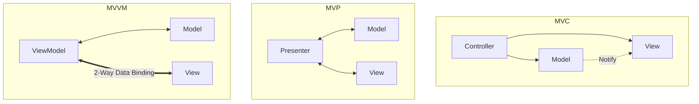

# File 32: MVC, MVP, and MVVM Architectural Patterns

## Overview
**MVC (Model-View-Controller)**, **MVP (Model-View-Presenter)**, and **MVVM (Model-View-ViewModel)** are architectural patterns used to separate domain data logic from UI user interface presentation.

---

## 1. Architectural Patterns Comparison



---

## 2. Model-View-Controller (MVC) Implementation

```javascript
// 1. Model: Holds domain data and business logic
class UserModel {
    constructor() {
        this.users = ["Priya", "Rajesh"];
    }

    addUser(name) {
        this.users.push(name);
    }
}

// 2. View: Renders presentation UI
class UserView {
    render(users) {
        console.log("=== User List View ===");
        users.forEach((user, i) => console.log(`${i + 1}. ${user}`));
    }
}

// 3. Controller: Handles user input & updates Model/View
class UserController {
    constructor(model, view) {
        this.model = model;
        this.view = view;
    }

    addUser(name) {
        this.model.addUser(name);
        this.updateView();
    }

    updateView() {
        this.view.render(this.model.users);
    }
}

const app = new UserController(new UserModel(), new UserView());
app.updateView();
app.addUser("Amit");
```

---

## Key Takeaways
1. **MVC**: Controller updates Model; View observes Model updates.
2. **MVP**: Presenter handles all interaction logic; View is completely passive.
3. **MVVM**: ViewModel uses **2-way data binding** to sync state with the View (Angular, Vue, Knockout).
