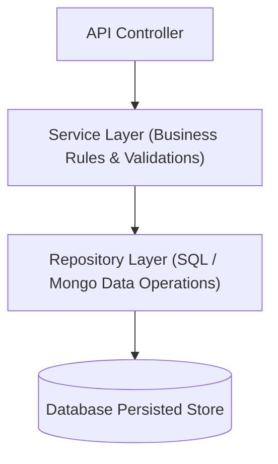

# File 33: Repository and Service Layer Patterns

## Overview
- The **Repository Pattern** abstracts data persistence mechanisms (SQL, MongoDB, Redis) behind an object-oriented collection interface.
- The **Service Layer Pattern** encapsulates business rules, domain orchestrations, and transaction boundaries, sitting above repositories and below API controllers.

---

## 1. Multi-Tier Layered Architecture



---

## 2. Layered Architecture Implementation

```javascript
// 1. Data Model Entity
class User {
    constructor(id, name, email) {
        this.id = id;
        this.name = name;
        this.email = email;
    }
}

// 2. Repository Layer (Data Access Isolation)
class UserRepository {
    constructor() {
        this.db = new Map();
    }

    save(user) {
        this.db.set(user.id, user);
        return user;
    }

    findById(id) {
        return this.db.get(id) || null;
    }

    findByEmail(email) {
        for (const user of this.db.values()) {
            if (user.email === email) return user;
        }
        return null;
    }
}

// 3. Service Layer (Business Logic & Workflow Control)
class UserService {
    constructor(userRepo) {
        this.userRepo = userRepo;
    }

    registerUser(id, name, email) {
        // Business Rule 1: Email uniqueness check
        const existing = this.userRepo.findByEmail(email);
        if (existing) {
            throw new Error(`Email ${email} is already registered`);
        }

        // Business Rule 2: Create entity and persist
        const newUser = new User(id, name, email);
        return this.userRepo.save(newUser);
    }
}

const repository = new UserRepository();
const service = new UserService(repository);

const user = service.registerUser("101", "Priya", "priya@example.com");
console.log("User registered:", user);
```

---

## Key Takeaways
1. **Repository Pattern** hides raw database SQL/Mongo queries from business code.
2. **Service Layer Pattern** enforces business rules, transactional logic, and multi-repository workflows.
3. Decouples controllers from data access, allowing effortless persistence layer migration.
