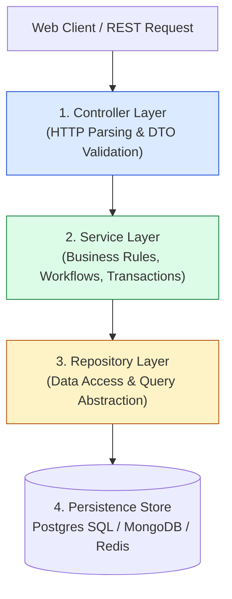
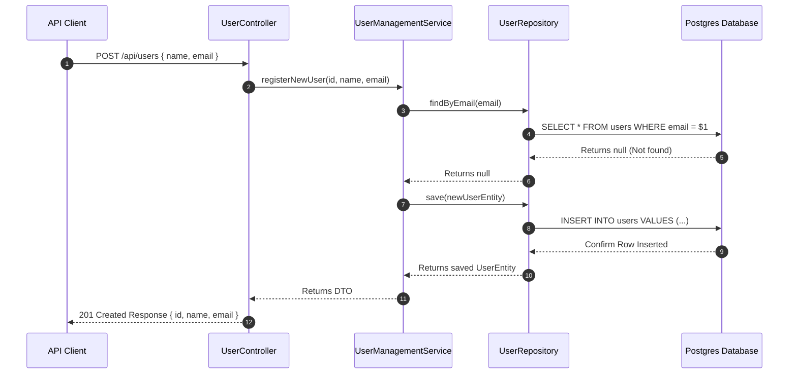

# Module 33: Repository & Service Layer Patterns — N-Tier Layered Architecture and Persistence Abstraction

## Overview

In enterprise backend applications, mixing raw SQL queries, HTTP request handling, and complex business logic inside API route handlers creates unmaintainable, untestable codebases.

To solve this, modern backends use an **N-Tier Layered Architecture**:
1. **The Repository Pattern**: Mediates between the domain and data mapping layers, exposing a clean object-oriented collection interface (`save()`, `findById()`, `delete()`) that hides raw SQL/MongoDB queries and ORM details.
2. **The Service Layer Pattern**: Defines an application's boundary with a set of available operations, encapsulating business rules, validations, multi-repository orchestration, and transaction boundaries.

Understanding **Persistence Decoupling**, **Transaction Scope**, and **Layer Boundaries** is essential.

---

## 1. Multi-Tier Layered Architecture Diagram



---

## 2. N-Tier Layer Responsibilities Comparison Matrix

| Layer Name | Primary Responsibility | Allowed Dependencies | Prohibited Actions |
| :--- | :--- | :--- | :--- |
| **Controller Layer** | Parses HTTP requests, validates JSON DTOs, returns HTTP status codes | Service Layer | **NO database queries**, **NO business rules** |
| **Service Layer** | Enforces business rules, coordinates domain workflows, manages transactions | Repositories, External SDK Services | **NO direct HTTP req/res objects**, **NO raw SQL** |
| **Repository Layer** | Executes CRUD data queries, maps DB rows/documents to Domain Entities | ORM / DB Drivers / Persistence Engine | **NO business validation rules** |

---

## 3. Code Showcase: Production Service & Repository Architecture

```javascript
// ==========================================
// 1. DOMAIN ENTITY CONTRACT
// ==========================================
class UserEntity {
  constructor(id, name, email, role = "USER") {
    this.id = id;
    this.name = name;
    this.email = email;
    this.role = role;
    this.createdAt = new Date();
  }
}

// ==========================================
// 2. REPOSITORY LAYER (Data Access Abstraction)
// ==========================================
class InMemoryUserRepository {
  #store = new Map();

  async save(userEntity) {
    this.#store.set(userEntity.id, userEntity);
    return userEntity;
  }

  async findById(id) {
    return this.#store.get(id) || null;
  }

  async findByEmail(email) {
    for (const user of this.#store.values()) {
      if (user.email === email) return user;
    }
    return null;
  }

  async findAll() {
    return Array.from(this.#store.values());
  }
}

// ==========================================
// 3. SERVICE LAYER (Business Rules & Orchestration)
// ==========================================
class UserManagementService {
  #userRepo;
  #emailNotificationService;

  constructor(userRepo, emailNotificationService) {
    this.#userRepo = userRepo;
    this.#emailNotificationService = emailNotificationService;
  }

  async registerNewUser(id, name, email) {
    console.log(`[UserService]: Processing registration for '${email}'...`);

    // Business Rule 1: Validate Email Format
    if (!email || !email.includes("@")) {
      throw new Error("Validation Error: Invalid email address format.");
    }

    // Business Rule 2: Ensure Email Uniqueness
    const existingUser = await this.#userRepo.findByEmail(email);
    if (existingUser) {
      throw new Error(`Business Conflict: Email '${email}' is already registered.`);
    }

    // Business Rule 3: Construct Entity & Persist via Repository
    const newUser = new UserEntity(id, name, email);
    const savedUser = await this.#userRepo.save(newUser);

    // Business Rule 4: Trigger External Service Notification
    await this.#emailNotificationService.sendWelcomeEmail(savedUser.email, savedUser.name);

    console.log(`[UserService]: Successfully registered user '${savedUser.id}'.`);
    return savedUser;
  }
}

// Mock External Service
class MockEmailService {
  async sendWelcomeEmail(email, name) {
    console.log(`  -> [Email Service]: Sent welcome email to ${name} <${email}>`);
  }
}

// Execution Demonstration
(async () => {
  const repository = new InMemoryUserRepository();
  const emailService = new MockEmailService();
  const userService = new UserManagementService(repository, emailService);

  console.log("=== 1. SUCCESSFUL USER REGISTRATION ===");
  await userService.registerNewUser("USR-101", "Anita Sharma", "anita@domain.com");

  console.log("\n=== 2. DUPLICATE EMAIL REGISTRATION (BUSINESS RULE BLOCK) ===");
  try {
    await userService.registerNewUser("USR-102", "Anita Duplicate", "anita@domain.com");
  } catch (err) {
    console.error("Caught Expected Exception:", err.message);
  }
})();
```

---

## 4. User Registration Multi-Tier Sequence Diagram



---

## Key Production Takeaways

1. **Keep Controllers Thin**: Controllers should only validate HTTP payloads, delegate processing to the Service Layer, and format HTTP responses.
2. **Encapsulate Business Rules in the Service Layer**: Never leak domain rules (such as discount policies or duplicate email checks) into repository query code or HTTP controller functions.
3. **Decouple Database Tech via Repositories**: Use the Repository Pattern so swapping from MongoDB to PostgreSQL requires updating only repository queries without touching business logic in the Service Layer.
4. **Interface Repositories for Unit Testing**: Inject repository interfaces into services to allow substituting in-memory mock repositories during unit testing.

