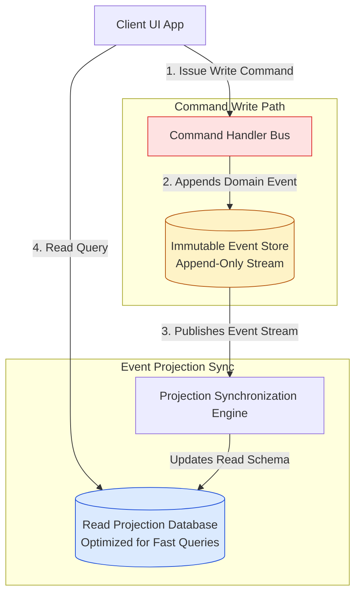
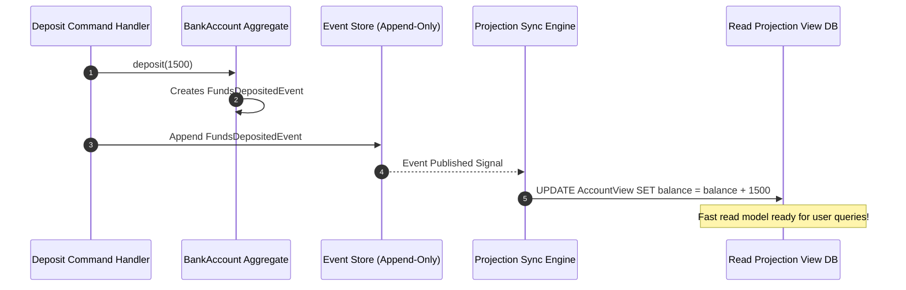

# Module 34: CQRS & Event Sourcing Patterns — Command/Query Segregation, Append-Only Logs, and Read Projections

## Overview

In high-scale enterprise architectures, traditional CRUD patterns hit severe performance limits when read operations and write operations contend for the same database tables and schema structures.

- **CQRS (Command Query Responsibility Segregation)**: Splits system architecture into two distinct pipelines:
  1. **Commands (Writes)**: Mutates state, handles business logic, returns void/status.
  2. **Queries (Reads)**: Fetches pre-computed view models without mutating state.
- **Event Sourcing**: Replaces mutable database table rows with an **Immutable Append-Only Event Store**. Current state is never overwritten; instead, it is dynamically computed by **replaying historical domain events** from timestamp $t_0$ to present.

Understanding **Command Handlers**, **Event Store Replays**, **Projection Synchronizers**, and **Snapshots** is essential.

---

## 1. CQRS & Event Sourcing Architecture Topology



---

## 2. Traditional CRUD vs. CQRS + Event Sourcing Matrix

| Architectural Feature | Traditional CRUD Architecture | CQRS + Event Sourcing Architecture |
| :--- | :--- | :--- |
| **State Storage** | Destructive in-place table mutations (`UPDATE users SET balance = 500`) | **Immutable Append-Only Stream of Domain Events** |
| **Audit Trail** | Requires custom audit log triggers | **Native Complete Audit Log** built directly into event store |
| **Time-Travel Debugging** | Impossible (Past state overwritten) | **Native Time Travel** (Replay events up to any past timestamp) |
| **Read/Write Scaling** | Contends for single database schema | **Scale Writes & Reads Independently** (Separate DB engines) |
| **Consistency Model** | Immediate Strong Consistency | **Eventual Consistency** (Async Projection Sync) |

---

## 3. Code Showcase: Bank Account Event Sourcing Aggregate & Read Projection

```javascript
// ==========================================
// 1. IMMUTABLE DOMAIN EVENT DEFINITIONS
// ==========================================
class AccountOpenedEvent {
  constructor(accountId, owner, initialDeposit) {
    this.type = "ACCOUNT_OPENED";
    this.accountId = accountId;
    this.owner = owner;
    this.initialDeposit = initialDeposit;
    this.timestamp = new Date().toISOString();
  }
}

class FundsDepositedEvent {
  constructor(accountId, amount) {
    this.type = "FUNDS_DEPOSITED";
    this.accountId = accountId;
    this.amount = amount;
    this.timestamp = new Date().toISOString();
  }
}

class FundsWithdrawnEvent {
  constructor(accountId, amount) {
    this.type = "FUNDS_WITHDRAWN";
    this.accountId = accountId;
    this.amount = amount;
    this.timestamp = new Date().toISOString();
  }
}

// ==========================================
// 2. EVENT-SOURCED AGGREGATE (Rebuilds State from Event History)
// ==========================================
class BankAccountAggregate {
  #accountId;
  #balance = 0;
  #owner = "";
  #version = 0;
  #uncommittedEvents = [];

  constructor(accountId) {
    this.#accountId = accountId;
  }

  // Replays stream of historical events to restore state!
  loadFromHistory(eventStream) {
    console.log(`[BankAccountAggregate]: Replaying ${eventStream.length} event(s) for account '${this.#accountId}'...`);
    for (const event of eventStream) {
      this.#applyEvent(event, false);
    }
  }

  // Business Command Method 1: Deposit Money
  deposit(amount) {
    if (amount <= 0) throw new Error("Deposit amount must be > 0");
    const event = new FundsDepositedEvent(this.#accountId, amount);
    this.#applyEvent(event, true);
  }

  // Business Command Method 2: Withdraw Money
  withdraw(amount) {
    if (amount > this.#balance) {
      throw new Error(`Insufficient funds: Requested ${amount}, Current Balance: ${this.#balance}`);
    }
    const event = new FundsWithdrawnEvent(this.#accountId, amount);
    this.#applyEvent(event, true);
  }

  // State Mutation Handler
  #applyEvent(event, isNew = true) {
    switch (event.type) {
      case "ACCOUNT_OPENED":
        this.#owner = event.owner;
        this.#balance = event.initialDeposit;
        break;
      case "FUNDS_DEPOSITED":
        this.#balance += event.amount;
        break;
      case "FUNDS_WITHDRAWN":
        this.#balance -= event.amount;
        break;
    }

    this.#version++;
    if (isNew) {
      this.#uncommittedEvents.push(event);
    }
  }

  get uncommittedEvents() { return this.#uncommittedEvents; }
  get balance() { return this.#balance; }
  get version() { return this.#version; }
}

// ==========================================
// 3. READ MODEL PROJECTION ENGINE
// ==========================================
class AccountReadProjection {
  #viewDatabase = new Map();

  // Projector listens to event store and updates read-optimized view model
  project(event) {
    switch (event.type) {
      case "ACCOUNT_OPENED":
        this.#viewDatabase.set(event.accountId, {
          accountId: event.accountId,
          owner: event.owner,
          currentBalance: event.initialDeposit,
          lastUpdated: event.timestamp
        });
        break;
      case "FUNDS_DEPOSITED":
      case "FUNDS_WITHDRAWN":
        const view = this.#viewDatabase.get(event.accountId);
        if (view) {
          view.currentBalance += (event.type === "FUNDS_DEPOSITED" ? event.amount : -event.amount);
          view.lastUpdated = event.timestamp;
        }
        break;
    }
  }

  // Fast Read Query Call
  getAccountSummary(accountId) {
    return this.#viewDatabase.get(accountId) || null;
  }
}

// Execution Demonstration
const globalEventStore = [
  new AccountOpenedEvent("ACC-7701", "Anita Sharma", 5000),
  new FundsDepositedEvent("ACC-7701", 1500)
];

// 1. Rebuild Aggregate from History
const account = new BankAccountAggregate("ACC-7701");
account.loadFromHistory(globalEventStore);
console.log(`Rebuilt Balance: ₹${account.balance} (Aggregate Version: ${account.version})`);

// 2. Issue New Command
console.log("\n=== EXECUTING WITHDRAWAL COMMAND ===");
account.withdraw(2000);

// 3. Append New Uncommitted Event to Event Store
const newEvents = account.uncommittedEvents;
globalEventStore.push(...newEvents);

// 4. Sync Read Model Projection
const projection = new AccountReadProjection();
globalEventStore.forEach((event) => projection.project(event));

console.log("\nFast Read Query Summary:", projection.getAccountSummary("ACC-7701"));
```

---

## 4. Projection Synchronization Sequence Diagram



---

## Key Production Takeaways

1. **Never Mutate Historical Event Records**: Event store entries must be immutable; incorrect past entries are corrected by appending new **Reversal / Compensating Events**.
2. **Implement Snapshots for High-Volume Aggregates**: If an aggregate has thousands of events, save a periodic snapshot every 100 events to avoid slow state replay benchmarks during aggregate initialization.
3. **Handle Eventual Consistency in UI**: Account for the small millisecond delay between writing to the Event Store and updating Read Model Projections in user interfaces.
4. **Use CQRS When Read & Write Requirements Differ**: Adopt CQRS when read traffic heavily outpaces write traffic or when complex reporting queries require denormalized databases (like Elasticsearch or Redis).

