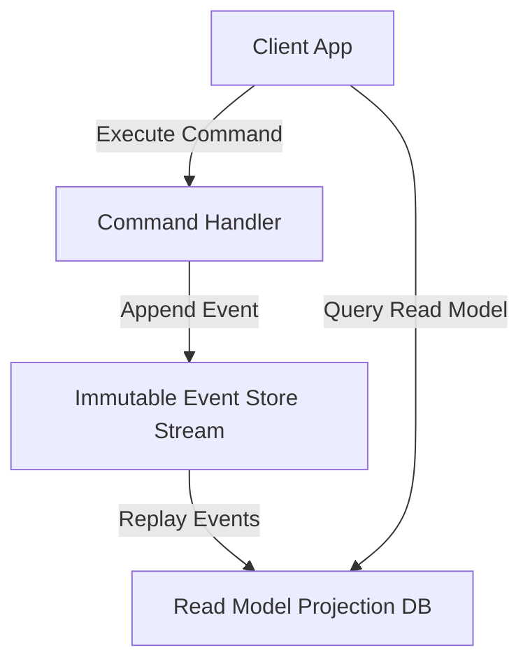

# File 34: CQRS and Event Sourcing Patterns

## Overview
- **CQRS (Command Query Responsibility Segregation)** separates read operations (**Queries**) from write operations (**Commands**) into separate data models.
- **Event Sourcing** persists state changes as an immutable sequence of historical domain events rather than mutating current database rows in place.

---

## 1. CQRS & Event Sourcing Architecture



---

## 2. Event Sourced Account Implementation

```javascript
// 1. Immutable Domain Events
class AccountCreatedEvent {
    constructor(accountId, initialBalance) {
        this.type = "ACCOUNT_CREATED";
        this.accountId = accountId;
        this.initialBalance = initialBalance;
        this.timestamp = new Date();
    }
}

class MoneyDepositedEvent {
    constructor(accountId, amount) {
        this.type = "MONEY_DEPOSITED";
        this.accountId = accountId;
        this.amount = amount;
        this.timestamp = new Date();
    }
}

// 2. Event Sourced Entity Aggregate
class BankAccountAggregate {
    constructor(accountId) {
        this.accountId = accountId;
        this.balance = 0;
        this.changes = [];
    }

    // Replays past events to rebuild state dynamically
    replay(events) {
        events.forEach(event => this.apply(event, false));
    }

    apply(event, isNew = true) {
        switch (event.type) {
            case "ACCOUNT_CREATED":
                this.balance = event.initialBalance;
                break;
            case "MONEY_DEPOSITED":
                this.balance += event.amount;
                break;
        }
        if (isNew) this.changes.push(event);
    }
}

// Event Store Log
const eventStore = [
    new AccountCreatedEvent("ACC_9001", 1000),
    new MoneyDepositedEvent("ACC_9001", 500),
    new MoneyDepositedEvent("ACC_9001", 200)
];

// Rebuilding state from Event History Stream
const account = new BankAccountAggregate("ACC_9001");
account.replay(eventStore);

console.log(`Current Rebuilt Balance: ₹${account.balance}`); // ₹1700
```

---

## Key Takeaways
1. **CQRS** optimizes read vs write paths independently.
2. **Event Sourcing** provides complete audit trails and temporal time-travel debugging.
3. State is a **derived calculation** achieved by replaying historical domain events.
