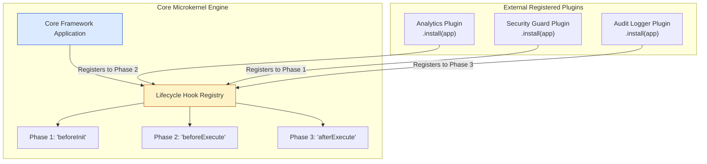
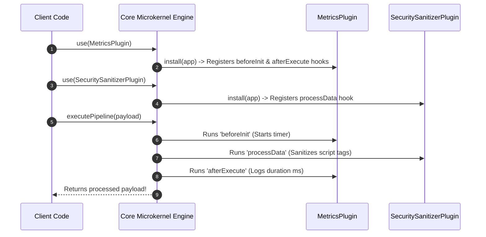

# Module 35: Middleware & Plugin System Patterns — Microkernel Architecture, Extensible Hooks, and Sandboxing

## Overview

The **Plugin System Pattern** (also known as the **Microkernel Architecture Pattern**) allows third-party developers to extend core application capabilities without modifying core framework source code.

While **Middleware** processes linear request/response HTTP streams sequentially, a **Plugin System** exposes structured **Lifecycle Hooks** (`onInit`, `beforeExecute`, `afterExecute`, `onError`) that allow external modules to register extensions, decorate core services, and hook into execution phases.

Famous examples of Plugin Systems in JavaScript include **Fastify plugins**, **Webpack plugins**, **Babel transforms**, **Vue.js plugins**, and **Rollup builders**.

---

## 1. Plugin Lifecycle & Microkernel Architecture



---

## 2. Extension Patterns Comparison Matrix

| Architectural Pattern | Primary Goal | Execution Style | Primary Target |
| :--- | :--- | :--- | :--- |
| **Middleware Pipeline** | Processes linear HTTP request/response streams | Sequential `next()` passing | Web servers (Express, Koa, Connect) |
| **Plugin System** | Extends core engine features & hooks into lifecycles | Event hook callbacks / tapable streams | Build tools (Webpack, Vite, Rollup, Babel), Fastify |
| **Decorator Pattern** | Wraps individual object instances dynamically | Composition wrapper delegation | Decorating class methods / functions |

---

## 3. Code Showcase: Production Extensible Microkernel Engine

```javascript
// ==========================================
// 1. EXTENSIBLE CORE MICROKERNEL ENGINE
// ==========================================
class ExtensibleFrameworkCore {
  #plugins = new Set();
  #hooks = new Map();
  #services = new Map();

  constructor() {
    // Standard Lifecycle Hook Points
    this.#hooks.set("beforeInit", []);
    this.#hooks.set("processData", []);
    this.#hooks.set("afterExecute", []);
    this.#hooks.set("onError", []);
  }

  // 1. Hook Registration Method
  hook(hookName, callbackFn) {
    if (!this.#hooks.has(hookName)) {
      throw new Error(`[CoreEngine]: Invalid hook lifecycle point '${hookName}'`);
    }
    this.#hooks.get(hookName).push(callbackFn);
    return this; // Method chaining!
  }

  // 2. Service Decoration Method (Allows plugins to attach utilities!)
  decorate(serviceName, serviceInstance) {
    if (this.#services.has(serviceName)) {
      throw new Error(`[CoreEngine]: Service '${serviceName}' is already decorated.`);
    }
    this.#services.set(serviceName, serviceInstance);
    console.log(`[CoreEngine]: Decorated core with service '$${serviceName}'`);
  }

  getService(serviceName) {
    return this.#services.get(serviceName);
  }

  // 3. Plugin Registration Method
  use(pluginObject, pluginOptions = {}) {
    if (!pluginObject || typeof pluginObject.install !== "function") {
      throw new TypeError("Plugin must be an object implementing an install(app, options) method.");
    }
    if (this.#plugins.has(pluginObject)) {
      console.warn("[CoreEngine]: Plugin already installed. Skipping registration.");
      return this;
    }

    this.#plugins.add(pluginObject);
    pluginObject.install(this, pluginOptions);
    console.log(`[CoreEngine]: Successfully installed plugin '${pluginObject.name || "AnonymousPlugin"}'`);
    return this;
  }

  // 4. Execute Async Pipeline with Hooks
  async executePipeline(initialPayload) {
    let payload = initialPayload;

    try {
      console.log("\n=== 1. TRIGGERING 'beforeInit' HOOKS ===");
      await this.#runHookChain("beforeInit", payload);

      console.log("\n=== 2. TRIGGERING 'processData' HOOKS ===");
      payload = await this.#runWaterfallHookChain("processData", payload);

      console.log("\n=== 3. TRIGGERING 'afterExecute' HOOKS ===");
      await this.#runHookChain("afterExecute", payload);

      return payload;
    } catch (err) {
      console.error("\n[CoreEngine]: Exception caught in pipeline. Triggering 'onError' hooks...");
      await this.#runHookChain("onError", err);
      throw err;
    }
  }

  async #runHookChain(hookName, arg) {
    const handlers = this.#hooks.get(hookName) || [];
    for (const fn of handlers) {
      await fn(arg, this);
    }
  }

  async #runWaterfallHookChain(hookName, initialValue) {
    const handlers = this.#hooks.get(hookName) || [];
    let value = initialValue;
    for (const fn of handlers) {
      value = await fn(value, this);
    }
    return value;
  }
}
```

```javascript
// ==========================================
// 2. THIRD-PARTY PLUGINS
// ==========================================

// Plugin 1: Security Sanitizer Plugin
const SecuritySanitizerPlugin = {
  name: "SecuritySanitizerPlugin",
  install(app, options) {
    app.hook("processData", async (payload) => {
      console.log("  -> [Security Plugin]: Sanitizing payload HTML...");
      return { ...payload, text: payload.text.replace(/<script.*?>.*?<\/script>/gi, "") };
    });
  }
};

// Plugin 2: Logger & Performance Metrics Plugin
const MetricsPlugin = {
  name: "MetricsPlugin",
  install(app, options) {
    app.decorate("logger", (msg) => console.log(`[PluginLogger]: ${msg}`));

    app.hook("beforeInit", async (payload, appInstance) => {
      payload.startTime = Date.now();
      appInstance.getService("logger")("Pipeline execution started!");
    });

    app.hook("afterExecute", async (payload, appInstance) => {
      const duration = Date.now() - payload.startTime;
      appInstance.getService("logger")(`Pipeline execution completed in ${duration} ms`);
    });
  }
};

// Execution Demonstration
(async () => {
  const app = new ExtensibleFrameworkCore();

  // Register Plugins
  app.use(MetricsPlugin);
  app.use(SecuritySanitizerPlugin);

  // Execute Core Framework Pipeline
  const rawInput = { text: "Hello World! <script>alert('hack')</script>" };
  const finalResult = await app.executePipeline(rawInput);
  console.log("\nFinal Processed Output:", finalResult);
})();
```

---

## 4. Plugin Hook Execution Sequence Diagram



---

## Key Production Takeaways

1. **Enforce a Strict Plugin Contract Interface**: Require plugins to implement a standardized `install(app, options)` method signature to ensure consistency.
2. **Prevent Name Collisions in Core Decorations**: Check for duplicate service names when allowing plugins to call `app.decorate()` to avoid overwriting existing core tools.
3. **Isolate Plugin Exceptions**: Wrap plugin hook invocations in `try...catch` blocks to prevent an error in a single third-party plugin from crashing the core framework.
4. **Use Waterfall Hooks for Data Transformations**: Use waterfall hook chains (where output of hook $N$ becomes input of hook $N+1$) for data processing pipelines like build bundlers or input sanitizers.

