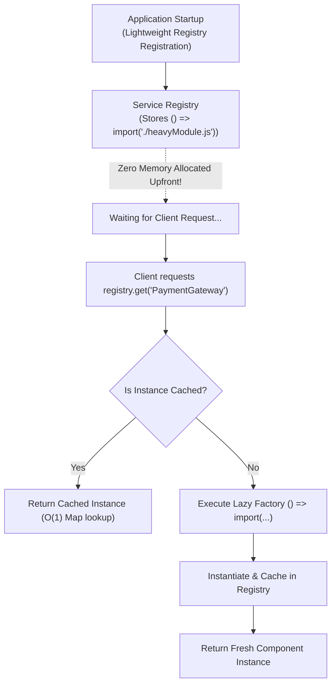
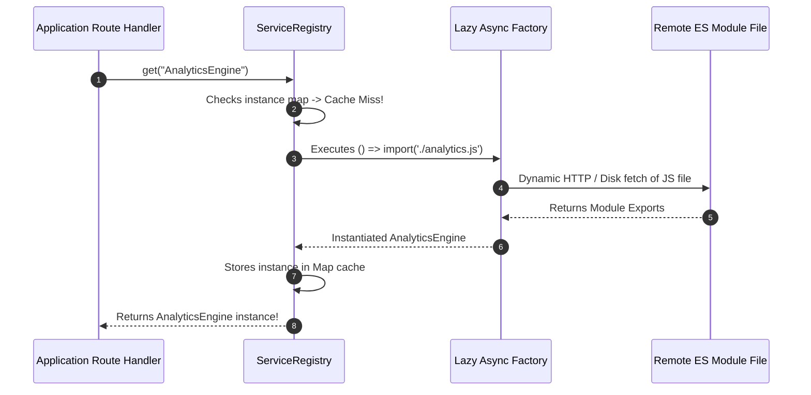

# Module 36: Service Registry & Lazy Loading — Dynamic Imports, On-Demand Instantiation, and Cold-Start Optimization

## Overview

The **Service Registry Pattern** acts as a centralized directory locator where application components register and resolve dependencies by string keys or symbols.

When combined with **Lazy Loading** (deferred instantiation and dynamic ES module imports `import()`), the Service Registry prevents heavy upfront memory allocations during application startup, accelerating application cold-start times.

Understanding **Lazy Factory Functions**, **Dynamic ES Module Chunking**, and **Service Locator vs. Dependency Injection trade-offs** is essential.

---

## 1. Lazy Service Registry Architecture



---

## 2. Startup Strategies Comparison Matrix

| Strategy | Memory Allocation | Startup Speed | Execution Mechanics |
| :--- | :--- | :--- | :--- |
| **Eager Service Registry** | High upfront memory footprint | Slow initial boot | Instantiates all services upfront during app startup |
| **Lazy Factory Registry** | Zero memory allocated upfront | Fast initial boot | Defers instantiation until first `.get(key)` call |
| **Dynamic ES Import (`import()`)** | Micro-chunked bundle size | Blazing fast web boot | Fetches JS code bundle over network only when accessed |

---

## 3. Code Showcase: Lazy Service Registry & Dynamic Module Loader

```javascript
// ==========================================
// 1. LAZY SERVICE REGISTRY WITH CACHING
// ==========================================
class ProductionServiceRegistry {
  #factories = new Map();
  #instances = new Map();

  // Register lazy factory wrapper (NOT instantiated during registration!)
  registerLazy(serviceKey, factoryFn) {
    if (typeof factoryFn !== "function") {
      throw new TypeError(`Factory for service '${serviceKey}' must be a function.`);
    }
    this.#factories.set(serviceKey, factoryFn);
    console.log(`[ServiceRegistry]: Registered lazy factory for '${serviceKey}'.`);
    return this;
  }

  // On-demand Resolution
  async get(serviceKey) {
    // 1. Return cached instance if already instantiated
    if (this.#instances.has(serviceKey)) {
      return this.#instances.get(serviceKey);
    }

    // 2. Lookup registered factory
    const factoryFn = this.#factories.get(serviceKey);
    if (!factoryFn) {
      throw new Error(`[ServiceRegistry]: Service '${serviceKey}' is not registered.`);
    }

    console.log(`\n[ServiceRegistry]: Instantiating '${serviceKey}' ON DEMAND...`);
    const startTime = Date.now();

    // 3. Execute lazy factory (Supports async factories & dynamic import()!)
    const instance = await factoryFn();
    const duration = Date.now() - startTime;

    console.log(`[ServiceRegistry]: Successfully instantiated '${serviceKey}' in ${duration} ms.`);
    this.#instances.set(serviceKey, instance);
    return instance;
  }

  hasInstance(serviceKey) {
    return this.#instances.has(serviceKey);
  }
}

// ==========================================
// 2. SIMULATED HEAVY MODULE DEPENDENCIES
// ==========================================
const HeavyPostgresPool = async () => {
  await new Promise((resolve) => setTimeout(resolve, 200)); // Simulate DB socket connection
  return { type: "PostgresConnection", status: "CONNECTED" };
};

const HeavyMLRecommendationEngine = async () => {
  await new Promise((resolve) => setTimeout(resolve, 500)); // Simulate tensor model loading
  return { type: "TensorFlowModel", status: "LOADED" };
};

// Execution Demonstration
const registry = new ProductionServiceRegistry();

// 1. Register heavy services lazily (Zero startup latency!)
registry
  .registerLazy("Database", async () => await HeavyPostgresPool())
  .registerLazy("RecommendationEngine", async () => await HeavyMLRecommendationEngine());

console.log("\nApp boot complete. DB loaded?", registry.hasInstance("Database")); // false!

// 2. First access triggers on-demand allocation:
(async () => {
  console.log("\n=== FIRST ACCESS: DATABASE ===");
  const db1 = await registry.get("Database");
  console.log("DB Connection Payload:", db1);

  console.log("\n=== SECOND ACCESS: DATABASE (CACHED INSTANT LOOKUP) ===");
  const db2 = await registry.get("Database");
  console.log("Is Identical Instance?", db1 === db2); // true!
})();
```

---

## 4. Dynamic Import Resolution Sequence Diagram



---

## Key Production Takeaways

1. **Use Lazy Registries to Maximize Cold-Start Performance**: Defer heavy database socket creation or machine learning model loads until routes using them are explicitly invoked.
2. **Combine Dynamic `import()` with Registries**: In web applications, use `const module = await import('./module.js')` inside lazy registry factories to code-split JS bundles.
3. **Avoid Service Locator Anti-Patterns**: Avoid passing the Service Registry instance deep into domain classes; instead, use the Registry inside IoC containers or root composition roots.
4. **Cache Instantiated Singletons**: Always cache instantiated services in a internal `Map` after the first factory call to prevent duplicate instantiation overhead.

