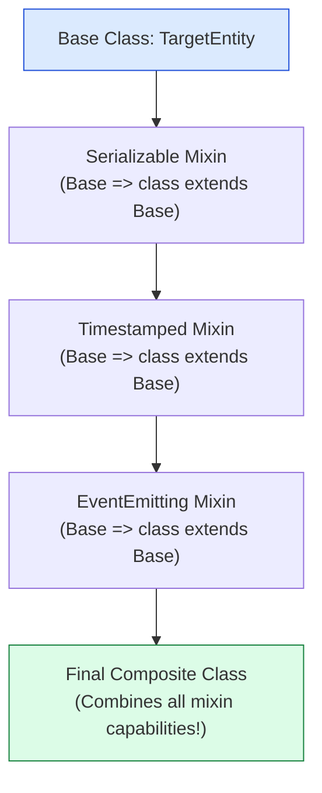
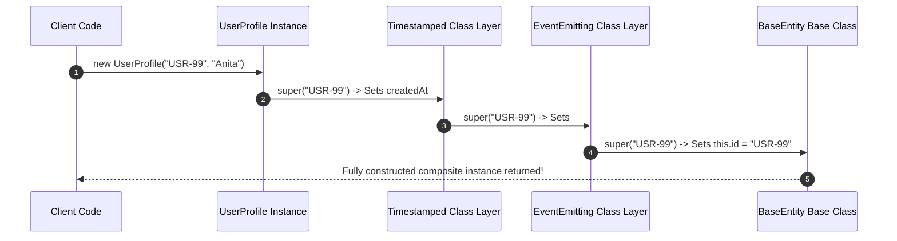

# Module 37: Mixins, Traits, & Symbol Meta-Programming — Composition over Inheritance and Well-Known Protocol Hooks

## Overview

Traditional single-inheritance in Object-Oriented Programming often forces developers into rigid class hierarchies, leading to the **Fragile Base Class Problem** and inability to share functionality across unrelated classes.

JavaScript provides powerful composition mechanisms:
1. **Functional & Class Expression Mixins**: Mixes behaviors from multiple sources into a target class without deep subclassing pipelines (`const Timestamped = Base => class extends Base`).
2. **Traits**: Parametric mixins with explicit name conflict resolution mechanisms.
3. **Symbol Meta-Programming**: Uses primitive **Symbols** to attach non-colliding internal state properties and hook into JavaScript engine protocols (**Well-Known Symbols** like `Symbol.iterator`, `Symbol.toStringTag`, `Symbol.toPrimitive`).

Understanding **Subclass Factories**, **Property Collisions**, and **Symbol Meta-Hooks** is essential.

---

## 1. Class Expression Mixin Composition Topology



---

## 2. Meta-Programming & Composition Mechanisms Matrix

| Mechanism | Composition Style | Collision Risk | Primary Use Case |
| :--- | :--- | :--- | :--- |
| **`Object.assign()` Mixin** | Mutates target prototype | High (Overwrites identical property keys silently) | Quick prototype decoration |
| **Class Expression Mixins** | Creates linear prototype chain | Moderate (Child overrides parent) | Reusable class capabilities (`Timestamped(CanFly(Base))`) |
| **Symbol Keys** | Unique primitive key (`Symbol("id")`) | **Zero Collision Risk** | Internal metadata properties hidden from `Object.keys()` |
| **Well-Known Symbols** | System protocol hooks | N/A (Standardized by TC39 spec) | Customizing `[Symbol.toStringTag]`, `[Symbol.iterator]` |

---

## 3. Code Showcase: Class Expression Mixin Pipeline & Symbol Protocol Hooks

```javascript
// ==========================================
// 1. CLASS EXPRESSION MIXINS (Subclass Factories)
// ==========================================

// Base Domain Model
class BaseEntity {
  constructor(id) {
    this.id = id;
  }
}

// Mixin 1: Timestamp Tracking Capability
const Timestamped = (Base) =>
  class extends Base {
    constructor(...args) {
      super(...args);
      this.createdAt = new Date();
      this.updatedAt = new Date();
    }
    touch() {
      this.updatedAt = new Date();
      console.log(`[Timestamped]: Touched entity ${this.id} at ${this.updatedAt.toISOString()}`);
    }
  };

// Mixin 2: Event Emitter Capability
const EventEmitting = (Base) =>
  class extends Base {
    #listeners = new Map();

    on(event, fn) {
      if (!this.#listeners.has(event)) this.#listeners.set(event, []);
      this.#listeners.get(event).push(fn);
    }

    emit(event, data) {
      const handlers = this.#listeners.get(event) || [];
      handlers.forEach((fn) => fn(data));
    }
  };

// Composite Pipeline Assembly (Composition over Inheritance!)
class UserProfile extends Timestamped(EventEmitting(BaseEntity)) {
  constructor(id, name) {
    super(id);
    this.name = name;
  }
}

// Client Execution
const user = new UserProfile("USR-99", "Anita Sharma");
user.on("update", (data) => console.log("Event Caught:", data));
user.emit("update", { status: "ACTIVE" });
user.touch(); // Mixin method call!
```

```javascript
// ==========================================
// 2. SYMBOL META-PROGRAMMING ENGINE HOOKS
// ==========================================

// Non-colliding internal metadata key
const INTERNAL_SECRET = Symbol("InternalSecretToken");

class CustomCollection {
  #items = [];

  constructor(...items) {
    this.#items = items;
    this[INTERNAL_SECRET] = "ENCRYPTED_SIGNATURE_KEY";
  }

  // 1. Custom Protocol Hook: Symbol.iterator (Enables for...of loop!)
  *[Symbol.iterator]() {
    for (const item of this.#items) {
      yield item;
    }
  }

  // 2. Custom Protocol Hook: Symbol.toStringTag (Customizes Object.prototype.toString)
  get [Symbol.toStringTag]() {
    return "CustomCollectionEngine";
  }

  // 3. Custom Protocol Hook: Symbol.toPrimitive (Customizes coercion to String/Number)
  [Symbol.toPrimitive](hint) {
    if (hint === "number") return this.#items.length;
    if (hint === "string") return `[CustomCollection: ${this.#items.join(", ")}]`;
    return this.#items.length;
  }
}

// Client Execution Demonstration
const collection = new CustomCollection("Item A", "Item B", "Item C");

console.log("\n=== 1. SYMBOL.ITERATOR FOR...OF CONSUMPTION ===");
for (const item of collection) {
  console.log("  Iterated:", item);
}

console.log("\n=== 2. SYMBOL.TOSTRINGTAG COERCION ===");
console.log(Object.prototype.toString.call(collection)); // "[object CustomCollectionEngine]"

console.log("\n=== 3. SYMBOL.TOPRIMITIVE COERCION ===");
console.log("Numeric Coercion (+collection):", +collection); // 3
console.log("String Coercion (`${collection}`):", `${collection}`); // "[CustomCollection: Item A, Item B, Item C]"
```

---

## 4. Class Expression Mixin Prototype Chain



---

## Key Production Takeaways

1. **Prefer Class Expression Mixins Over `Object.assign()`**: Class expression factories (`Base => class extends Base`) preserve the prototype chain, `instanceof` checks, and method overriding capabilities.
2. **Prevent Symbol Key Collisions**: Use Symbols for hidden internal state properties to prevent accidental property overrides by child classes or third-party libraries.
3. **Leverage Well-Known Symbols for Custom Types**: Implement `Symbol.iterator`, `Symbol.toStringTag`, and `Symbol.toPrimitive` to make custom collection classes behave like native JavaScript types.
4. **Avoid Deep Mixin Chains**: Limit class expression mixin pipelines to 3-4 layers to keep prototype lookup performance fast and stack traces easy to debug.

