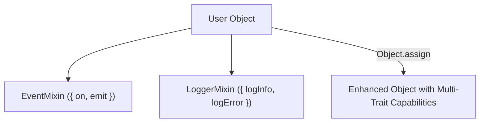

# File 37: Mixins, Traits, and Symbol Meta-Programming

## Overview
- **Mixins** allow inheriting behaviors from multiple objects without using deep inheritance hierarchies (`Object.assign`).
- **Symbols** provide non-clashing unique meta-programming keys and custom language protocol hooks (`Symbol.iterator`, `Symbol.toStringTag`).

---

## 1. Mixin Composition Architecture



---

## 2. Mixin & Symbol Implementation

```javascript
// 1. Functional Mixins
const EventMixin = {
    on(event, fn) {
        this._listeners = this._listeners || {};
        (this._listeners[event] = this._listeners[event] || []).push(fn);
    },
    emit(event, data) {
        if (this._listeners && this._listeners[event]) {
            this._listeners[event].forEach(fn => fn(data));
        }
    }
};

const LoggerMixin = {
    log(msg) {
        console.log(`[${this.name || "LOG"}] ${msg}`);
    }
};

// Target Class
class User {
    constructor(name) {
        this.name = name;
    }
}

// Applying Mixins via Object.assign onto prototype
Object.assign(User.prototype, EventMixin, LoggerMixin);

const user = new User("Rajesh");
user.log("User session created"); // Mixin Method!
user.on("login", data => console.log("Login event:", data));
user.emit("login", { ip: "192.168.1.1" });

// 2. Custom Symbol Meta-Programming Hook
const CUSTOM_TAG = Symbol("CustomMetaData");

class Product {
    constructor(name) {
        this.name = name;
        this[CUSTOM_TAG] = "ENCRYPTED_METADATA_TOKEN";
    }

    // Engine Hook: Customize Object.prototype.toString tag
    get [Symbol.toStringTag]() {
        return "CustomProductEntity";
    }
}

const prod = new Product("Laptop");
console.log(Object.prototype.toString.call(prod)); // "[object CustomProductEntity]"
```

---

## Key Takeaways
1. **Mixins** combine reusable functionality across unrelated classes without rigid subclassing.
2. **Symbols** create private, collision-free properties and customize language engine protocol hooks.
