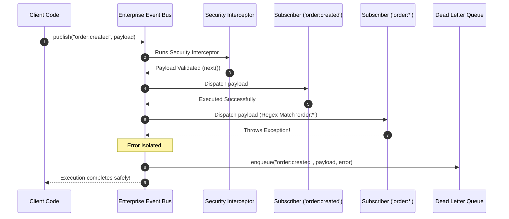

# Module 38: Project Architecture — Enterprise Event Bus & Message Broker System

## Overview

This capstone project module demonstrates a production-grade **Enterprise Event-Driven Architecture (EDA)**, synthesizing four foundational design patterns into a high-performance event bus engine:
1. **The Pub/Sub Pattern**: Topic-based message routing with wildcard subscription support (`orders:*`).
2. **The Middleware Interceptor Pattern**: Intercepts events prior to dispatch for logging, authentication, and payload sanitization.
3. **The Disposer Pattern**: Clean memory lifecycle management using returned unsubscribe functions.
4. **The Dead Letter Queue (DLQ) Pattern**: Captures unhandled or failing event payloads for safe retry or dead-letter auditing.

Understanding **Wildcard Topic Matching**, **Async Middleware Pipelines**, and **DLQ Fault Tolerance** is essential.

---

## 1. Enterprise Event Bus Architecture Topology

```mermaid
flowchart TD
    Producer[Event Publisher / Producer] -->|publish('order:created', payload)| Bus["Enterprise Event Bus Engine"]

    subgraph Interceptor Middleware Pipeline
        Bus --> MW1["1. Audit Logger Interceptor"]
        MW1 --> MW2["2. Security Sanitizer Interceptor"]
        MW2 --> MW3["3. Schema Validation Interceptor"]
    end

    MW3 --> Router["Wildcard Topic Router<br/>(Matches 'order:*')"]

    subgraph Active Subscribers
        Router --> Sub1["Order Fulfiller Service<br/>(Topic: 'order:created')"]
        Router --> Sub2["Analytics Engine<br/>(Topic: 'order:*')"]
    end

    Router -.->|Handler Throws Error| DLQ["Dead Letter Queue (DLQ)<br/>(Persists failed payload for audit)"]

    style Bus fill:#dbeafe,stroke:#1d4ed8
    style DLQ fill:#fee2e2,stroke:#dc2626
```

---

## 2. Event Engine Component Specifications

| Component | Responsibility | Architectural Design Pattern |
| :--- | :--- | :--- |
| **EventBus Engine** | Main registry for topic subscriptions & event dispatching | **Pub/Sub & Facade** |
| **Interceptor Pipeline** | Sequentially executes pre-dispatch guards and transforms | **Chain of Responsibility / Middleware** |
| **Wildcard Matcher** | Resolves regex pattern matching for dynamic topics (`order:*`) | **Strategy Pattern** |
| **Dead Letter Queue (DLQ)**| Captures failed events after maximum retries are exhausted | **Command / Repository Pattern** |

---

## 3. Production Code Showcase: Enterprise Event System

```javascript
// ==========================================
// 1. DEAD LETTER QUEUE (DLQ) REPOSITORY
// ==========================================
class DeadLetterQueue {
  #failedEvents = [];

  enqueue(topic, payload, error) {
    const entry = {
      id: `DLQ-${Date.now()}-${Math.floor(Math.random() * 1000)}`,
      topic,
      payload,
      error: error.message,
      timestamp: new Date().toISOString()
    };
    this.#failedEvents.push(entry);
    console.error(`  !! [DLQ ENQUEUED]: Failed event on topic '${topic}'. Entry ID: ${entry.id}`);
  }

  getFailedEvents() {
    return Array.from(this.#failedEvents);
  }
}

// ==========================================
// 2. PRODUCTION ENTERPRISE EVENT BUS ENGINE
// ==========================================
class EnterpriseEventBus {
  #topics = new Map();
  #wildcardSubscriptions = new Set();
  #middlewares = [];
  #dlq = new DeadLetterQueue();

  // 1. Register Interceptor Middleware
  use(middlewareFn) {
    if (typeof middlewareFn !== "function") throw new TypeError("Middleware must be a function");
    this.#middlewares.push(middlewareFn);
    return this; // Method chaining!
  }

  // 2. Subscribe to Exact Topic or Wildcard Pattern ('order:*')
  subscribe(topicPattern, handlerFn) {
    if (typeof handlerFn !== "function") throw new TypeError("Handler must be a function");

    const isWildcard = topicPattern.includes("*");
    
    if (isWildcard) {
      // Convert wildcard pattern to regular expression (e.g. 'order:*' -> /^order:.*$/)
      const regexPattern = new RegExp("^" + topicPattern.replace(/\*/g, ".*") + "$");
      const subscription = { pattern: topicPattern, regex: regexPattern, handlerFn };
      this.#wildcardSubscriptions.add(subscription);

      // Return Disposer Function for Memory Leak Protection!
      return () => {
        this.#wildcardSubscriptions.delete(subscription);
        console.log(`[EventBus]: Unsubscribed wildcard handler for '${topicPattern}'`);
      };
    } else {
      if (!this.#topics.has(topicPattern)) this.#topics.set(topicPattern, new Set());
      const handlers = this.#topics.get(topicPattern);
      handlers.add(handlerFn);

      return () => {
        handlers.delete(handlerFn);
        console.log(`[EventBus]: Unsubscribed handler for exact topic '${topicPattern}'`);
      };
    }
  }

  // 3. Publish Event Payload through Interceptor Pipeline
  async publish(topic, payload) {
    console.log(`\n[EventBus]: Publishing event to topic '${topic}'...`);
    
    const eventContext = {
      topic,
      payload,
      timestamp: Date.now(),
      canceled: false
    };

    // Execute Async Interceptor Pipeline
    try {
      await this.#executeMiddlewares(eventContext);
    } catch (middlewareErr) {
      console.error(`[EventBus]: Interceptor pipeline aborted event on topic '${topic}':`, middlewareErr.message);
      this.#dlq.enqueue(topic, payload, middlewareErr);
      return;
    }

    if (eventContext.canceled) {
      console.warn(`[EventBus]: Event propagation canceled by interceptor guard for topic '${topic}'`);
      return;
    }

    // Dispatch to Matching Subscribers
    await this.#dispatchToSubscribers(eventContext.topic, eventContext.payload);
  }

  async #executeMiddlewares(context) {
    let index = 0;
    const next = async () => {
      if (context.canceled) return;
      if (index < this.#middlewares.length) {
        const middleware = this.#middlewares[index++];
        await middleware(context, next);
      }
    };
    await next();
  }

  async #dispatchToSubscribers(topic, payload) {
    const targetHandlers = new Set();

    // 1. Gather exact topic match handlers
    if (this.#topics.has(topic)) {
      this.#topics.get(topic).forEach((fn) => targetHandlers.add(fn));
    }

    // 2. Gather matching wildcard handlers
    for (const sub of this.#wildcardSubscriptions) {
      if (sub.regex.test(topic)) {
        targetHandlers.add(sub.handlerFn);
      }
    }

    if (targetHandlers.size === 0) {
      console.warn(`[EventBus]: No active subscribers found for topic '${topic}'.`);
      return;
    }

    // Dispatch payload to all matched handlers with error isolation!
    for (const handler of targetHandlers) {
      try {
        await handler(payload, topic);
      } catch (handlerErr) {
        console.error(`[EventBus]: Subscriber handler threw exception on topic '${topic}':`, handlerErr.message);
        this.#dlq.enqueue(topic, payload, handlerErr);
      }
    }
  }

  get dlq() {
    return this.#dlq;
  }
}

// Client Execution Demonstration
const bus = new EnterpriseEventBus();

// 1. Attach Interceptor 1: Audit Logger
bus.use(async (ctx, next) => {
  console.log(`  -> [Interceptor - Audit Log]: Processing '${ctx.topic}' at ${new Date(ctx.timestamp).toISOString()}`);
  await next();
});

// 2. Attach Interceptor 2: Security Sanitizer
bus.use(async (ctx, next) => {
  if (ctx.payload && ctx.payload.malicious) {
    ctx.canceled = true;
    console.warn("  !! [Interceptor - Security Guard]: Malicious flag detected. Aborting dispatch!");
    return;
  }
  await next();
});

// 3. Register Wildcard Subscriber
const unsubscribeWildcard = bus.subscribe("order:*", (payload, topic) => {
  console.log(`  [Wildcard Subscriber 'order:*']: Caught event on sub-topic '${topic}' -> Order ID: ${payload.orderId}`);
});

// 4. Register Exact Subscriber
bus.subscribe("order:created", (payload) => {
  console.log(`  [Exact Subscriber 'order:created']: Fulfilling order for customer '${payload.customer}'`);
});

// 5. Register Failing Subscriber (To demonstrate DLQ capturing!)
bus.subscribe("order:created", () => {
  throw new Error("Payment Gateway Connection Timeout (Simulated Error)");
});

// Run Demonstrations
(async () => {
  console.log("=== 1. PUBLISHING VALID EVENT ===");
  await bus.publish("order:created", { orderId: "ORD-9901", customer: "Anita Sharma" });

  console.log("\n=== 2. PUBLISHING BLOCKED MALICIOUS EVENT ===");
  await bus.publish("order:created", { orderId: "ORD-BAD", malicious: true });

  console.log("\n=== 3. AUDITING DEAD LETTER QUEUE (DLQ) ===");
  console.log("Captured DLQ Entries:", bus.dlq.getFailedEvents());
})();
```

---

## 4. Interceptor & Wildcard Dispatch Sequence



---

## Key Production Takeaways

1. **Support Wildcard Subscriptions**: Implement pattern matching (e.g. `orders:*` or `user.*.created`) to allow analytics and logging services to subscribe to entire event families easily.
2. **Isolate Subscriber Errors**: Wrap subscriber handler invocations in `try...catch` blocks so a failing handler does not prevent other subscribers from receiving events.
3. **Route Failed Events to a Dead Letter Queue (DLQ)**: Persist failed event payloads and stack traces in a DLQ to allow retrospective analysis and reprocessing.
4. **Always Return Disposer Functions**: Return an unsubscribe function from `.subscribe()` methods to prevent dangling memory leaks when components unmount.

