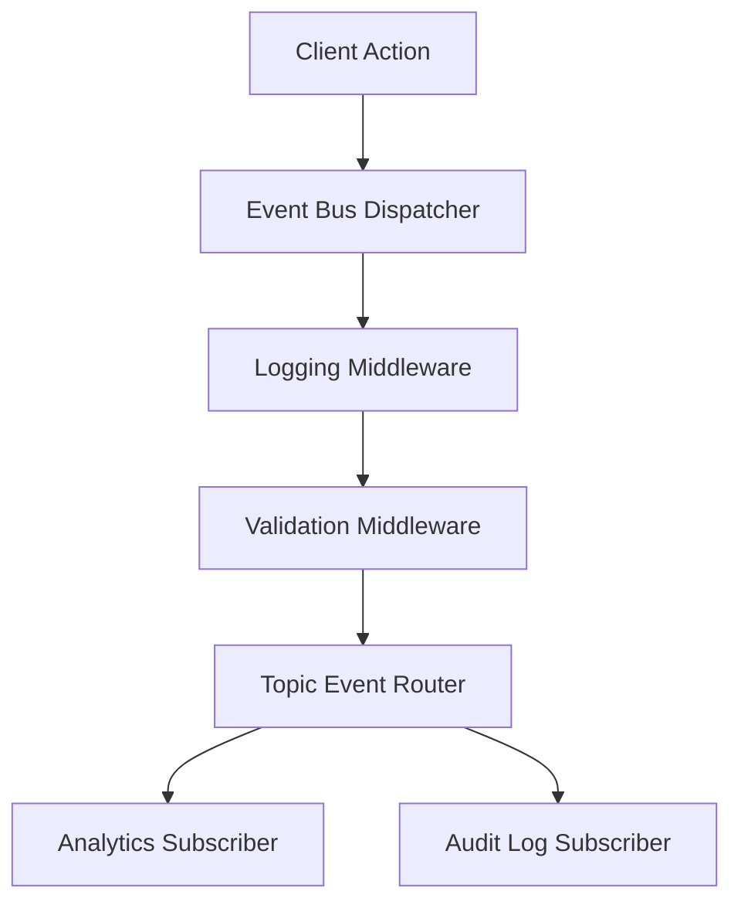

# File 38: End-to-End Project Architecture — Event System

## Overview
This file demonstrates a production-grade **Event System Architecture**, integrating the **Pub/Sub**, **Observer**, **Command**, and **Middleware** patterns into a unified event bus pipeline.

---

## 1. System Architecture Diagram



---

## 2. Event System Architecture Implementation

```javascript
class ProductionEventBus {
    constructor() {
        this.topics = new Map();
        this.middlewares = [];
    }

    // Register Middleware
    use(middlewareFn) {
        this.middlewares.push(middlewareFn);
        return this;
    }

    // Subscribe to Event Topic
    subscribe(topic, handler) {
        if (!this.topics.has(topic)) this.topics.set(topic, []);
        this.topics.get(topic).push(handler);

        return () => {
            const list = this.topics.get(topic) || [];
            this.topics.set(topic, list.filter(h => h !== handler));
        };
    }

    // Publish Event through Middleware Pipeline
    publish(topic, payload) {
        const context = { topic, payload, timestamp: Date.now(), canceled: false };
        let index = 0;

        const next = () => {
            if (context.canceled) return;
            if (index < this.middlewares.length) {
                const mw = this.middlewares[index++];
                mw(context, next);
            } else {
                this.dispatch(context.topic, context.payload);
            }
        };

        next();
    }

    dispatch(topic, payload) {
        const handlers = this.topics.get(topic) || [];
        handlers.forEach(h => h(payload));
    }
}

const bus = new ProductionEventBus();

// Middleware 1: Audit Logger
bus.use((ctx, next) => {
    console.log(`[EVENT LOG] ${ctx.topic} @ ${ctx.timestamp}`);
    next();
});

// Middleware 2: Security Filter
bus.use((ctx, next) => {
    if (ctx.payload && ctx.payload.blocked) {
        console.warn("[EVENT BUS] Blocked malicious payload");
        ctx.canceled = true;
        return;
    }
    next();
});

// Subscriber
bus.subscribe("USER_LOGIN", user => {
    console.log(`Welcome subscriber handling for ${user.username}`);
});

bus.publish("USER_LOGIN", { username: "Priya", blocked: false });
```

---

## Key Takeaways
1. Integrates **Pub/Sub** topic routing with **Middleware** interceptor pipelines.
2. Supports short-circuiting event propagation for security or validation filters.
3. Provides a clean, extensible architectural backbone for enterprise applications.
