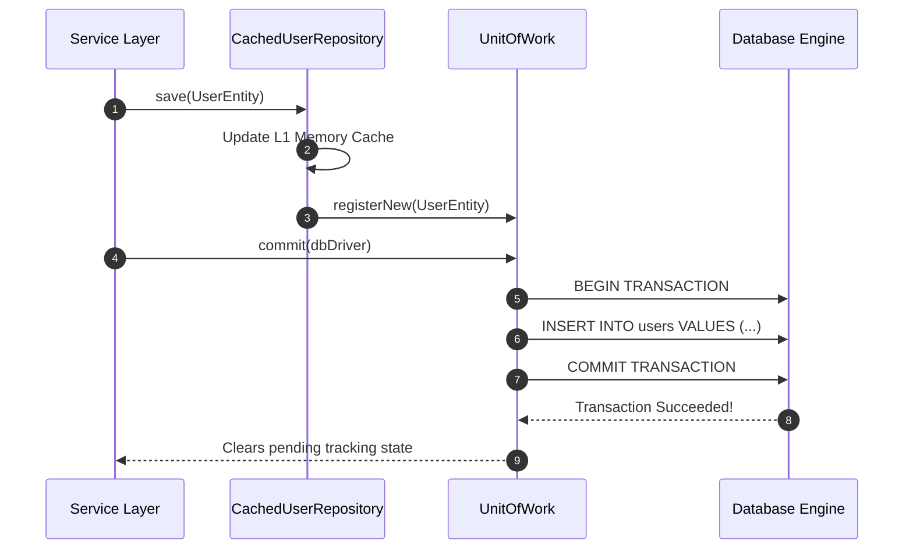

# Module 39: Project Architecture — Enterprise Data Access & Unit of Work Layer

## Overview

This capstone project module demonstrates a production-grade **Enterprise Data Access Layer**, integrating four database abstraction patterns:
1. **The Repository Pattern**: Encapsulates entity querying and persistence logic behind collection interfaces.
2. **The Caching Proxy Pattern**: Transparently intercepts read queries to serve cached entities in $\mathcal{O}(1)$ time, invalidating cache entries on state mutations.
3. **The Unit of Work Pattern**: Tracks business entity state changes (**Dirty Tracking**: New, Modified, Deleted) during a request lifecycle, committing all mutations to the database inside a single atomic ACID transaction.
4. **The Data Mapper Pattern**: Maps database row results into rich, encapsulated Domain Entities.

Understanding **Dirty Entity Tracking**, **Atomic Unit of Work Commits**, and **Proxy Cache Invalidation** is essential.

---

## 1. Data Access Layer Topology

```mermaid
flowchart TD
    Client[Service Layer / Business Application] --> Proxy["1. Caching Proxy Repository<br/>(L1 RAM Cache Lookup)"]

    Proxy -->|Cache Miss| RealRepo["2. SQL Repository<br/>(Queries & Mapping)"]
    Proxy -->|Write / Update| UoW["3. Unit of Work Manager<br/>(Tracks New, Dirty, Deleted Entities)"]

    RealRepo --> UoW
    UoW -->|4. Single Atomic commit()| TransactionDB[(4. ACID Database Store<br/>PostgreSQL / MySQL Transaction)]

    style Proxy fill:#dbeafe,stroke:#1d4ed8
    style UoW fill:#fef3c7,stroke:#b45309
    style TransactionDB fill:#dcfce7,stroke:#15803d
```

---

## 2. Component Specifications & Design Patterns

| Layer Component | Primary Architectural Responsibility | Applied Design Pattern |
| :--- | :--- | :--- |
| **`CachedUserRepository`** | Intercepts read queries; manages L1 memory cache | **Proxy & Decorator Pattern** |
| **`SqlUserRepository`** | Reads/writes domain entities to database store | **Repository Pattern** |
| **`UnitOfWork` Manager** | Tracks entity mutations; manages atomic transaction commit/rollback | **Unit of Work Pattern** |
| **`UserDomainEntity`** | Encapsulates domain logic and validation rules | **Data Mapper / Domain Model** |

---

## 3. Production Code Showcase: Enterprise Data Layer

```javascript
// ==========================================
// 1. DOMAIN ENTITY (Data Mapper Object)
// ==========================================
class UserDomainEntity {
  #id;
  #name;
  #email;

  constructor(id, name, email) {
    this.#id = id;
    this.#name = name;
    this.#email = email;
  }

  updateDetails(name, email) {
    this.#name = name;
    this.#email = email;
  }

  get id() { return this.#id; }
  get name() { return this.#name; }
  get email() { return this.#email; }

  toJSON() {
    return { id: this.#id, name: this.#name, email: this.#email };
  }
}

// ==========================================
// 2. UNIT OF WORK (Transactional State Manager)
// ==========================================
class UnitOfWork {
  #newEntities = new Set();
  #dirtyEntities = new Set();
  #deletedEntities = new Set();

  registerNew(entity) {
    this.#newEntities.add(entity);
  }

  registerDirty(entity) {
    if (!this.#newEntities.has(entity)) {
      this.#dirtyEntities.add(entity);
    }
  }

  registerDeleted(entity) {
    if (this.#newEntities.has(entity)) {
      this.#newEntities.delete(entity);
      return;
    }
    this.#dirtyEntities.delete(entity);
    this.#deletedEntities.add(entity);
  }

  async commit(databaseDriver) {
    console.log("\n=== STARTING UNIT OF WORK ATOMIC TRANSACTION ===");
    console.log(`  Pending Mutations -> New: ${this.#newEntities.size}, Modified: ${this.#dirtyEntities.size}, Deleted: ${this.#deletedEntities.size}`);

    try {
      await databaseDriver.beginTransaction();

      // 1. Persist New Entities
      for (const entity of this.#newEntities) {
        await databaseDriver.insert("users", entity.toJSON());
      }

      // 2. Persist Modified Entities
      for (const entity of this.#dirtyEntities) {
        await databaseDriver.update("users", entity.id, entity.toJSON());
      }

      // 3. Persist Deleted Entities
      for (const entity of this.#deletedEntities) {
        await databaseDriver.delete("users", entity.id);
      }

      await databaseDriver.commitTransaction();
      console.log("=== ATOMIC TRANSACTION COMMITTED SUCCESSFULLY ===");

      // Clear tracking state upon successful commit
      this.#clearState();
      return true;
    } catch (err) {
      console.error("  !! [TRANSACTION FAILED]: Rolling back changes...", err.message);
      await databaseDriver.rollbackTransaction();
      this.#clearState();
      throw err;
    }
  }

  #clearState() {
    this.#newEntities.clear();
    this.#dirtyEntities.clear();
    this.#deletedEntities.clear();
  }
}
```

```javascript
// ==========================================
// 3. REPOSITORY & CACHING PROXY
// ==========================================
class SqlUserRepository {
  #uow;
  #dbDriver;

  constructor(unitOfWork, dbDriver) {
    this.#uow = unitOfWork;
    this.#dbDriver = dbDriver;
  }

  async findById(id) {
    console.log(`  -> [SqlUserRepository]: Querying DB for User ID '${id}'...`);
    const row = await this.#dbDriver.selectById("users", id);
    if (!row) return null;
    return new UserDomainEntity(row.id, row.name, row.email);
  }

  save(userEntity) {
    this.#uow.registerNew(userEntity);
  }

  update(userEntity) {
    this.#uow.registerDirty(userEntity);
  }
}

// Caching Proxy Repository (Decorator / Proxy Pattern)
class CachedUserRepository {
  #realRepo;
  #cache = new Map();

  constructor(realRepo) {
    this.#realRepo = realRepo;
  }

  async findById(id) {
    // 1. Proxy Cache Lookup: Fast O(1) hit
    if (this.#cache.has(id)) {
      console.log(`  -> [CachedUserRepository PROXY HIT]: Returning cached user '${id}'`);
      return this.#cache.get(id);
    }

    // 2. Cache Miss: Fetch from underlying SQL Repository
    const userEntity = await this.#realRepo.findById(id);
    if (userEntity) {
      this.#cache.set(id, userEntity);
    }
    return userEntity;
  }

  save(userEntity) {
    this.#cache.set(userEntity.id, userEntity); // Optimistic L1 Cache update
    this.#realRepo.save(userEntity);
  }

  update(userEntity) {
    this.#cache.set(userEntity.id, userEntity);
    this.#realRepo.update(userEntity);
  }
}

// Mock Database Driver
class MockDBDriver {
  #tables = new Map();
  async beginTransaction() { console.log("  [DB Engine]: BEGIN TRANSACTION"); }
  async commitTransaction() { console.log("  [DB Engine]: COMMIT TRANSACTION"); }
  async rollbackTransaction() { console.log("  [DB Engine]: ROLLBACK TRANSACTION"); }

  async insert(table, data) { this.#tables.set(data.id, data); }
  async update(table, id, data) { this.#tables.set(id, data); }
  async delete(table, id) { this.#tables.delete(id); }
  async selectById(table, id) { return this.#tables.get(id) || null; }
}

// Client Execution Demonstration
(async () => {
  const dbDriver = new MockDBDriver();
  const uow = new UnitOfWork();
  const sqlRepo = new SqlUserRepository(uow, dbDriver);
  const repo = new CachedUserRepository(sqlRepo);

  // 1. Stage New Users in Unit of Work
  const user1 = new UserDomainEntity("USR-101", "Anita Sharma", "anita@domain.com");
  repo.save(user1);

  // 2. Commit Atomic Transaction
  await uow.commit(dbDriver);

  // 3. Query User (First query hits cache created during save!)
  console.log("\n=== QUERYING USER (PROXY CACHE HIT) ===");
  const fetchedUser = await repo.findById("USR-101");
  console.log("Fetched User:", fetchedUser.toJSON());
})();
```

---

## 4. Unit of Work Commit Sequence Diagram



---

## Key Production Takeaways

1. **Batch Mutations Using Unit of Work**: Avoid executing database roundtrips for every single entity update; register changes in a Unit of Work and commit them in a single database transaction.
2. **Invalidate Proxy Caches on Mutating Transactions**: Always clear or update L1 proxy cache entries whenever a Unit of Work transaction mutates or deletes an entity.
3. **Isolate Domain Models from Database Drivers**: Ensure domain entities (`UserDomainEntity`) contain pure business logic and zero SQL driver or ORM dependencies.
4. **Implement Rollback Safety**: Wrap database commits in `try...catch` blocks to trigger `rollbackTransaction()` if an error occurs during batch processing.

