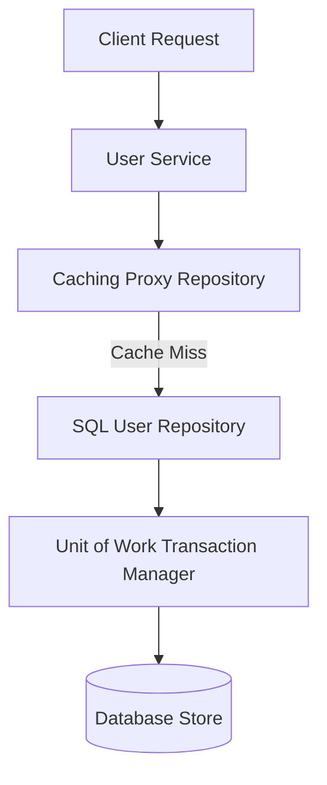

# File 39: End-to-End Project Architecture — Data Layer

## Overview
This file demonstrates a production-grade **Data Layer Architecture**, integrating the **Repository**, **Unit of Work**, **Proxy Caching**, and **Active Record** patterns.

---

## 1. Data Layer Pipeline Architecture



---

## 2. Production Data Layer Implementation

```javascript
// Entity Model
class UserEntity {
    constructor(id, name, email) {
        this.id = id;
        this.name = name;
        this.email = email;
    }
}

// Unit of Work Transaction Manager
class UnitOfWork {
    constructor() {
        this.newEntities = [];
        this.dirtyEntities = [];
    }

    registerNew(entity) {
        this.newEntities.push(entity);
    }

    commit() {
        console.log(`[TRANSACTION COMMIT] Persisting ${this.newEntities.length} new records...`);
        this.newEntities = [];
        return true;
    }
}

// Data Access Repository
class SqlUserRepository {
    constructor(uow) {
        this.uow = uow;
        this.storage = new Map();
    }

    save(user) {
        this.storage.set(user.id, user);
        this.uow.registerNew(user);
        return user;
    }

    findById(id) {
        return this.storage.get(id) || null;
    }
}

// Caching Proxy Wrapper Repository
class CachedUserRepository {
    constructor(realRepo) {
        this.realRepo = realRepo;
        this.cache = new Map();
    }

    save(user) {
        this.cache.set(user.id, user);
        return this.realRepo.save(user);
    }

    findById(id) {
        if (this.cache.has(id)) {
            console.log(`[CACHE HIT] Found user ${id} in proxy memory`);
            return this.cache.get(id);
        }
        const user = this.realRepo.findById(id);
        if (user) this.cache.set(id, user);
        return user;
    }
}

const uow = new UnitOfWork();
const sqlRepo = new SqlUserRepository(uow);
const cachedRepo = new CachedUserRepository(sqlRepo);

cachedRepo.save(new UserEntity("101", "Priya", "priya@example.com"));
uow.commit();

cachedRepo.findById("101"); // Cache hit!
```

---

## Key Takeaways
1. Combines **Repository**, **Caching Proxy**, and **Unit of Work** patterns.
2. Protects database persistence boundaries while maintaining high-speed caching.
3. Groups write operations into transactional commits (`commit()`).
